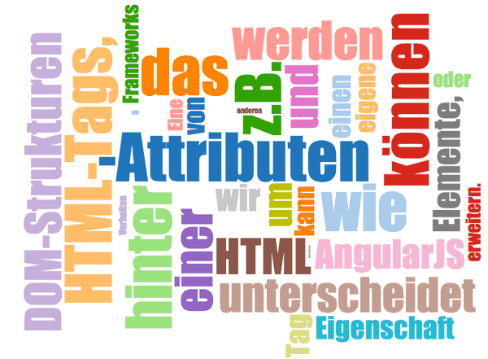

Eine beeindruckende Eigenschaft unterscheidet AngularJS von anderen Frameworks - wir können HTML um eigene Elemente, wie z.B. einen Tag `<tabs>` erweitern. Komplexe DOM-Strukturen und das dazugehörige Verhalten kann hinter einfachen HTML-Tags, -Attributen oder einer CSS-Klassen versteckt werden. In diesem Artikel wird ein Projekt vorgestellt, welches diese Möglichkeiten von AngularJS nutzt und sich als Ziel gesetzt hat, die D3-Bibliothek auch für Menschen nutzbar zu machen, die bisher nur Basiskenntnisse in JavaScript besitzen. Es basiert auf einem AngularJS-Modul, das die D3-Implementierung durch einen Service bereitstellt. Dieser Service kann über den Injektor-Mechanismus in andere Module wie z.B. eine eigene Direktive eingebunden werden. Um dies zu demonstrieren, werden wir das Vorgehen bei der Implementierung der D3-WordCloud Direktive beschreiben. Das komplette Projekt ist [auf GitHub](https://github.com/robinboehm/angular-d3-directives) zu finden.

<!--more-->



D3 steht für Data-Driven-Documents und ist eine JavaScript-Bibliothek, die von [Mike Bostock](http://bost.ocks.org/mike/) geschrieben wurde. Unter Verwendung von HTML5, SVG und CSS können wir Daten enorm vereinfacht visualisieren. Eines dieser Beispiele ist auch die bereits erwähnte Darstellung einer WordCloud, die von [Jason Davies](https://www.jasondavies.com/wordcloud/) entwickelt wurde. J. Davies ist ein Datenvisualisierungs-Spezialist aus England der sich intensiv mit D3 auseinander setzt. In diesem Beispiel nutzt Davies die öffentliche Schnittstelle von Twitter, um eine WordCloud aus Beiträgen zu einem bestimmten Thema zu erstellen. Wir beschreiben beispielhaft das Vorgehen, wie auf der Basis dieser Implementierung eine AngularJS Direktive erstellt werden kann, die diese Logik kapselt.

Zuerst wird die Methode `angular.factory` genutzt, um die D3-Bibliothek innerhalb der Welt von AngularJS als Service bereit zu stellen. Somit können wir D3 innerhalb von AngularJS z.B in einer Direktive zu nutzen.

```javascript
angular.module('d3')
  .factory('d3',[function () {
    var d3;
    //d3 code...
    return d3;
  }]);
```


Nach diesem Schritt können wir in einer eigenen Applikation D3 verwenden, indem wir es als Abhänigkeit in dem sogenannten Dependency-Array einer Modul-Definition angeben. In dem folgenden Code-Snippet siehst du, wie das aussehen könnte:

```javascript
angular.module('exampleApp', ['d3']);

angular.module('exampleApp').directive('example',
  function (d3){
  // use d3 to implement some fancy directive
});
```


Um die WordCloud Direktive möglichst einfach nutzen zu können, müssen wir der D3 Bibliothek als erstes die benötigte Funktionalität hinzufügen. AngularJS bietet hierzu einen Mechanismus, der es uns erlaubt, bereits registrierte Services zu erweitern. Dies wird mit dem Decorator-Pattern realisiert.

```javascript
angular.module('d3')
  .config( ['$provide', function ($provide) {

    var d3WorldCloudDecorator = function($delegate){
      var d3 = $delegate;
      ... // word cloud layout definition
      return d3;
    };

    $provide.decorator('d3', d3WorldCloudDecorator);
  }]);
```

Nachdem wir dies getan haben, implementieren wir nun die eigentliche Direktive. Diese wird unter dem Namen `wordcloud` registriert und enthält eine Abhänigkeit zu dem D3-Service. Somit können wir diesen innerhalb unserer Direktive nutzen. Folgende Attribute soll die Direktive unterstützen:

*   width Number
*   height Number
*   font-family String
*   font-size String
*   words Array

Um dies zu erreichen, wird ein neuer isolierter Scope erstellt, der einige Parameter zur Konfiguration entgegen nimmt. Der isolierte Scope eignet sich in diesem Fall, um die Wiederverwendbarkeit der Direktive herzustellen und die Abhängigkeit zu einem äußeren Scope zu vermeiden. Des Weiteren gibt es die Möglichkeit für das `click`- bzw. `hover`-Event entsprechende Callback-Funktionen zu definieren.

```javascript
angular.module('d3')
  .directive('wordcloud', ['d3',function (d3) {
    return {
      restrict : 'E',
      // isolated scope
      scope : {
        // attributes
        width : "@",
          height: "@",
        fontFamily : "@",
        fontSize: "@",
        // bindings
        words: "=",
        // event callbacks
        onClick: "&",
        onHover: "&"
      },
      link : function postLink(scope, element, attrs) {
        ...
        var cloudFactory = function(words){
          // Keep the anonym functions here for readability
          d3.layout.cloud().size([width, height])
        ...
        // Execute
        cloudFactory(words);
      }
    };
  }]);
```


## Wie verwende ich die Direktive?

### Option 1: Komma-separierte Liste

Es gibt drei verschiedene Möglichkeiten, die Direktive zu benutzen. Die Erste und wahrscheinlich einfachste Möglichkeit, ist die Erstellung einer WordCloud mit einer festen Anzahl von Wörtern, die mittels einer kommaseparierten Liste definiert werden.

```html
<wordcloud>this,is,a,test,with,strings</wordcloud>
```


### Option 2: XML “konformes” Template

Mit der zweiten Option können die Elemente in einem “XML-konformen” Format angegeben werden. Dies hat einen weiteren Vorteil: Elemente können explizit mit weiteren Attributen, wie Farbe, Schriftart oder auch speziellen Klick-Ereignissen, definiert werden. Die Eigenschaften sind zum aktuellen Zeitpunkt jedoch noch nicht komplett implementiert.

```html
<wordcloud>
  <word>this</word>
  <word>is</word>
  <word>a</word>
  <word>sub-element</word>
  <word>test</word>
  <word>to</word>
  <word>demonstrate</word>
  <word>this</word>
  <word>feature</word>
</wordcloud>
```


### Option 3: Nutzung des Controller Scopes

Mit der dritten Option ist es möglich, die Wörter über den Controller-Scope einzutragen und per JavaScript-Array an die Direktive zu übergeben. Über bidirektionales Databinding hat die Direktive vollen Zugriff auf dieses Array. Des Weiteren können Methoden registriert werden, welche auf `click`- bzw. `hover`-Events der Elemente reagieren und im Callback das betroffene Element übergeben bekommen.

```html
<wordcloud
  words="words"
  on-click="myOnClickFunction(element)"
  on-hover="myOnHoverFunction(element)">
</wordcloud>
```


## Testbarkeit

Aufgrund der Tatsache, dass D3 einfache SVG-Elemente nutzt, um die Visualisierungen zu erzeugen, lassen sich diese sehr angenehm testen. AngularJS bietet die globale Funktion `angular.element` an, welche eine Submenge von jQuery implementiert. Diese Submenge nennt sich jqLite. Mit dieser Methode ist es sehr einfach auf Elemente im DOM über Selektoren zuzugreifen, was für die meisten Web-Entwickler eine vertraute Art der DOM-Selektion ist. Des Weiteren können die Attribute dieser Elemente abgefragt werden, um innerhalb eines Tests deren Korrektheit zu überprüfen. Um die Dependency Injection Mechanismen ebenfalls im Test nutzen zu können, bietet AngularJS uns die `inject`-Methode an. Diese erlaubt es die übergebenen Referenzen aufzulösen und die verschiedenen Services einzubinden. Hier siehst Du Auszüge aus der Test-Suite der WorldCloud Direktive:

```javascript
it('should not create a svg on an empty words definition',
  inject(function ($rootScope, $compile) {
    element = angular.element('<wordcloud></wordcloud>');
    element = $compile(element)($rootScope);
    expect(element.children().children().length).toBe(0);
}));
```

Die komplette Test-Suite ist auf GitHub zu finden.

## Ausblick in die Zukunft

Das Projekt entstand in relativ kurzer Zeit an einem Wochenende. Viele Aufgaben sind noch offen und wollen gelöst werden. Vor allem hat der Build-Prozess noch einige Punkte, die optimiert werden können. Zur Zeit nutzt der AngularJS-D3-Service noch einen Snapshot der D3-Bibliothek von Anfang März 2013. Eine notwendige Optimierung ist hier, den jeweils aktuellen Stand von D3 im Build einzubinden. Auch fachlich gibt es noch einige Ideen, um die WordCloud Direktive zu erweitern.

## Zusammenfassung

Wir haben in diesem Artikel gezeigt, wie die Möglichkeiten von D3 auch für Menschen ohne tiefe JavaScript-Kenntnisse nutzbar gemacht werden können. Durch die Kapselung mit AngularJS kann dieses Framework einer deutlich größeren Gruppe von Nutzen sein. Es gibt eine Menge [Beispiele](https://github.com/mbostock/d3/wiki/Gallery), die Mike Bostock auf seiner GitHub-Seite veröffentlicht hat. Viele davon bieten sich ebenfalls an, um sie in einfach bedienbare und wiederverwendbare Direktiven zu kapseln. Wenn man diesen Gedanken weiterdenkt, benötigt man nur noch ein dynamisches Dashboard, wie es z.B. das [Projekt dashing](http://dashing.io/) bietet, um mit minimalem Aufwand perfekt angepasste und ansprechende Visualisierung zu erstellen. AngularJS und D3 sind eine Kombination, die verdammt viel Potential entfesseln...
