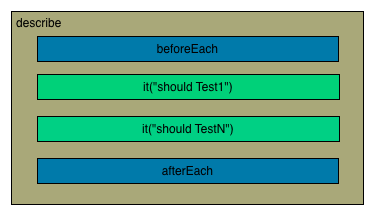
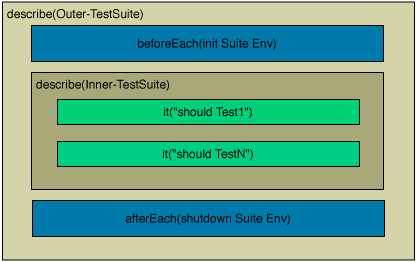
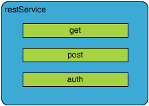
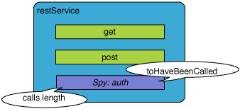
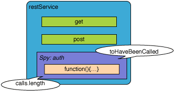

Unit-Tests für meine Web-Anwendung? Für viele Web-Entwickler:innen ist dieser Bereich noch absolutes Neuland. Bisher beschränkten sich Tests oft auf die Simulation von Interaktionen wie es Werkzeuge wie z.B. [Selenium](https://selenium.dev/documentation/en/) ermöglichen. Diese Tests sind sinnvoll und notwendig, jedoch wird hier meistens nur das Endprodukt in der gesamten Komplexität getestet. Dies macht es schwer Fehler exakt zu identifizieren. Möchtest du einen einzelnen Funktionsbaustein auf seine *Korrektheit* prüfen, ohne die Komplexität des gesamten Systems mit einzubeziehen, benötigst du einen isolierten Test für z.B. eine Methode.

<!--more-->

Seit der Definition des [Manifests für Agile Softwareentwicklung](http://agilemanifesto.org/iso/de/manifesto.html) im Jahre 2001 hat sich die testgetriebene Entwicklung als essentieller Bestandteil jedes Software-Entwicklungs-Prozesses etabliert. Gerade hier ist die Möglichkeit, isolierte Tests einfach und schnell schreiben zu können, enorm wichtig. Aus diesem Grund ist AngularJS von Anfang an unter dem Aspekt der Testbarkeit entwickelt worden. Das Framework liefert Dir 'out of the box' ein Paket von Mock-Objekten und bietet Dir außerdem alle Vorteile des Dependency Injection Mechanismus in Deinen Tests. Somit ist die Definition von Unit-Tests und End-to-End-Tests sehr angenehm im Vergleich zu anderen JavaScript Frameworks wie z.B. [Backbone.js](http://backbonejs.org/).

## Einführung in Jasmine

Um die Tests für AngularJS zu definieren, wurde in diesem Fall das BDD-Framework [Jasmine](http://jasmine.github.io/) eingesetzt. Es nutzt eine klare und sehr einfach verständliche Syntax, die Dir das Schreiben von Tests sehr intuitiv ermöglicht. Als erstes definierst du mit der `describe(…)` Methode eine Gruppe zusammenhängender Tests. Diese Funktion nimmt zwei Parameter entgegen: Der erste Parameter ist ein String und beschreibt in natürlicher Sprache die beinhaltenden Tests. Der zweite Parameter ist eine Funktion, die alle Spezifikationen zu den Tests beinhaltet. Innerhalb dieser kann die `it(…)` Funktion genutzt werden, um die spezifische Test-Logik zu implementieren. Schauen wir uns folgendes Beispiel an:

```javascript
describe('A suite', function() {
  it('contains spec with an expectation', function() {
    expect(true).toBe(true);
  });
});
```


In CoffeeScript lässt es sich noch einfacher lesen. Innerhalb dieses Artikels wird aber weiter mit JavaScript gearbeitet. Wenn Du mehr über CoffeeScript in Verbindung mit AngularJS erfahren möchtest, kannst Du das in unserem [Artikel über AngularJS in Verbindung mit CoffeeScript](/artikel/angularjs-mit-coffeescript/) nachlesen.

```javascript
describe 'A suite', ->
  it 'contains spec with an expectation', ->
    expect(true).toBe true
```


## Matcher

Jasmine bringt eine Reihe von sogenannten Matchern mit, die genutzt werden können, um Bedingungen für Deine Tests zu definieren. Zum Beispiel:

*   toBe
*   toBeDefined
*   toBeTruthy
*   toEqual
*   toMatch
*   toContain
*   toThrow

Wie auch in anderen XUnit Test-Frameworks bekannt, ermögtlicht uns Jasmine `setup` und `teardown` Funktionen zu definieren, die vor bzw. nach jedem Test der aktuellen Test-Suite ausgeführt werden können. Sie sind über die Methoden `beforeEach` und `afterEach` zu definieren.

```javascript
describe('A suite', function() {
  var testMe;

  beforeEach(function() {
    testMe = true;
  };

  it('should be true', function() {
    expect(testMe).toBe(true);
  });
});
```


Du kannst beliebig viele `describe(…)` Aufrufe schachteln und somit auch `setup` und `teardown` Funktionen für ganze Suites definieren.





## Spies

Oft kommt es vor, dass eine Methode ein anderes Objekt über ein Interface anspricht. Nicht immer ist es gewollt oder gar möglich eine reale Implementierung des Objekts direkt zu nutzen.

```javascript
function MyController($scope, restService) {
  var authSuccessful= restService.auth('login','pass');

  if (authSuccessful) {
    $scope.xxx = 'yyy'
  }
}
```


Wollen wir die Logik dieses Controllers isoliert testen, ohne die Implementierung des *restService* indirekt mit einzubeziehen, benötigen wir ein Stub- oder Mock-Objekt. Sogenannte Stubs sind Objekte, die lediglich das Interface anbieten, jedoch keine wirkliche Implementierung beinhalten. Mocks sind Objekte, die das Verhalten eines Objektes in einem ganz bestimmten Zustand simulieren. Diese strikte Trennung von anderen Komponenten ist durchaus sinnvoll und beabsichtigt, da somit der Test komplett isoliert den einzelnen atomaren Funktionsteil testet und keine Abhängigkeiten zu der Korrektheit einer speziellen Implementierung hat. Der Mechanismus, den uns Jasmine hier anbietet, nennt sich Spies (Spione). Mit Jasmine kann man sehr einfache solche Spies erstellen. Gehen wir davon aus, dass wir ein einfaches Funktions-Objekt mit dem Namen ‘restService’ in unserem Scope haben. Wir wollen nun herausfinden, ob unsere Methode wirklich, wie wir es erwarten, die Methode C aufruft. Somit erstellen wir einen Spy auf diese Methode.



```javascript
describe('A spy', function() {
  var foo, bar = null;

  beforeEach(function() {
    restService = {
      'get': function(valueObject) {
        return {status:200};
      },
      'post': function(valueObject) {
        return {status:201};
      },
      'auth': function(name,password) {
        return true;
      }
    };
  });

  it('auth was called', function() {
    spyOn(restService, 'auth');
    restService.auth('login','password');
    expect(restService.auth).toHaveBeenCalled();
  });
});
```


Falls wir die Aufrufe der reale Implementierung überwachen wollen, können wir dies mit `.andCallThrough()` einleiten.

```javascript
it('auth was called', function() {
  spyOn(restService, 'auth').andCallThrough();
  var return = restService.auth('login','password');
  expect(restService.auth).toHaveBeenCalled();
  expect(restService.auth.calls.length).toEqual(1);
  expect(return).toEqual(true);
});
```




Wollen wir den Test isoliert ausführen, können wir die Implementierung der auth-Funktion simulieren und die erwartete Rückgabe definieren.

```javascript
it('auth was called', function() {
  //spyOn(restService, auth).andReturn(true);
  spyOn(restService, 'auth').andCallFake(function(login,pass) {
    return (login=='login' && pass=='password');
  });
  var return = restService.auth('login','wrongPassword');
  expect(restService.auth).toHaveBeenCalled();
  expect(restService.auth.calls.length).toEqual(1);
  expect(return).toEqual(false);
});
```




## Testen Deiner AngularJS Module

Nun sind wir in der Lage mit Jasmine Tests zu definieren. Aber wie schaffen wir es, dass unsere Module innerhalb der Test-Funktionen nutzbar sind? Hier können wir die bereits am Anfang erwähnten Vorteile der Dependency Injection nutzen. Wir können über die `beforeEach`-Funktion unser Modul initialisieren und dann mit Hilfe der `inject`-Methode auf die gewünschten Komponenten zugreifen. Für die folgenden Test-Beispiele gehen wir von folgendem Modul aus.

```javascript
angular.module('angularjsDE', [])
  .factory('restService', function ($http) {
    return {
      auth: function (login,password) {
        return (login=='login' && pass=='password');
      },
      get: function () {
        return $http.get('/user');
      }
    }
  });
```


Wir können nun testen, ob wir unseren Service über den Inject-Mechanismus übergeben bekommen.

```javascript
beforeEach(module('angularjsDE'));

it('should exist', inject(function (restService) {
  expect(restService).toBeDefined();
}));
```


In einem nächsten Test überprüfen wir, ob der Service die Schnittstelle `auth` korrekt implementiert.

```javascript
it('should implementent a auth function', inject(function (restService) {
  expect(restService.auth).toBeDefined();
  expect(restService.auth('login','password')).toEqual(true);
}));
```


Wir können einen Spy nutzen, um zu überprüfen, ob unsere auth-Funktion wirklich die get-Methode des $http Services aufruft. Wir erzeugen mit SpyOn + andCallThrough() einen Wrapper um die $http.get-Methode und können dann die bereits erwähnte Methode toHaveBeenCalled() nutzen. Zusätzlich müssen wir einen Spy auf unser $http registrieren.

```javascript
it('should call $http.get in get', inject(function (restService,$http) {
  spyOn($http,'get');
  restService.get();
  expect($http.get).toHaveBeenCalled();
}));
```


## Stub/Mock Objekte

Möchtest Du überprüfen, ob auch tatsächlich ein GET-Request abgesendet wurde, kannst Du dies über das Mock-Objekt $httpBackend überprüfen.

```javascript
it('should call $http.get in auth', inject(function (restService, $httpBackend) {
  $httpBackend.expectGET('/user');
  restService.get();
  $httpBackend.flush();
}));
```


Folgende Objekte sind in dem Modul *ngMock* derzeitig implementiert.

*   $httpBackend
*   $browser
*   $exceptionHandlerProvider
*   $exceptionHandler
*   $log
*   $timeout

Minimale Beispiele sind in der AngularJS Dokumentation beschrieben. Wenn Du Dich jedoch tiefer mit dem Testen von AngularJS beschäftigen möchtest, solltest Du Dir einfach ein paar Tests des Frameworks selbst ansehen. Zu finden sind diese im [AngularJS Projekt auf GitHub](https://github.com/angular/angular.js/tree/master/test).

## Ausführen der Tests

Zum Ausführen der Tests wird das [Werkzeug Karma](http://karma-runner.github.io/0.8/index.html), ehemals Testacular, genutzt. Es erlaubt Dir die definierten Tests parallel in mehreren Browsern auszuführen und sammelt die Ergebnisse ein. Es basiert auf Node.js und Socket.IO. Alle Tests in echten Browsern laufen zu lassen bietet einen großen Vorteil: Es ermöglicht die Nutzung bereits vorhandener Tools, wie z.B. der diversen Debugging-Werkzeuge. Karma startet automatisch mehrere Instanzen der verschiedenen Browser, welche sich über eine einfache Konfigurationsdatei im JSON-Format definieren lassen. Des Weiteren ist es möglich Karma als eine Art lokales [Continuous Integration](https://martinfowler.com/articles/continuousIntegration.html) System zu betreiben. Der Prozess überwacht das Projekt und führt Deine Tests aus, sobald eine Änderung festgestellt wird.

Mit der vorgestellten Testumgebung von AngularJS ist es sehr einfach Tests zu definieren und auszuführen. Methoden wie testgetriebene Entwicklung lassen sich ohne großen Konfigurationsaufwand direkt anwenden. Der Frontend-JavaScript Entwickler kann sich endlich auf die wesentlichen Sachen wie z.B. die Implementierung der eigentlichen Anwendungslogik konzentrieren. AngularJS ermöglicht die Entwicklung von hochqualitativen Webanwendungen - jetzt bist Du am Zug! :)
