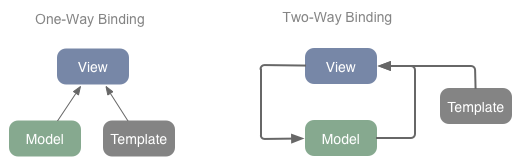

## AngularJS in Stichpunkten:

* JavaScript-Framework für client-seitige Webapplikationen
* Geeignet für Single-Page-Applications
* Open Source von Google
* MVVM (zum größten Teil)
* Opinionated

Mit AngularJS bauen wir normalerweise **Webapplikationen**. Natürlich kannst du es auch in normalen Webseiten benutzen. Wenn dir Suchmaschinenoptimierung aber wichtig ist, wirst du dabei zusätzlichen Aufwand betreiben müssen. In AngularJS wird alles per JavaScript gerendert, womit Suchmaschinen bis heute noch ihre Probleme haben.

**Single-Page-Application** bedeutet, dass wir die meisten Daten beim ersten Aufruf laden. Bei einer Änderung der URL wird nicht mehr die komplette Seite aktualisiert, sondern nur noch neue benötigte Daten per Ajax nachgeladen.

Wir nennen AngularJS **opinionated**,  weil es viele Vorgaben macht, wie wir das Framework nutzen sollen. Zum Beispiel gibt es nur eine Template-Sprache. Unsere gesammte Applikation fügen wir über Dependency Injection zusammen.

## Stärken von AngularJS

* Zwei-Wege-Datenbindung
* Erweiterung von HTML
* Abstraktion von Low-Level-Operationen
* Lesbarkeit des HTML-Codes
* Sehr gute Testbarkeit

**Zwei-Wege-Datenbindung** bezieht sich auf die Synchronisation der Daten zwischen View und Model. Wenn wir in der View Daten ändern, werde diese auf die Datenstruktur im Model übertragen. Wenn wir die Datenstruktur im Model ändern, wird die Anzeige der View entsprechend angepasst.

Als Template-Sprache setzt AngularJS auf **erweiterbares HTML**. Wir können zu HTML eigene Tags und Attribute hinzufügen. Zum Beispiel können wir ein neues Tag `<tabs title="Einstellungen">` erstellen, das intern mehrere Div-Elemente erzeugt.

**Low-Level-Operationen:** Wenn wir jQuery benutzen, müssen wir immer wieder die gleichen Dinge tun - DOM-Manipulationen/-Selektionen. Haben wir ein neues Element in ein Array eingefügt, müssen wir in jQuery selbst dafür sorgen, dass wir z.B. die entsprechende Liste im DOM finden (Selektion) und auch dort das Element eintragen (Manipulation). Mit AngularJS beschreiben wir nur, dass wir eine Liste im DOM mit einem Array verknüpfen wollen. Ab da synchronisiert AngularJS diese selbständig. Keine überflüssigen IDs und Klassen. Kein Boilerplate-Code mehr.

Der ursprüngliche Autor, Miško Hevery, hat großen Wert auf **Testbarkeit gelegt**. Dies bezieht sich nicht nur auf die sehr gute Testabdeckung für das Framework selbst. Auch Entwickler:innen selbst sollen ihre Anwendung einfach testen können. Wenn man sich an den *Angular-Weg* hält, sind Tests wirklich sehr einfach zu schreiben.

## Was unterscheidet AngularJS grundlegend von anderen Frameworks?

Eine Sache unterscheidet AngularJS erheblich von anderen Frameworks. In AngularJS  kann man als Datenstruktur normale JavaScript-Objekte (POJO) nutzen. Dies macht es sehr leicht, fremde Bibliotheken einzubinden. In anderen Framework, wie zum Beispiel Ember.js müssen dazu erst extra Model-Klassen erstellt werden, die die Bibliotheken wrappen.

**Lust auf AngularJS bekommen?** - Dann starte mit unserem [Einsteiger-Tutorial](/artikel/angularjs-tutorial-deutsch/)
