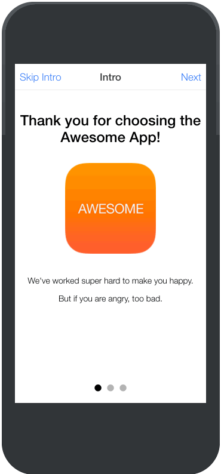

Immer wieder gab es [Probleme] mit der bisherigen Slidebox-Komponente des hybriden Frameworks zur Erstellung von mobilen Apps auf Basis von AngularJS.
Von inkorrekter Darstellung bis zerstörten Funktionalität war alles dabei. Nun hat das Team rund um [Ionic] reagiert und bietet nun einen alternativen Slider an.

Ab jetzt kann auch der solide, hoch funktionelle und sehr stark konfigurierbare Slider [Swiper] von [iDangero.us] genutzt werden. Dazu bietet Ionic zwei neue Direktiven an, um Swiper zu initialisieren und und Slides hinzuzufügen.



## Nutzung

Das Erstellen des Sliders erfolgt über die ionSlides-Komponente.

```html
<ion-slides options="options" slider="slider">
</ion-slides>
```

Dabei kann diese über ein Objekt (*options*) konfiguriert und der erstellte Slider mit einer Scope-Variable (*slider*) verknüpft werden. Das Options-Objekt kann dabei alle verfügbaren Einstellungen des Sliders entgegen. Unter anderem können Standardwerte, wie Höhe und Breite gesetzt werden oder ob die Slides automatisch durchlaufen und wenn wie schnell.

__Besonderheiten__

 - mehrere Slides auf einmal sichtbar
 - Austausch mehrerer Slides beim Swipen
 - für Mobilgeräte und Desktops optimiert
 - verschiedene vordefinierte Effekte, z.B. slide, fade
 - __sowohl horizontale, als auch vertikale Slider möglich!__
 - spezielle Konfiguration für Touch-Geräte, z.B. iOS swip-to-go-back Unterstützung

Hinzukommen eine Vielzahl von definierbaren Callbacks, um in verschiedene Zustände des Sliders einzugreifen.

### Negativ Punkt

Das ist nur die erste persönliche und subjektive Einschätzung, denn damit sicher gegangen werden kann, dass der Slider erstellt und mit der angegebenen Scope-Variable verbunden wurde, wird von Ionic empfohlen einen Watcher auf diese zu setzen.

```javascript
$scope.$watch(...);
```

Dies ist nicht gerade elegant, da viele nicht wissen, dass der Watcher nach dem Setzen der Variable wieder entfernt werden kann bzw. Watcher generell wieder entfernt werden können.

```javascript
var entfernMich = $scope.$watch(...);
```

Die Variable *entfernMich* hält dann eine Funktion, um den Watcher wieder zu entfernen.
Meiner Meinung nach wäre das Werfen eines eigenen Events ein wenig schöner. Spart 1. die Definition einer weiteren Scope-Variable und das Setzen des Watchers. Der Controller wird einfach informiert, wenn ein Slider erstellt wurde.

Der andere Bestandteil der Ionic-Komponente ist ein Slide an sich. Dieser sieht dann wie folgt aus.

```html
<ion-slide-page>
  <!-- Slide-Inhalt -->
</ion-slide-page>
```

### Positiver Nebeneffekt

Da die Jungs von Ionic ja nicht auf den Kopf gefallen sind, werden die Komponenten der neuen Slidebox in der Version 2 des Frameworks genauso heißen. Dadurch sind sie den Entwicklern zur Veröffentlichung der nächsten Version bereits bekannt und lassen sich leichter migrieren.

## Fazit

Es geht voran! Mit dem Release der Version 1.2 macht das Framework einen riesen Schritt zu mehr Stabilität (es wurden mehr als **100 Bugs** gefixt!!!) und einige Neuerungen eingeführt, die den Umstieg oder das Upgrade von v1.x-Apps auf die Version 2 erleichtern. Der neue Slider freut mich persönlich besonders, da sich damit viele "Kundenprobleme" in Luft auf lösen :).

[Swiper]: <http://swiperjs.com/>
[iDangero.us]: <http://www.idangero.us/>
[Ionic]: <http://ionicframework.com/>
[Probleme]: <https://github.com/driftyco/ionic/issues?utf8mb4=%E2%9C%93&q=is%3Aissue+is%3Aopen+is%3Aclosed+slide>
