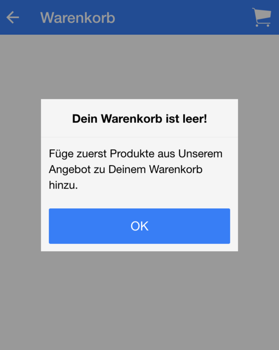

Link zum [Quellcode](https://github.com/angularjs-de/ionic-tutorial/tree/master/12-Popups) und [Live-Demo](https://angularjs-de.github.io/ionic-tutorial/12-Popups/#/order)

Neben den in vorherigen Tutorials - wie [Modale](/artikel/ionic-tutorial-deutsch-modals/) - beschriebenen Anwendungsfällen zur Darstellung weiterer Details und aufbauend auf unserer [Ionic Framework Einführung](/artikel/ionic-tutorial-deutsch/), müssen in einer App oft auch kurze Hinweistexte, Fehlermeldungen oder einfache Nutzereingaben eingepflegt werden. Als Beispiel solltet ihr einen Anwender immer auf dem Laufenden halten. Wenn gerade eine wichtige Aktivität im Hintergrund abläuft, wie das Laden der Daten für die View, dann sollte er das mitbekommen. Genauso - auch wenn sich viele davor scheuen - ist es für den Endnutzer und für euch wichtig zu wissen, wann etwas so richtig schief gelaufen ist ;). So könnte ein wichtiger Request fehlgeschlagen sein, dann ist es gut den Nutzer darauf hinzuweisen. Oft passen aber die Ausgaben solcher Fehlermeldungen nicht in das vom Desginer angedachte Layout, denn wer denkt schon an mögliche Fehlerfälle.

Hier bieten sich Popups gerade zu an. Sie legen sich, wie schon die vorherigen vorgestellten Komponenten über die View, aber bedecken nur einen geringen Teil dieser.

In Ionic heißt die Popup-Komponente **$ionicPopup**, und ist ein Service der mit Hilfe verschiedenen Funktionen auch unterschiedliche Arten von Popups erzeugen kann.

 - $ionicPopup.*alert*(options)
   - simple Meldung mit Button zum Schließen des Popups
   - options:
     - title (String) - Titel des Popups
     - subTitle (String) - zweiter (Unter) Titel des Popups
     - cssClass (String) - CSS-Klasse für eigenes Styling
     - template (String) - Template als Zeichenkette
     - templateUrl (String) - Template aus Templatedatei/cache
     - okText (String) - Text der bestätigen Schaltfläche, standardmäßig "OK"
     - okType (String) - Button-CSS-Klasse, standardmäßig "button-positive"
 - $ionicPopup.*confirm*(options)
   - simple Meldung mit Button zum Bestätigen und Schließen, und einen zum Abbrechen bzw. nur Schließen
   - options:
     - siehe *alert*
     - cancelText (String) - Text des Abbrechen-Buttons, standardmäßig "Cancel"
     - cancelType (String) - Button-CSS-Klasse, standardmäßig "button-default"
 - $ionicPopup.*prompt*(options)
   - simple Meldung mit Bestätigen und Schließen Button, und einem Eingabefeld
   - options:
     - siehe *confirm*
     - inputType (String) - Typ des Eingabefelds, standardmäßig "text"
     - defaultText (String) - Standartwert des Eingabfelds
     - inputPlaceholder (String) - Platzhaltertext, falls Typ "text"
     - maxLength (Integer) - maximale Länge der Zeichenkette, setzt maxlength-Attribute
 - $ionicPopup.*show*(options)
   - Basisfunktion aller anderen Popup-Typen
   - Erstellung komplexer Popups
   - options:
     - title (String) - Titel des Popups
     - subTitle (String) - zweiter (Unter) Titel des Popups
     - cssClass (String) - CSS-Klasse für eigenes Styling
     - template (String) - Template als Zeichenkette
     - templateUrl (String) - Template aus Templatedatei/cache
     - scope (Object) - verlinktes Scope-Objekt
     - buttons (Array.Object)
       - Liste von Button-Objekten
       - Schlüssel sind *text* (String - Buttonbeschriftung), *type* (String - Button-CSS-Klasse), *onTap* (Function - Callback-Funktion, wenn Button angeklickt wurde, erhält als Parameter das Event)
       - soll ein Popup beim Button-Klick nicht geschlossen werden, muss in der Callback-Funktion `e.preventDefault()` ausgeführt werden!

Als Rückgabewert liefern alle Funktionen ein Promise. Dieses Promise hat eine zusätzliche Funktion *close()*, um das Popup programmatisch zu schließen. Generell wird das Promise resolved, wenn das Popup geschlossen wird. Durch die verschiedenen Typen erhält die Resolve-Funktion auch verschiedene Werte.

 - *alert()*, *show()* - keinen besonderen Wert
 - *confirm()* - **true**, falls OK-Button, **false** wenn Cancel-Button gedrückt
 - *prompt()* - **Eingabewert**, falls OK-Button, und **undefined** falls Abbrechen-Button gedrückt

Natürlich soll zur praktischen Übung auch unsere Pizza-Service-App mit einem Popup ausgestattet werden. Dazu soll nun beim Aufruf eines leeren Warenkorbs ein Hinweis aufploppen, dass zuerst Pizzen aus dem Angebot in den Warenkorb gelegt werden müssen, um zu bestellen.

Dazu wird unser Cart-Controller ein wenig umgebaut, denn wir müssen jedes Mal, wenn wir die View aufrufen prüfen, was im Warenkorb liegt. Dazu machen wir uns die schon vorgestellten ionicView-Events zu nutze. Bevor die Warenkorb-View in den Viewport geschoben wird, holen wir uns den aktuellen Warenkorb aus dem dazugehörigen Service. Ist die View dann im Viewport, zeigen wir im Falle eines leeren Warenkorb die Meldung mit Hilfe eines Popups an.

Der daraus resultierende Code sieht dann wie folgt aus.

```javascript
$scope.$on('$ionicView.beforeEnter', function () {
  $scope.cart = cartService.getCart();
});

$scope.$on('$ionicView.enter', function () {
  if (!$scope.cart.length) {
    $ionicPopup.alert({
      title: '<b>Dein Warenkorb ist leer!</b>',
      template: 'Füge zuerst Produkte aus Unserem Angebot zu Deinem Warenkorb hinzu.'
    });
  }
});
```

Nicht vergessen $ionicPopup über die Abhängigkeiten des Controllers zu laden!


