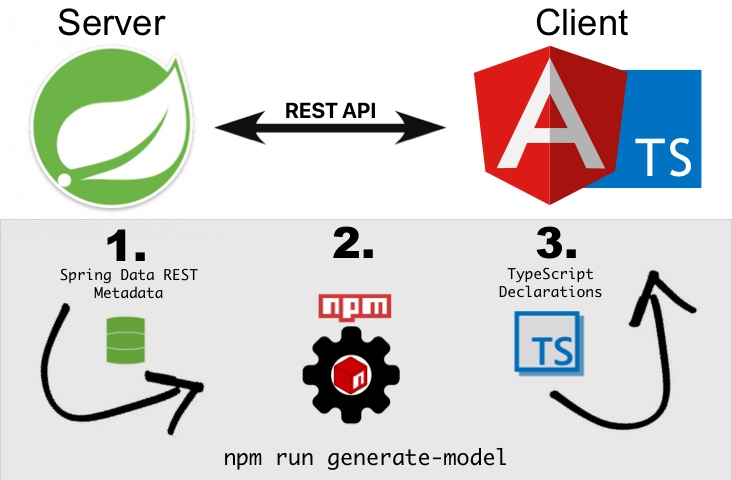

## Was möchten wir erreichen?
Mit Hilfe der Metadaten, die uns [Spring Data REST](https://projects.spring.io/spring-data-rest/) zur Verfügung stellt, können wir für unsere Web Clients automatisch Schema-Definitionen generieren. Somit sparen wir uns unnötige Aufwände durch die sonst notwendige doppelte Definition von Datenmodellen in Java und TypeScript. Dies reduziert weiterhin fehleranfälliges manuelles Aktualisieren dieser Definitionen. Durch ein von mir erstelles NPM Paket kann dieses Verfahren nun in jedes Projekt eingebunden werden.



## Warum macht dieser Ansatz Sinn?

Heutzutage ist es üblich, Web Anwendungen in Client und Server Komponenten aufzuteilen: Während der Server (oft auch _Back-end_ genannt) sich um das zugrundeliegende Datenmodell, Datenhaltung und den größten Teil der Business Logik kümmert, wird das User Interface und Verhalten, das den Nutzer betrifft, im Allgemeinen mit JavaScript, HTML und CSS auf dem Client (oft auch als _Front-end_ bezeichnet) realisiert, d.h. im Browser des Nutzers.

Häufig kommen dabei Frameworks wie [Angular](https://angular.io/) zum Einsatz, um die Entwicklung zu beschleunigen und Code besser lesbar und generell zugänglicher zu machen, z.B. indem eine standardisierte Struktur für Projekte vorgegeben und bestimmte Code Artefakte an bestimmte Stellen platziert werden, so dass Entwickler, die sich in einem Projekt noch nicht auskennen, sich dennoch schnell zurecht finden.

Die zwei Seiten einer solchen Web Anwendung kommunizieren typischerweise mittels **HTTP-basierter RESTful APIs**, die vom Server bereit gestellt werden. Diese klare Trennung zwischen Client und Server hat zahlreiche Vorteile, z.B.:

*   Flexibilität: Die Implementierung der Business Logik ist nicht an eine spezielle Technologie gebunden.
*   dynamischeres Verhalten der Anwendung beim Nutzer statt statisch generierter Seiten
*   Skalierbarkeit: Server und Client können unabhängig voneinander deployed werden. Außerdem läuft der Client auf dem Rechner des Nutzers und hat daher nicht notwendigerweise direkte Auswirkungen auf die Nutzung von Server Ressourcen.
*   Offline Fähigkeit: Selbst wenn der Server nicht erreichbar ist, kann die Anwendung weiterlaufen (siehe [Progressive Web Apps (PWAs)](https://en.wikipedia.org/wiki/Progressive_Web_Apps)) und sich wieder synchronisieren, sobald der Server wieder verfügbar ist.

Dennoch, wie bei fast jedem _design pattern_, bringt dies auch Nachteile mit sich. Einer davon ist, dass das clientseitige Datenmodell mit seinem serverseiigen Gegenstück synchron gehalten werden muss. Wenn man nicht dauerhaft darauf achtet, werden das Server und das Client Model mit der Zeit unvermeidlich divergieren, was die Software wiederum deutlich schwerer wartbar macht.

## Wie funktioniert das Paket?

Es gibt nun einige Ansätze, dieses Problem zu lösen, ohne dass man [diese Arbeit manuell machen muss](http://threevirtues.com/). Einer dieser Ansätze ist die Nutzung von [Swagger](https://swagger.io/) und / oder [OpenAPI](https://www.openapis.org/). Mit diesen Werkzeugen lassen sich APIs definieren und anschließend clientseitige SDKs mittels [Swagger Codegen](https://swagger.io/tools/swagger-codegen/) generieren, um auf APIs zuzugreifen, so dass man diese nicht selber programmieren muss.

Momentan bin ich in der Erstellung eines Workflow Tool involviert, das [Spring Data REST](https://projects.spring.io/spring-data-rest/) für die Bereitstellung von REST-Ressourcen und [Spring REST Docs](https://spring.io/projects/spring-restdocs) zur Dokumentierung dieser API nutzt (eine Aufgabe, die sonst oft ebenfalls an Swagger delegiert wird. Denn obwohl Swagger ein umfassendes Werkzeug zum Arbeiten mit APIs ist, ist dessen offensichtlichster und direktester Nutzen die Bereitstellung einer automatisch generierten, für Menschen lesbaren API Dokumentation). Was die Entwicklung des Clients angeht, werden für dieses Workflow Tool [Angular](https://angular.io/) und [TypeScript](https://www.typescriptlang.org/) verwendet.

Hier wäre also eine API Definition, aus der man einen TypeScript Client generieren könnte, sehr sinnvoll.

Daher dachte ich mir: "Spring REST Docs stellt ebenfalls eine maschinenlesbare API Definition zur Verfügung, weil es nicht allein zum Dokumentieren von APIs genutzt werden." Tatsächlich ist dies lediglich ein Nebenprodukt seines Hauptzwecks: Zugängliche Acceptance Tests für APIs zu schreiben, die gleicherma0en als API Definition und Dokumentation dienen.

Also recherchierte ich ein wenig und fragte ein wenig herum, konnte aber nicht wirklich etwas geeignetes finden. Etwas verwirrt, weil ich mir nicht vorstellen konnte, wirklich der einzige mit diesem Problem zu sein, fiel mir plötzlich auf, dass ich viel zu kompliziert gedacht hatte: Spring Data REST stellte bereits selbst Metadaten über APIs zur Verfügung, insbesondere über die verwendeten Datentypen!

Normalerweise geschieht diese in einem Format namens [Application-Level Profile Semantics (ALPS)](https://docs.spring.io/spring-data/rest/docs/current/reference/html/#metadata). Obwohl dieses Format sicherlich sinnvoll ist, eignet es sich nicht besonders, um in JavaScript (oder TypeScript wie im Falle von Angular) Applikationen verarbeitet zu werden.

Allerdings besteht alternativ die Möglichkeit, `application/schema+json` als `Accept` Header an Spring Data REST Endpoints zu senden, woraufhin diese [mit Metadaten in einem JSON Schema Format antworten](https://docs.spring.io/spring-data/rest/docs/current/reference/html/#metadata.json-schema).

[JSON Schema](http://json-schema.org/) wiederum lässt sich sehr gut zusammen mit Angular and TypeScript verwenden. Zum Beispiel gibt es Libraries, die [dynamisch Formulare aus mit JSON Schema definierten Datentypen generieren](https://github.com/json-schema-form/angular-schema-form).

Darüber hinaus gibt es [json-schema-to-typescript](https://github.com/bcherny/json-schema-to-typescript) von [Boris Cherny](https://github.com/bcherny), das beinahe das ist, wonach ich suchte. Diese Library nimmt JSON Schema Dateien entgegen und erstellt daraus [TypeScript Deklarationen](https://www.typescriptlang.org/docs/handbook/declaration-files/introduction.html).

Was allerdings noch fehlte, war eine Möglichkeit, nicht nur einfach eine einzelne JSON Datei - oder mehrere davon - einzulesen, sondern über alle REST API Endpoints zu iterieren, die vom Server per HTTP bereit gestellt werden und deren Metadaten dann jeweils zu verarbeiten.

Daher habe ich [ein npm Package mit dem Namen spring-data-rest-json-schema-to-typescript-definitions](https://www.npmjs.com/package/spring-data-rest-json-schema-to-typescript-definitions) erstellt, das dieses Problem in einer wiederverwendbaren Weise löst.

## Benutzung des Paketes

### Paket via NPM installieren

`npm install spring-data-rest-json-schema-to-typescript-definitions --save-dev`

### package.json erweitern

In eurer `package.json` könnt ihr das script nach der Installation wie folgt einbinden.
In diesem Beispiel habe ich es unter dem Namen `generate-model` angelegt.

```json
{
  ...
  "scripts": {
    ...
    "generate-model": "node node_modules/spring-data-rest-json-schema-to-typescript-definitions/dist/index.js http://localhost:8080 ./src/app/generated-model"
    ...
  },
  ...
}

```

Die `index.js` nimmt hierbei zwei Argumente entgegen:

1. Die URL eures API Endpoints der genutzt werden soll, um die Metadaten abzufragen.
Hierbei hängt das Script `/profile` an die URL und ruft die [Spring Data Metadaten](https://docs.spring.io/spring-data/rest/docs/current/reference/html/#metadata.json-schema) ab.

2. Der Ordner in den die TypeScript Decleations geschrieben werden sollen.


### Ausführen

Habt ihr das nach eur spezifischen Projektkonfiguration angepasst, könnt ihr mit folgendem Befehl die Declarations erstellen und aktuallisieren.

`npm run generate-model`

## Fazit

Dies wird hoffentlich anderen - mein zukünftiges Ich inklusive - ermöglichen, darauf in ihren Angular (bzw. generell TypeScript-basierten) Applikationen darauf aufzubauen.
TypeScript Declarations auf diese Weise zu generieren, sollte dabei helfen, Datenmodelle zwischen Client und Server synchron zu halten und damit die Software Qualität insgesamt zu verbessern.


Weitere Informationen finden sich im [spring-data-rest-json-schema-to-typescript-definitions GitHub Repository](https://github.com/BjoernKW/spring-data-rest-json-schema-to-typescript-definitions), sowie [der Projekt Dokumentation](https://bjoernkw.github.io/spring-data-rest-json-schema-to-typescript-definitions/).
