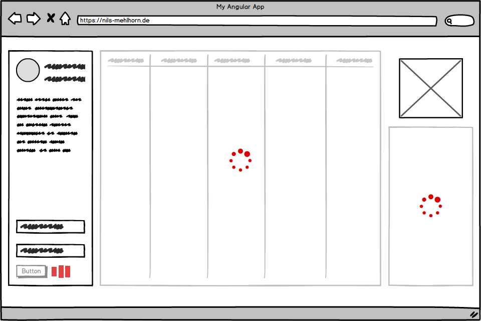

Es ist eine Standardanforderung: eine Ladeanzeige soll den Nutzer unterhalten, während er darauf wartet, dass der Server Daten bereitstellt. Auch wenn man schnell einen Spinner von [CodePen](https://codepen.io/search/pens?q=spinner) oder [Angular Material](https://material.angular.io/components/progress-spinner/overview) eingebunden hat, mag es doch ein paar Unklarheiten geben, wenn man diesen nun zum richtigen Zeitpunkt in Angular anzeigen möchte - das ändern wir mit diesem Artikel!

> Die RxJS-Operatoren `indicate` und `prepare`, welche in diesem Artiekl entwickelt werden, sind in der Bibliothek [ngx-operators](https://github.com/nilsmehlhorn/ngx-operators) erhältlich. Ich freue mich über jeden Stern auf GitHub, denn das hilft anderen Entwicklern die Bibliothek zu finden.

## Ladeanzeige für Daten

Fangen wir mit einem häufig vorkommenden Fall an: wir wollen eine Liste von Nutzern darstellen, welche asynchron von einem Service bereitgestellt wird. Eine einfache, aber technisch einwandfreie Lösung könnte wie folgt aussehen:

``` typescript
export class UserComponent implements OnInit  {

  users: User[]
  loading = false

  constructor(private userService: UserService) {}

  ngOnInit(): void {
    this.loading = true
    this.userService.getAll().pipe(
      finalize(() => this.loading = false)
    ).subscribe(users => this.users = users)
  }
}
```

Hier wird die Instanzvariable `users` verwendet um die Nutzer vorzuhalten, während das Flag `loading` anzeigt, ob wir noch auf die Nutzerdaten warten oder diese bereits angekommen sind. Bevor wir subscriben - und damit den asynchronen Aufruf über den Service starten - aktualisieren wir das Flag. Nachdem der Aufruf abgeschlossen ist, setzen wir es mithilfe des RxJS-Operators [finalize](https://rxjs-dev.firebaseapp.com/api/operators/finalize) zurück. Der Callback den wir an diesen Operator geben wird aufgerufen, sobald das zugrundeliegende Observable abgeschlossen ist - unabhängig von dessen Ergebnis. Wenn wir hier hingegen nur mit dem ersten Callback von `subscribe` gearbeitet hätten, würde das Lade-Flag im Fehlerfall nicht zurückgesetzt werden.

Eine dazugehöriges View-Template könnte wie folgt aussehen:

``` html
<ul *ngIf="!loading">
  <li *ngFor="let user of users">
    {{ user.name }}
  </li>
</ul>
<loading-indicator *ngIf="loading"></loading-indicator>
```

Nun kann unsere Komponente für die meisten Aufrufe, welche auf diese Art Daten direkt in der View darstellen, mithilfe der [AsyncPipe](https://v17.angular.io/api/common/AsyncPipe) wie folgt vereinfacht werden:

``` typescript
export class UserComponent implements OnInit  {

  users$: Observable<User[]>

  constructor(private userService: UserService) {}

  ngOnInit(): void {
    this.users$ = this.userService.getAll()
  }
}
```

Die Komponente stellt dann direkt ein RxJS-Observable `users$` für die View bereit. Dort binden wir die Nutzer aus diesem Datenstrom mit der `async as` Syntax an eine Template-Variable `users`:
``` html
<ul *ngIf="users$ | async as users; else indicator">
  <li *ngFor="let user of users">
    {{ user.name }}
  </li>
</ul>
<ng-template #indicator>
  <loading-indicator></loading-indicator>
</ng-template>
```
Indem wir die Template-Referenz `indicator` über das `else` Schlüsselwort an die `*ngIf` Directive geben, sparen wir uns das manuelle Pflegen eines Lade-Flags. Dieser Ansatz ist deklarativer und verbindet beide View-Zustände mittels if-else-Beziehung anstatt, dass wir zwei separate if-Blöcke haben. Außerdem müssen wir uns nicht mehr selber um die Subscription kümmern - die AsyncPipe räumt diese mit der Komponente ordnungsgemäß auf.

## Ladeanzeige für Aktionen


Wenn wir Aktionen wie das Erstellen eines Nutzers beim Klick auf einen Button durchführen möchten, kommen wir mit der AsyncPipe nicht weiter. Hier müssen wir immer noch in der Komponente manuell subscriben, da wir meist keine sinnvolle Möglichkeit haben, das resultierende Observable an die View zu binden.

Zunächst sei gesagt, dass es völlig in Ordnung ist, hier wieder auf den Ansatz mit dem Lade-Flag zurückzugreifen - auch wenn manche anderes behaupten mögen. Lasst euch nicht vorzeitig auf unnötige Optimierungen ein nur um ein bisschen Redundanz zu vermeiden. Häufig ist es wichtiger, dass Code einfach zu verstehen, zu testen und auch zu [löschen](https://programmingisterrible.com/post/139222674273/write-code-that-is-easy-to-delete-not-easy-to) ist.

Um den angesprochenen Use-Case umzusetzen, wäre folgendes also durchaus machbar:
``` html
<button (click)="create()">Create User</button>
<div *ngIf="loading">
  Creating, please wait <loading-indicator></loading-indicator>
</div>
```
``` typescript
export class UserComponent  {

  loading = false

  constructor(private userService: UserService) {}

  create(name = "John Doe"): void {
    this.loading = true
    this.userService.create(new User(name)).pipe(
      finalize(() => this.loading = false)
    ).subscribe()
  }
}
```

Aber lasst uns schauen, was wir machen können, wenn uns die zwei Zeilen zum expliziten Ändern des Lade-Flags dann doch noch zu viel in jeder Komponente sind.

### Ansatz mit HTTP Interceptor

Häufig wird empfohlen einen [HttpInterceptor](https://v17.angular.io/api/common/http/HttpInterceptor) zu verwenden um nachzuhalten, ob irgendwelche HTTP-Aufrufe aktuell verarbeitet werden. Ein solcher Interceptor könnte wie folgt aussehen:

``` typescript
@Injectable()
export class LoadingInterceptor implements HttpInterceptor {
  constructor(private loadingService: LoadingService) {}

  intercept(req: HttpRequest<any>, next: HttpHandler): Observable<HttpEvent<any>> {
    // hier könnte man auch noch auf eine bestimmte HTTP-Methode testen
    this.loadingService.attach(req);
    return next.handle(req).pipe(
      finalize(() => this.loadingService.detach(req)),
    );
  }
}
```
Mit dieser Implementierung wird ein separater LoadingService mittels `attach(req)` benachrichtigt, sobald ein HTTP-Aufruf beginnt. Die Methode `detach(req)` informiert den Service schließlich über die Beendigung des Aufrufs - dank `finalize()` wieder unabhängig vom Ergebnis. Nach jedem Aufruf könnte der Service dann prüfen ob noch irgendwelche Anfragen ausstehen und so ein **globales** Lade-Flag verwalten.

Auch wenn der Nutzer mit diesem Ansatz eine grobe Indikation darüber bekommt, ob die Anwendung gerade lädt, muss man sich die folgenden Aspekte vor Augen führen:

1. **Man verliert Genauigkeit**. Da wir nun kein Lade-Flag pro HTTP-Aufruf haben, sondern nur ein globales, können wir später nicht mehr genau wissen, was gerade lädt. Auch wenn wir den LoadingService in irgendeine unserer Komponete injizieren um eine lokale Ladeanzeige darzustellen, bleibt die Information die wir eigentlich haben auf einen globalen Anwendungslevel. Es wäre einfach semantisch falsch einen globalen Indikator für eine einzelne lokale Anfrage anzuzeigen.

2. **Was soll der Nutzer mit einer globale Ladeanzeige machen?** Deaktivieren wir _alles_ während _irgendwas_ in der Anwendung noch lädt? Soll der Nutzer warten bis die globale Ladeanzeige fertig ist? Was ist, wenn eine Anfrage, die gerade nichts mit dem Use-Case des Nutzers zutun hat, hängt?

3. **Wir sind komisch verdrahtet**. Erst gehen wir hin und verstecken alle HTTP-Aufrufe hinter einem Service um Logik und Ansicht voneinander zu trennen, nur um uns dann doch selbst zu hintergehen indem wir alles von HTTP-Anfragen abhängig machen.

### Globale vs. kontextbezogene Ladeanzeige

Wenn dir die Nachteile des Ansatzes mit HTTP Interceptor passen, kannst du ihn für eine globale Ladeanzeige wie etwa ein Fortschrittsleiste am oberen Bildschirmrand verwenden - siehe erste Abbildung.


Ein paar Mainstream-Anwendungen machen das, es sieht ganz fancy aus und es gibt [Tutorials](https://www.freakyjolly.com/http-global-loader-progress-bar-using-angular-interceptors/) und [Bibliotheken](https://github.com/aitboudad/ngx-loading-bar) mit denen man dieses Verhalten gut umsetzen kann.

Wenn wir dem Nutzer aber genau sagen wollen, worauf er gerade wartet oder sogar bestimmte Interaktionen deaktivieren möchten (siehe zweite Abbildung), müssen wir uns was anderes überlegen.



Es ist wichtig den Unterschied zu verstehen. Ansonsten zeigt man vielleicht fälschlicherweise an, dass eine Formular-Interaktion (bspw. unten link in der Abbildung) lädt, obwohl ein anderer Aufruf (bspw. das Widget ganz rechts) eigentlich für den Indikator verantwortlich ist.

## Reaktiver Ansatz mit RxJS

Um eine kontextbezogene Ladeanzeige umzusetzen ohne explizit ein Lade-Flag zu verwalten, können wir RxJS-Operatoren verwenden. Seit RxJS 6 ist es leicht möglich seine [eigenen Operatoren](https://rxjs-dev.firebaseapp.com/guide/operators) in Form von puren Funktionen zu definieren. Zuerst erstellen wir einen Operator der ein Callback aufruft, sobald auf ein Observable `subscribe` aufgefrufen wird. Das geht mit der RxJS-Methode [defer](https://rxjs-dev.firebaseapp.com/api/index/function/defer):

``` typescript
export function prepare<T>(callback: () => void): (source: Observable<T>) => Observable<T> {
  return (source: Observable<T>): Observable<T> => defer(() => {
    callback();
    return source;
  });
}
```

Dann erstellen wir einen weiteren Operator, welcher ein [RxJS-Subject](https://rxjs-dev.firebaseapp.com/api/index/class/Subject) als Senke für den Lade-Zustand entgegennimmt. Mithilfe unseres neuen perpare-Operators aktualisieren wir dieses Subject sobald das eigentliche Observable abonniert wird via `indicator.next(true)`. Genauso nutzen wir den finalize-Operator um den Lade-Zustand mit `indicator.next(false)` wieder zurückzusetzen, wenn das Observable abgeschlossen ist.
``` typescript
export function indicate<T>(indicator: Subject<boolean>): (source: Observable<T>) => Observable<T> {
  return (source: Observable<T>): Observable<T> => source.pipe(
    prepare(() => indicator.next(true)),
    finalize(() => indicator.next(false))
  )
}
```

Dann können wir den indicate-Operator in unserer Komponente wie folgt verwenden:

``` typescript
export class UserComponent  {
  loading$ = new Subject<boolean>()

  constructor(private userService: UserService) {}

  create(name = "John Doe"): void {
    this.userService.create(new User(name))
    .pipe(indicate(this.loading$))
    .subscribe()
  }
}
```
``` html
<button (click)="create()">Create User</button>
<div *ngIf="loading$ | async">
  Creating, please wait <loading-indicator></loading-indicator>
</div>
```

Ich habe die Code-Snippets in ein vollständiges [Beispiel auf StackBlitz](https://stackblitz.com/edit/ng-loading-indication) zusammengestellt - klick auf 'Run Project' um die Ladenindikatoren zu sehen. Lass dich nicht von den blauen Indikatoren von StackBlitz irritieren, unsere sind rot.

<iframe
style="width: 100%; height: 450px"
src="https://stackblitz.com/edit/ng-loading-indication?ctl=1&embed=1&file=src/app/app.component.ts&view=preview">
</iframe>


Du möchtest den Artikel lieber in Englisch lesen? Das kannst du hier tun:
<https://nils-mehlhorn.de/posts/indicating-loading-the-right-way-in-angular>
