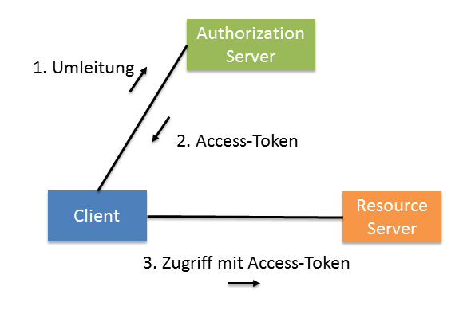
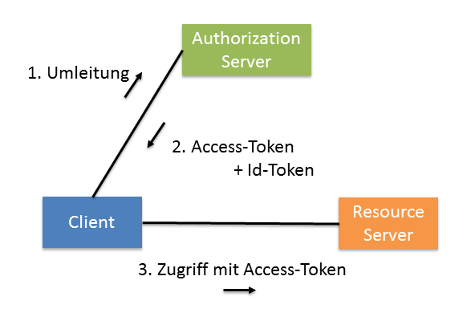

Die wenigsten Geschäftsanwendungen kommen ohne Authentifizierung und Autorisierung aus. Häufig müssen bestehende Identity-Lösungen wie Active Directory oder LDAP-Systeme integriert werden, um Single-Sign-on zu ermöglichen. In modernen Web-Anwendungen muss der Client auch das Recht erhalten, im Namen des angemeldeten Benutzers auf Services zuzugreifen. All diese Anforderungen lassen sich elegant mit Security-Tokens lösen.

Dieser Artikel zeigt, wie Token-basierte Sicherheit in einer Angular-Anwendung genutzt werden kann. Dazu kommen die populären Standards OAuth 2 und OpenId Connect  sowie die Bibliothek [angular-oauth2-oidc](https://www.npmjs.com/package/angular-oauth2-oidc) zum Einsatz. Das verwendete Beispiel findet sich [hier](https://github.com/manfredsteyer/oauth2-oidc-demo)

## OAuth 2 und OpenId Connect

Wer sich heutzutage mit Token-basierter Sicherheit beschäftigt, kommt wohl kaum an den beiden populären Standards [OAuth 2](https://oauth.net/2/) und [OpenId Connect](http://openid.net/connect/) vorbei. Sie beschreiben unter anderem, wie sich ein Benutzer bei einem verteilten System anmelden kann und wie ein Client das Recht erhält, im Namen des Benutzers Services zu konsumieren. Dazu kommt, dass diese Standards direkt auf HTTPS aufsetzen und sich somit wunderbar für leichtgewichtige Web API eignen.

### OAuth 2

Die erste Version von OAuth wurde 2006 von Twitter und Ma.gnolia entwickelt. Das Ziel war es, Benutzern die Möglichkeit zu geben, einen Teil ihrer Rechte an einen Client weiterzugeben, ohne das eigene Passwort mit ihm zu teilen. Somit können zum Beispiel Anwendungen das Recht erhalten, im Namen des Benutzers Services aufzurufen.

Mittlerweile wird OAuth bzw. dessen Nachfolger OAuth 2 von Größen wie Google, Facebook, Flickr, Microsoft, Salesforce.com oder Yahoo! eingesetzt. Dabei fällt auf, dass es zunehmend nicht nur zum Delegieren von Rechten (Autorisierung) sondern auch für Single-Sign-On-Szenarien (Authentifizierung) eingesetzt wird. So können sich Benutzer zum Beispiel mit ihrem Google-Konto auch bei anderen Weblösungen anmelden. In diesem Fall erhält die betroffene Weblösung das Recht, auf die Profildaten des angemeldeten Google-Benutzers zuzugreifen. Auch andere der zuvor aufgeführten Unternehmen bieten diese Möglichkeit.

Hierzu leitet der Client den Benutzer zur Anmeldung zu einem sogenannten Authorization Server weiter:



Dieser Server hat Zugriff auf zentrale Benutzerkonten. Hat sich der Benutzer dort angemeldet, erhält der Client ein sogenanntes Access-Token, das ihm im Namen des Benutzers Zugriff auf Services im Backend – sogenannte Ressource Server – gibt.

Ein Access-Token informiert den Resource Server unter anderem über den entsprechenden Benutzer sowie über die Rechte, die der Client im Namen des Benutzers wahrnehmen darf. Zusätzlich finden sich im Token meist auch Metadaten, wie der Aussteller, das Ausstellungsdatum oder die Gültigkeitsdauer.

Diese vom Prinzip her einfache Vorgehensweise hat mehrere Vorteile:

- Jeder Benutzer kann ein zentrales Benutzerkonto für verschiedene Clients und Services nutzen
- Da die Anmeldung beim Authorization Server erfolgt, bekommt der Client das Passwort nicht in die Hand.
- Die Authentifizierung ist vom Client entkoppelt und lässt sich somit in bestehende Identity-Lösungen integrieren
- Tokens erhöhen die Flexibilität. Beispielsweise könnte ein Service das Token an einen weiteren Service weiterreichen, um zu beweisen, dass er im Namen des Benutzers agiert. Zum Zugriff auf anderen Sicherheits-Domänen kann der Service das Token auch gegen eines für diese Domäne tauschen.
- Die Lösung kommt ohne Cookies aus. Somit kann der Client auch auf Services, die auf anderen Servern laufen (bzw. eine andere Origin haben), zugreifen. Zusätzlich schränkt der Verzicht auf Cookies bestimmte Angriffe ein.

Das Format des Access-Tokens sowie die Maßnahmen, die der Resource Server zum Validieren des Tokens unternimmt, sind von OAuth 2 nicht näher beschriebene Implementierungsdetails. Häufig kommen digitale Signaturen zum Einsatz, damit der Ressource Server einfach prüfen kann, ob das Token von einem vertrauenswürdigen Authorization Server stammt. Alternativ dazu könnte das Token auch nur aus einer nicht vorhersehbaren Id bestehen, mit der der Ressource Server sich nochmals an den Authorization Server wendet.

### Benutzer mit OpenId Connect authentifizieren

Als Ergänzung zu OAuth 2 definiert OpenId Connect (OIDC) unter anderem, wie der Client Informationen über den Benutzer bekommen kann. Diesen Aspekt deckt OAuth 2 nicht ab, denn selbst das ausgestellte Access Token muss für den Client nicht lesbar sein. Dazu spezifiziert OIDC unter anderem ein sogenanntes Id-Token, das der Client zusätzlich zum Access-Token erhalten kann. Während das Access-Token zum Zugriff auf das Backend bestimmt ist, kann der Client aus dem Id-Token direkt Informationen über den Benutzer entnehmen (Abbildung 2).




Im Gegensatz zu Access-Tokens bei OAuth 2 ist der Aufbau von Id-Tokens vorgegeben. Es handelt sich dabei immer um ein JSON Web Token (JWT), welches signiert und/oder verschlüsselt sein kann. Zusätzlich definiert OIDC einen sogenannten Userinfo Endpunkt. Dabei handelt es sich um einen Service, der dem Client weitere Informationen zum aktuellen Benutzer preis gibt, sofern dieser das erhaltene Access-Token vorweisen kann.

### JSON Web Token

Beim durch OpenID Connect beschriebenen Identitäts-Token handelt es sich um ein JSON Web Token (JWT). Ein JWT beinhaltet unter anderem ein JSON-basiertes Objekt mit Claims. Dabei handelt es sich um Name/Wert-Paare, die ein Subjekt beschreiben, zum Beispiel einen Benutzer. Daneben existieren Claims, die Informationen über das Token selbst liefern, darunter den Zeitraum, indem das Token gültig ist, oder die Audience des Tokens. Dieses Claims-Set kann der Aussteller signieren und/oder verschlüsseln. Nachfolgend findet sich ein Beispiel für ein signiertes JWT. Es besteht aus drei BASE64-codierten Abschnitten, die durch einen Punkt zu trennen sind. Zur besseren Lesbarkeit wurden in diesem Listing Zeilenumbrüche eingefügt und der zweite und dritte Teil unter Verwendung von Auslassungszeichen abgekürzt.

```
eyJ0eXAiOiJKV1QiLCJhbGciOiJSUzI1NiJ9
.
eyJuYmYiOjEz[...]BlbmlkIn0
.
Nt5pBRqGvDFn[...]1205awFjw
```

Der erste Teil beinhaltet ein JSON-Objekt, welches den Header des JWT repräsentiert, der zweite Teil das Claims-Set und der dritte Teil die Signatur. Der Header des betrachteten JWT gestaltet sich wie folgt:

```json
{"typ":"JWT","alg":"RS256"}
```

Interessant ist hierbei die Eigenschaft ``alg``, die den Algorithmus, der zur Erstellung der Signatur verwendet wurde, widerspiegelt. RS256 bedeutet, dass der Aussteller aus dem zu signierenden Claims-Set mit SHA-256 einen Hash-Wert errechnet und für diesen anschließend mit RSA eine digitale Signatur erstellt hat. Da es sich bei RSA um ein asymmetrisches Verfahren handelt, hat der Aussteller zum signieren einen privaten Schlüssel verwendet. Ob die Signatur korrekt ist, kann nun jeder mit dem dazu passenden öffentlichen Schlüssel prüfen.

Das nachfolgende Listing zeigt das Claims-Set, welches sich im zweiten Teil des JWT befindet:

```json
{
    "nbf":1388357979,
    "exp":1388444379,
    "aud":[
        "http://service",
        "http://partner-authsvc",
        "http://myClient"],
    "iss":"http://authsvc",
    "sub":"3ca4ccc8",
    "name":"Manfred Steyer",
    "role":"Manager",
    "company":"ACME"
}
```

Die Claims ``nbf`` (Not Before) und ``exp`` (Expiration Time), die einen UNIX-Timestamp (Sekunden seit 1. 1. 1970, 0 Uhr GMT) beinhalten, geben die Zeitspanne an, in der das Token gültig ist. Die Audience des Tokens findet sich im Claim ``aud``. Es handelt sich dabei um ein JSON-Array mit den einzelnen Parteien, für die das Token ausgestellt wurde. Wird ein JWT nur für eine Partei ausgestellt, kann dieses Claim auch nur aus einem String mit dem Bezeichner dieser Partei bestehen. Der Aussteller des Tokens findet sich im Claim ``iss`` (Issuer) wieder und das Claim ``sub`` repräsentiert das Subjekt, welches durch das vorliegende Claims-Set beschrieben wird. Im betrachteten Fall handelt es sich hierbei um eine Benutzer-ID. Die restlichen Claims beinhalten den Namen (``name``), die Firma (``company``) und die Rolle (``role``) des beschriebenen Benutzers. Die ersten fünf Claims müssen laut dem zur Drucklegung dieses Buches gültigen Draft zu OpenID Connect im JWT vorkommen.

Während sich Aussteller und Konsumenten von Claims bilateral auf die zu verwendenden Claim-Namen einigen können, macht es Sinn, zu prüfen, ob es für den gewünschten Zweck bereits offiziell definierte Namen gibt, um Kollisionen sowie Missverständnisse zu vermeiden. Eine gute erste Anlaufstelle dafür ist die [OpenID Connect-Spezifikation](http://openid.net/connect). Darüber hinaus kann der Aussteller auch öffentliche Bezeichner, zum Beispiel URLs, als Namen für Claims heranziehen.

### Protokoll-Flüsse (Flows)

Für verschiedene Anwendungsfälle definieren OAuth 2 und OIDC sogenannte Flows. Diese legen fest, welche Nachrichten auszutauschen sind, damit der Client die erwähnten Tokens erhält. Das aktuelle [Best Current Practice Dokument](https://tools.ietf.org/html/draft-ietf-oauth-security-topics-13) der OAuth-Working-Group empfiehlt den sogenannten Authorization Code Flow in Kombination mit dem Verfahren [PKCE](https://oauth.net/2/pkce/) für Single Page Applications. Darauf ist auch bei der Konfiguration des gewählten Authorization Servers zu achten.

Wer sich für die Protokoll-Details dieses Flows interessiert, wird in der [OAuth 2 Spezifikation](https://oauth.net/2/) fündig. Dieser Artikel nutzt zur Automatisierung der damit einhergehenden Details die Bibliothek [angular-oauth2-oidc](https://www.npmjs.com/package/angular-oauth2-oidc), sodass man sich damit nicht belasten muss.


### Umsetzung in Angular

Die Bibliothek [angular-oauth2-oidc](https://www.npmjs.com/package/angular-oauth2-oidc) erfreut sich einer weiten Verbreitung und wurde mit mehreren verschiedenen Authorization Servern getestet, um sicherzustellen, dass keine Überanpassung an einen bestimmten Hersteller stattfindet. Dabei handelt es sich um den [IdentityServer](https://identityserver.io/) für .NET, [Keycloak](https://www.keycloak.org/) von RedHat und der Cloud-Lösung [Auth0](https://auth0.com/). Außerdem ist sie von der [OpenId Connect Foundation](https://openid.net/foundation/) zertifiziert, was zu weiterem Vertrauen führt.

Die nachfolgenden Ausführungen nutzen eine Identity-Server-Instanz, die ich zu Testzwecken in der Azure-Cloud betreibe.

Nach der Installation mit npm (``npm install angular-oauth2-oidc``) lässt sie sich in das Hauptmodul einer Angular-Anwendung importieren:

```typescript
@NgModule({
  imports: [
    BrowserModule,
    HttpClientModule,
    OAuthModule.forRoot({
      resourceServer: {
        sendAccessToken: true,
        allowedUrls: ['http://www.angular.at/api/']
      }
    }),
  ],
  […]
})
export class AppModule {}
```

Der Parameter ``sendAccessToken`` gibt an, dass die Bibliothek das abgerufene Access-Token bei jedem mit Angular durchgeführten HTTP-Anfrage anhängen soll. Dazu kommt intern ein ``HttpInterceptor`` zum Einsatz. Damit das Token nicht aus Versehen an die falschen APIs gesendet werden, müssen jene, die es erhalten dürfen, im Array ``allowedUrls`` eingetragen werden. Hierzu reicht das Hinterlegen eines Präfixes. Im betrachteten Fall erhalten alle APIs, deren URLs mit ``http://www.angular.at/api/`` beginnen, das Token.

An dieser Stelle soll betont werden, dass die hier betrachteten Mechanismen nur bei Einsatz von HTTPS als sicher angesehen werden können. Aus Gründen der Vereinfachung kommt bei dem hier gezeigten Beispiel, das lediglich der Veranschaulichung dient, lediglich HTTP zum Einsatz.

Um der Bibliothek Eckdaten wie die URL des Authorization Servers mitzuteilen, ist ein Konfigurationsobjekt anzulegen.

```typescript
import { AuthConfig } from 'angular-oauth2-oidc';

export const authConfig: AuthConfig = {

  // Url des Authorization-Servers
  issuer: 'http://idsvr4.azurewebsites.net',

  // Url der Angular-Anwendung
  // An diese URL sendet der Authorization-Server den Access Code
  redirectUri: window.location.origin + '/index.html',

  // Name der Angular-Anwendung
  clientId: 'spa',

  // Rechte des Benutzers, die die Angular-Anwendung wahrnehmen möchte
  scope: 'openid profile email offline_access api',

  // Code Flow (PKCE ist standardmäßig bei Nutzung von Code Flow aktiviert)
  responseType: 'code'

}
```

Die ``redirectUri`` und die ``clientId`` müssen gemeinsam beim Authorization-Server hinterlegt sein. Existiert für diese Kombination kein Eintrag, muss der Authorization-Server die Anfrage aus Sicherheitsgründen ablehnen. Ansonsten könnte ein Angreifer vorgeben, ein bestimmter Client zu sein.

Die Scopes ``openid``, ``profile`` und ``email`` sind durch OIDC definiert und beschrieben die Informationen, die die Anwendung über den Benutzer bekommen möchte. Im einfachsten Fall wird nur ``openid`` angefordert. Das hätte zur Folge, dass die Anwendung lediglich die Id des Benutzers erhält. Hinter ``profile`` verbergen sich Profilinformationen wie Vorname oder Nachname und hinter ``email`` – wenig überraschend – die Email-Adresse des Benutzers, aber auch die Tatsache, ob diese bereits durch eine Test-Email verifiziert wurde.

Der Scope ``offline_access`` gibt an, dass die Anwendung ein Refresh-Token haben möchte. Damit lässt sich ein neues Access Token anfordern, wenn das bestehende abgelaufen ist. Aus Sicherheitsgründen sind Access Tokens in der Regel kurzlebig - eine Lebensdauer von lediglich 10 bis 20 Minuten ist keine Seltenheit.

Bei ``api`` handelt es sich hingegen um einen benutzerspezifischen Scope. Im betrachteten Fall gibt er an, dass der Client im Namen des Benutzers auf die Demo-API zugreifen darf. In der Regel gibt es pro API solch einen Scope, wobei sich diese auch auf (Teile von) Use-Cases herunterbrechen oder zu übergeordneten Scopes aggregieren lassen.

Laut OAuth 2 müssen Benutzer diesen Scopes ihre Zustimmung erteilen. Somit könnten sie festlegen, dass ein Client doch nicht in ihrem Namen auf eine bestimmte API zugreifen dürfen oder ihre Email-Adresse erhält. Alle gewährten Scopes finden sich im Access-Token wieder und der Ressource-Server kann so prüfen, welche Rechte der Benutzer dem Client delegiert hat.

Während ein solches explizites Zustimmen bei Consumer-Anwendungen wichtig ist, gestaltet es sich bei Geschäftsanwendungen häufig als lästig. Deswegen erlauben viele Produkte, diesen sogenannten _Consent_ zu überspringen. In diesem Fall gehen sie davon aus, dass alle Scopes bestätigt wurden.

Wichtig ist an dieser Stelle auch, dass die Scopes nicht die Rechte des Benutzers widerspiegeln, sondern nur jene Rechte, die der Benutzer der Anwendung überträgt.

Damit die Bibliothek das Konfigurations-Objekt verwendet, ist es beim Programmstart zu übergeben:

```typescript
@Component({ … })
export class AppComponent {

  constructor(private oauthService: OAuthService) {
    oauthService.configure(authConfig);
    oauthService.loadDiscoveryDocumentAndTryLogin();
    oauthService.setupAutomaticSilentRefresh();
  }

}
```

Die Methode ``loadDiscoveryDocumentAndTryLogin`` lädt weitere Konfigurationsdaten vom Authorization Server. Dieses als Discovery bekannte Verfahren ist durch OIDC standardisiert. Danach prüft diese Methode, ob sich bereits ein Access-Code in der Url befindet. In diesem Fall versucht sie, den Flow abzuschließen, was im Erfolgsfall zum Erhalt der diskutierten Tokens führt.

Mit ``setupAutomaticSilentRefresh`` gibt die Anwendung an, dass die Token automatisch zu erneuern sind. Danach wird es sehr geradlinig. Die Methode ``initLoginFlow`` beginnt mit dem Code-Flow und leitet den Benutzer zu Authorization-Server um:

```typescript
this.oauthService.initLoginFlow();
```

Mit der Methode ``logOut`` lässt sich der Benutzer hingegen wieder abmelden:

```typescript
this.oauthService.logOut();
```

Das bedeutet, dass zum einen die Tokens verworfen werden, aber auch, dass durch eine Umleitung der Benutzer beim Authorization-Server abgemeldet wird.

Die Methode ``getIdentityClaims`` liefert Key/Value-Pairs, die den Benutzer beschreiben:

```typescript
const claims = this.oauthService.getIdentityClaims();
if (!claims) return null;
return claims['given_name'];
```

Um die Funktionsweise zu prüfen, reichtes, nach dem Anmelden die Claims zu beziehen sowie einen HTTP-Service aufzurufen. Im letzteren Fall sollte die Bibliothek das Access-Token über den HTTP-Header Authorization übersenden.

## Fazit

OAuth 2 ist ein etablierter Industriestandard zum Anfordern von Tokens, die einem Client im Namen des Benutzers Zugriff auf das Backend gewähren. OpenId Connect baut darauf auf und versorgt den Client mit Informationen über den Benutzer.

Durch den Einsatz von Token ergeben sich einige Vorteile: Der Benutzer kann sich mit einem zentralen Konto bei mehreren Anwendungen anmelden und die Anwendung muss sich nicht um das Verwalten eigener Konten kümmern. Im Gegensatz zum Einsatz von Cookies können verschiedene Origins zum Einsatz kommen und XSRF Attacken sind ausgeschlossen.

---
Manfred Steyer ist Trainer und Berater mit Fokus auf Angular sowie Google Developer Expert und Trusted Collaborator im Angular-Team. Er schreibt für O’Reilly, das deutsche Java-Magazin und Heise Developer. Unter https://angulararchitects.io bietet er Angular Schulungen und Beratung im gesamten deutschsprachigen Raum an.
