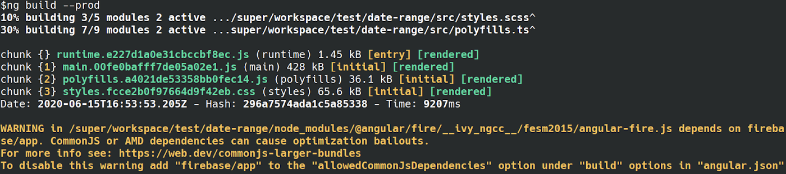
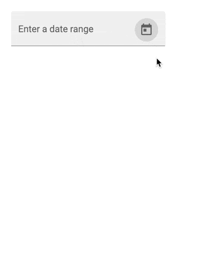
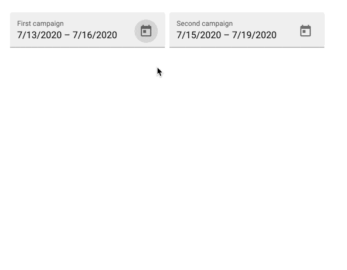

Gerade einmal vier Monate nach Erscheinen von Angular 9 wurde am 24 Juli Angular 10 veröffentlicht.

Das jüngste Release wartet mit vielen Bug-Fixes, Feinjustierungen und ein paar nützlichen Neuerungen auf.

## Die Aufräumarbeiten sind im vollen Gange

Mit Angular 10 wurden über 700 Issues auf GitHub geschlossen. Insgesamt hat das Das Angular-Team über 2.000 Issues bearbeitet. Diese Arbeit soll mit hoher Intensität fortgesetzt werden.

## Angular CLI

### Solution-Style tsconfig.json

Für Code-Editoren wie VS Code oder WebStorm ist es schon immer eine Herausforderung die `*.ts`-Dateien der richtigen Konfiguration zuzuordnen. Im einfachsten Fall gilt es die `tsconfig.app.json` und die `tsconfig.spec.json` zu unterscheiden.

In Zeiten von Libraries, E2E-Tests,  Node-Backends und Monorepos wächst die Zahl der Compiler-Einstellungsdateien und damit auch das Problem, dass es hin und wieder zu verwirrenden Anzeigen im Code-Editor kommt, weil die falsche `tsconfig.***.json` zu Grunde gelegt wird.

Durch das Update auf [TypeScript 3.9](https://www.typescriptlang.org/docs/handbook/release-notes/typescript-3-9.html) wird dieses Problem adressiert. Angular 10 setzt nun die *Solution-Style tsconfig.json* ein.

Diese Datei dient als Referenz für TS-Projekte die im Repository unterschieden werden. Der jeweilige Editor kann damit die Konfiguration aus dem Root-Level des Projekts lesen und gezielt auf die TypeScript-Sourcen anwenden.

```json
{
    "files": [],
    "references": [
        { "path": "./tsconfig.shared.json" },
        { "path": "./tsconfig.frontend.json" },
        { "path": "./tsconfig.backend.json" },
    ]
}
```

**tsconfig.json**

- Die Solution-Style-tsconfig.json ist wirklich nur für das Referenzieren anderen TS-Projekte gedacht. Compiler-Einstellungen sollten ausgelagert sein.

### Warnung: CommonJS

Geschwindigkeit und Reduktion der Bundle-Size sind zentrale Eigenschaften, die mit jeder Angular Version verbessert werden.

Die Angular CLI warnt nun vor der Nutzung von JavaScript-Bibliotheken, die als CommonJS-Bundle verpackt sind.

Der Grund ist schnell erklärt CommonJS-Pakete können durch Tree-Shaking-Algorithmen nur schwer optimieren.

- Tree-Shaking entfernt JavaScript-Code, der nicht verwendet wird, wodurch die Bundle-Size reduziert wird.



Bildquelle: [https://blog.angular.io/version-10-of-angular-now-available-78960babd41](https://blog.angular.io/version-10-of-angular-now-available-78960babd41){:rel="noopener noreferrer nofollow"}

### Mit dem neuen Strict Mode mehr Typsicherheit und Kontrolle über die JS-Bundles

Zugegeben, zu mehr Typsicherheit konnte sich jedes Team bereits manuell verhelfen, wenn es die `tsconfig.json` anpasst. Allerdings musste man vorher um die Feinheiten der TypeScript-Compiler-Einstellungen wissen.

Die Angular CLI wartet in Version 10 mit einem neuen Schalter auf, der das striktere Setup automatisch anlegt.

```bash
ng new next-app --strict
```

Der Einsatz von `--strict` bewirkt folgende Einstellungen in der TypeScript-Konfiguration.

```json
{
  "compilerOptions": {
    "forceConsistentCasingInFileNames": true,
    "strict": true,
    "noImplicitReturns": true,
    "noFallthroughCasesInSwitch": true,
    ...
  }
}
```

- ℹ️ Eine detaillierte Erläuterung zu den Compiler-Optionen von TypeScript gibt es [hier](https://www.typescriptlang.org/docs/handbook/compiler-options.html){:rel="noopener noreferrer nofollow"}.

Darüber hinaus bewirkt Angulars `strict-mode` , dass in der `angular.json` die Maximalgröße der Bundles stark reduziert wird.

Damit soll unter anderem erreicht werden, dass der initiale Ladevorgang so kurz wie möglich ist. Außerdem wird überwacht, dass die Styles einzelner Komponenten nicht zu groß werden.

```diff
"budgets": [
  {
     "type": "initial",
+    "maximumWarning": "500kb",
+    "maximumError": "1mb"
-    "maximumWarning": "2mb",
-    "maximumError": "5mb"
   },
   {
     "type": "anyComponentStyle",
+    "maximumWarning": "2kb",
+    "maximumError": "4kb"
-    "maximumWarning": "6kb",
-    "maximumError": "10kb"
   }
 ]
```

- ℹ️ Eine genaue Beschreibung für die einstellbaren Budgets gibt es [hier](https://web.dev/articles/performance-budgets-with-the-angular-cli). Jeffrey Bosch hat einen [prägnanten Artikel](https://dev.to/jefiozie/a-new-type-of-angular-budget-on-the-block-4l8) geschrieben, der auf den `anyComponentStyle` eingeht.

## Standardeinstellung für unterstützte Browser wurde verschlankt

Die Angular CLI nutzt die in `.browserslist` angegebenen Einstellungen, um unterstützte Browser des Projekts zu identifizieren, um daraufhin notwendige Polyfills oder ES5-Bundles zu generieren.

Die standardmäßig unterstützten Browser wurden reduziert.

```diff
chrome 84
edge 84
edge 83
firefox 78
firefox 68
ios_saf 13.4-13.5
ios_saf 13.3
ios_saf 13.2
ios_saf 13.0-13.1
ios_saf 12.2-12.4
ios_saf 12.0-12.1
safari 13.1
safari 13
safari 12.1
safari 12
- and_chr 84
- and_ff 68
- and_qq 10.4
- and_uc 12.12
- android 81
- baidu 7.12
- edge 18
- ie 11
- kaios 2.5
- op_mini all
- op_mob 46
- opera 69
- opera 68
- samsung 12.0
- samsung 11.1-11.2
```

**.browserlistrc**

Aber keine Sorge, wenn ältere Browser unterstützt werden sollen können diese nachwievor in der `.browserslist` konfiguriert werden.

Ferner liefert Angular keine ES5 Bundles mehr aus. Dadurch reduziert sich der Download von npm um über 100MB. Wenn im Build ES5 als Target angegeben wird, werden die ES5 Bundles on-the-fly generiert.

- Das Angular-Team hat darüber hinaus nach zahlreichen Interviews mit der Community beschlossen den Support für Internet Explorer 9, 10 & Mobile in Zukunft auslaufen zu lassen. Ein genauer Termin ist noch nicht bekannt.

## Angular Material erhält den Date Range Picker

Angular Material 10 stattet den [DatePicker](https://material.angular.io/components/datepicker/overview#date-range-selection) mit einer neuen Funktion aus. Es ist nun möglich einen Zeitraum zu selektieren.

Das Angular Team hat eine Demo auf [StackBlitz](https://run.stackblitz.com/api/angular/v1?file=src%2Fapp%2Fdate-range-picker-overview-example.ts) bereit gestellt.



Außerdem können Überlappungen mehrere Zeiträume out-of-the-box visualisiert werden ([StackBlitz - Comparison Ranges](https://stackblitz.com/angular/gxqprxpnxbj?file=src%2Fapp%2Fdate-range-picker-comparison-example.ts)).



## So gelingt die Migration zu Angular 10

Für viele Projekte kann die Migration automatisch durch die Angular CLI durchgeführt werden.

Darüber hinaus steht auf [https://angular.dev/update-guide](https://angular.dev/update-guide) eine komplette Beschreibung zur Verfügung, die alle Anpassungen diskutiert.

Das Update kann wie folgt von der Konsole aus angestoßen werden.

```bash
ng update @angular/core @angular/cli
```

Je nachdem, wie viele Abhängigkeiten das jeweilige Projekt hat, können Bibliotheken, die keinen offiziellen Support für Angular 10 haben, ignoriert werden. Dafür gibt es den Parameter `--force`. Ein weiterer, nützlicher Schalter heißt `--create-commits` , der jeden Migrationsschritt mit einem Git-Commit versieht und damit den ganzen Prozess protokolliert.

```bash
ng update @angular/core @angular/cli --force --create-commits
```

Das Update auf Angular 10 aktualisiert übrigens auch TypeScript, TSLint und tslib.

- TypeScript [](https://www.typescriptlang.org/docs/handbook/release-notes/typescript-3-9.html)v[3.9](https://www.typescriptlang.org/docs/handbook/release-notes/typescript-3-9.html)
- TSLib v[2.0](https://github.com/microsoft/tslib/releases/tag/2.0.0){:rel="noopener noreferrer nofollow"}
- TSLint v[6](https://github.com/palantir/tslint/blob/master/CHANGELOG.md){:rel="noopener noreferrer nofollow"}

## Fazit

In Angular 10 wurde vieles Aufgeräumt. Es ist spürbar, dass das Performance und Stabilität an erster Stelle stehen. Viel Neues gibt es zwar nicht. Dennoch bestätigt das Angular Team immer mehr, dass die Versions-Updates mit immer weniger Aufwand vollzogen werden können.

In Angular Material wird mit der Zeitraumselektion ein großer Wunsch der Community erfüllt.

Zum Ende bleibt zu sagen: Wir sind schon sehr gespannt auf Angular 11!

## Ressourcen

[Version 10 of Angular Now Available](https://blog.angular.io/version-10-of-angular-now-available-78960babd41){:rel="noopener noreferrer nofollow"}

[Angular 10 erschienen - das sind die Neuerungen auf einen Blick](https://entwickler.de/online/javascript/angular-10-579937743.html){:rel="noopener noreferrer nofollow"}

[What's new in Angular 10](https://www.infoworld.com/article/3537449/whats-new-in-angular-10.html){:rel="noopener noreferrer nofollow"}

[What is New in Angular 10?](https://volosoft.com/blog/what-is-new-in-angular-10){:rel="noopener noreferrer nofollow"}
