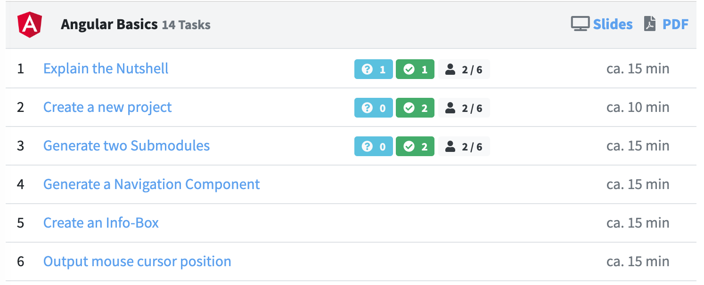
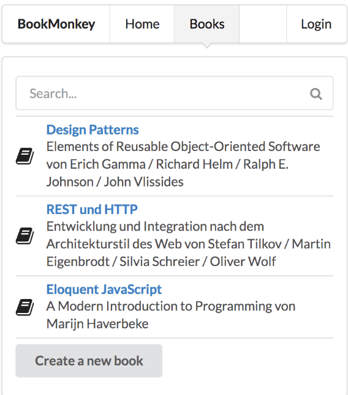
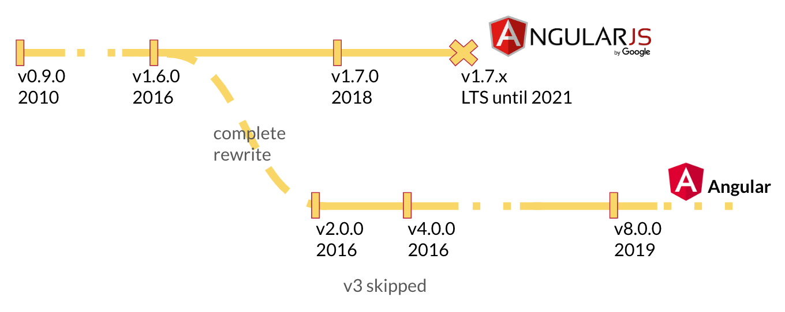
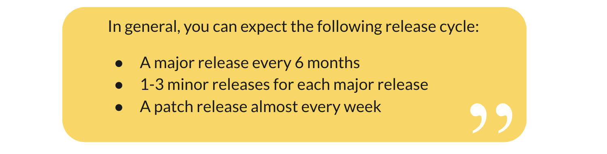
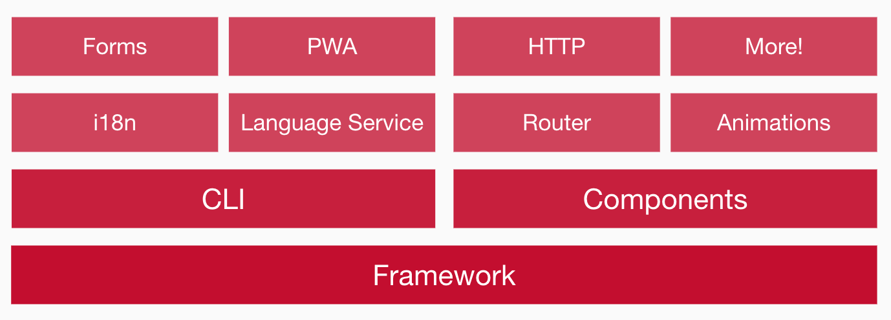
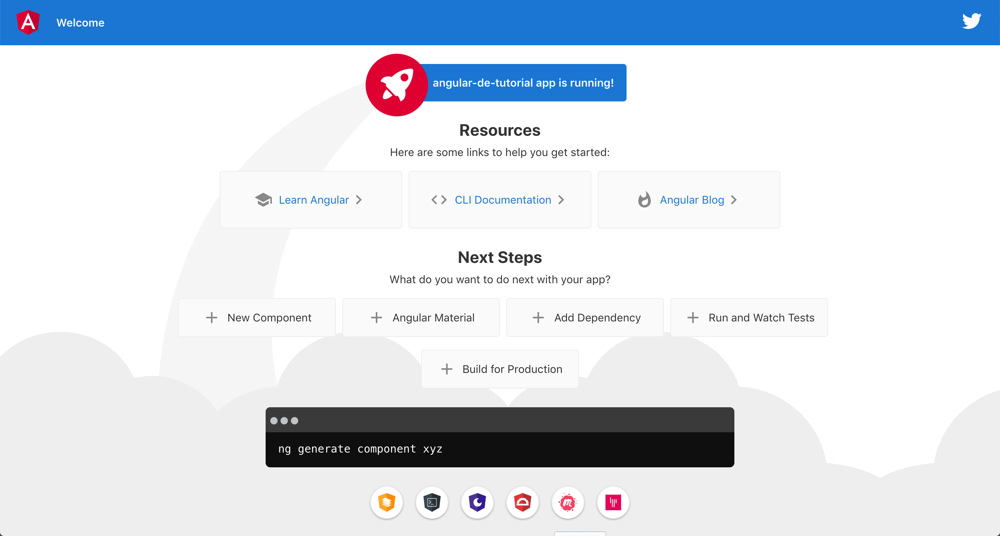
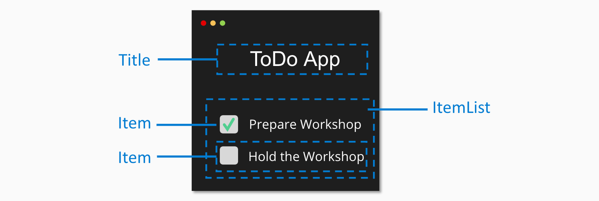
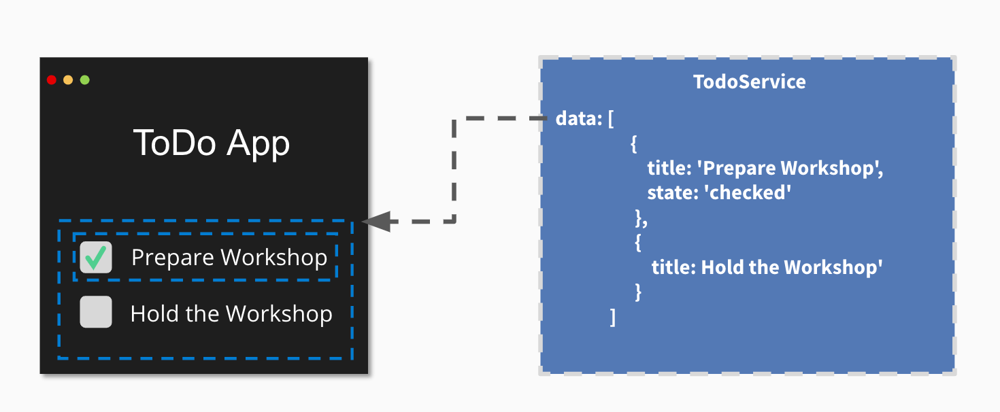
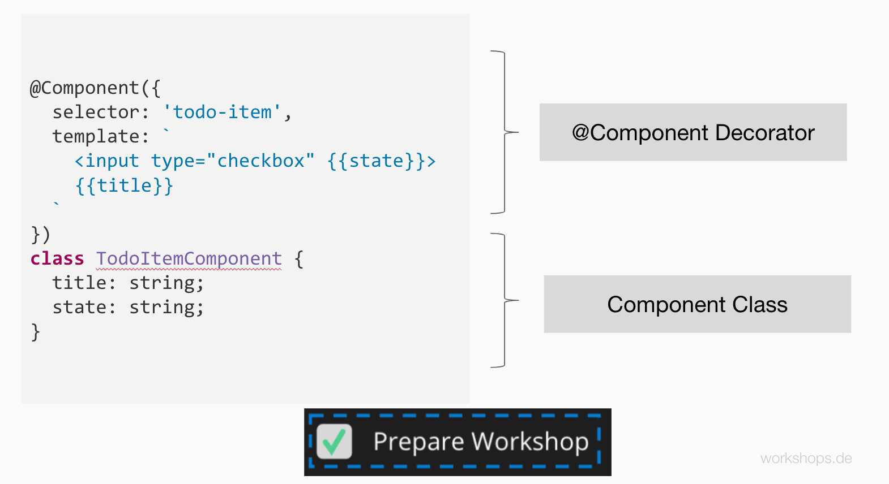
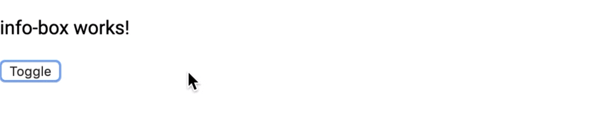

## Einführung

Dieses Tutorial erklärt euch die Grundlagen des Frameworks Angular. Wir behandeln hierbei Angular in der Version 2 und höher. Bewusst wird hierbei aber die Versionsnummer weggelassen, da das Framework nun semantische Versionierung benutzt. Kurz gesagt: Es ist einfach Angular.

Diese Einführung ist für Anfänger gedacht, die gerade mit Angular beginnen. Das Beispiel orientiert sich an den ersten Aufgaben unserer Workshop-Inhalten der [Angular Intensiv Schulung](https://workshops.de/seminare-schulungen-kurse/angular-typescript).

Unsere Didaktik behandelt dabei die Motivation, die Theorie und dann den Praxis-Teil. Ihr könnt hierbei alle Aufgaben selber Programmieren und über unseren Workshops.DE Classroom Hilfestsellungen und Musterlösungen für die Aufgaben erhalten.



Den Quellcode für das Tutorial findet ihr in unsererem GitHub-Repository: <a href="https://github.com/angularjs-de/angular2-tutorial" title="Tutorial Quellcode" target="_blank"><strong>Tutorial Quellcode</strong></a>

### Was wirst du in diesem Tutorial lernen?
Dieses Tutorial zeigt die die Grundlegenden Bestandteile einer Angular Anwendung anhand eines praktisches Beispiels welches du selber implementieren oder fertige Musterlösungen nutzen und verändern kannst.

Wir werden hierbei folgende Themen behandeln:
* Was ist Angular
* Unterschiede zu React und Vue
* Installation von Angular
* Komponenten
* Expressions und Schleifen
* Event & Property-Binding
* Services
* Dependency-Injection
* Anbinden einer Rest-API

Wir werden hierbei die Motivation und den Theoretischen Background kurz einleiten uns jedoch primär auf Praktische Beispiele konzentrieren. Wir werden eine kleine Anwendung bauen welche uns eine Liste von Daten von einer REST-API ausliest und diese anzeigt.

<p class="text-center">
 
</p>

<div class="alert alert-success">Dieser Artikel und unser Portal ist open-source. Wenn ihr Vorschläge zur Verbesserung des Artikels habt, fühlt euch jederzeit herzlich willkommen euch über unser <a href="https://github.com/workshops-de/angular.de" target="_blank">GitHub Repo</a> zu beteiligen. Wir freuen uns über jeden Input! </div>

## Was ist Angular?
Angular ist ein sehr erfolgreiches clientseitiges JavaScript-Web-Framework zur Erstellung von Single-Page-Webanwendungen. Es reiht sich neben den anderen großen Frameworks für Single Page Applications ein. Wobei das nicht ganz stimmt, da Angular sich mittlerweile sogar eher zur Plattform weiterentwickelt hat. Es beinhaltet neben der reinen "API" um Anwendungen zu entwickeln mittlerweile auch Entwicklungs-Werkzeuge, Generatoren und mitgelieferte Architektur-Konzepte. Eine Ready-to-Rock Lösung um Enterprise-Anwendungen zu entwickeln. Es reiht sich ein neben den beiden anderen erfolgreichen Frontend Frameworks [React](https://reactjs.de) und [VueJS](https://vuejs.de).


### Unterschiede zu Vue und React
Alle drei Bibliotheken bzw Frameworks haben ihre Daseinsberechtigung, Stärken und Schwächen. Je nach Use-Case sollte hier entschieden werden, welche der Alternativen die beste Basis für das aktuelle Projekt liefert.

**Angular** zielt hierbei ganz klar auf die professionelle Entwicklung von Enterprise Software. Durch klare Vorgaben in Struktur und den Einsatz von Generatoren können langfristig wartbare und skalierbare Softwarelösungen erstellt werden. Konzepte wie Dependency Injection und ein Fokus auf TDD sind seit der ersten Stunde von Angular im Core verankert. Durch die klare Struktur von Projekten ist hierbei explizit die Skalierbarkeit von neuen Entwickler:innen hervorzuheben. Durch dieses Massive Grundgerüst wirkt Angular auf den ersten Blick oft etwas schwergewichtig - überzeugt jedoch in Production durch systematische Optimierungen und Erweiterbarkeit.

**ReactJS** zielt hierbei eher auf einen sehr minimalen Layer auf Komponenten-Ebene und ermöglicht/erfordert das Konzipieren einer eigenen Architektur von Grund auf. Dies bietet sehr flexible Möglichkeiten für individuelle Problemstellungen sehr explizite Lösungen zu bauen. Es gibt eine Auswahl an verschiedensten Modulen für die verschiedene Anforderungen. Der Aufwand der Integration und Pflege ist hier höher als in Angular, allerdings ist das Projekt dadurch oftmals auch simpler und sehr leichtgewichtig.

**VueJS** bedient die Anforderungen zwischen diesen beiden Frameworks. Indem das Framework auf einen Generator und klare Strukturen setzt begünstigt es ebenfalls die Skalierung von Projekt-Teams. Allerdings versucht Vue gleichzeitig sehr leichtgewichtig zu bleiben und möglichst wenig "Framework-Magic" einzubringen. Es ist also die simple aber strukturiere Mittellösung.

Dies ist meine persönliche Einschätzung und ich habe bereits sehr gut mit allen dieser Frameworks gearbeitet. Es kommt individuell auf die Problemstellung und das Team an. Falls ihr gerade Neu im Bereich Web seid kann ich euch auch sehr unseren [Moderne Webentwicklung und Frontend-Architekur Kurs](https://workshops.de/seminare-schulungen-kurse/frontend-architektur) empfehlen, welcher euch einen Überblick in die moderne Webentwicklung von heute aufzeigt.


### Motivation
Angular selbst hat die Ursprünge in 2009, im "wilden Westen" der Web Anwendungsentwicklung. Seitdem ist viel passiert - keine Angst, ich werde jetzt hier keine Geschichtsstunde starten. Es geht eher um den Punkt: In der wilden Welt von JavaScript Frameworks wo gefühlt jeden Tag 10 neue Frameworks raus kommmen ... wie konnte sich Angular sich auch seit über 10 Jahren noch als eines der erfolgreichsten Frameworks beweisen?
Dies lässt sich wahrscheinlich am einfachsten mit der Mission von Angular beschreiben:

* Apps that users ❤️ to use.
* Apps that developers ❤️ to build.
* A community where everyone feels welcome.

Durch diese Mission ist ein wunderbares Ökosystem mit einer wahnsinnig tollen Community entstanden.
Neben diesen ist aber der Fokus auf Qualität und Enterprise ebenfalls klar zu spüren.
Google selber selbst nutzt nach eigenen Angaben Angular in über 1600 Projekten ein.
(Google Teams nutzen übrigens AUCH React und VueJS für Projekte wo dieser Stack besser passt).

In 2016 hat sich das Angular-Team für ein kompletten Rewrite in TypeScript entschieden.
Damals wurde die Entscheidung größtenteils negativ wahrgenommen und von anderen Framework Benutzern zerrissen.




Heute sehen wir die Weitsicht dieser Entscheidungen, da mittlerweile viele andere Frameworks ebenfalls auf TypeScript setzen. Um Breaking Changes einfacher kommunizieren zu können hat sich das Team ebenfalls für ein fixen Release Plan entschieden. So können Projektteams Budgets für Updates bereits im Voraus einplanen und werden nicht von Breaking-Changes in einem Release "überrascht".



### Die Angular Platform

Das Ökosystem von Angular ist sehr groß. Die Basis bildet hierbei das Core-Framework. Hier sind die fundamentalen Konzepte implementiert die für moderne Web-Anwendungen essentiell sind. Zwei weitere Core-Konzepte die jedoch als separat nutzbar sind ist die Angular-CLI und das die Verwaltung von Komponenten. Diese bilden die Kernfunktionalitäten ab welche in fast jeder Anwendung benötigt werden. Weitere Module lassen sich *optional einbinden* falls ihr diese benötigt:

* Routing - Routing für Single Page Applications
* forms - Formulare und Validierung
* i18n - Mehrsprachige Anwendungen
* Animations - Animationen für Transitionen
* PWA - Offline Fähigkeiten
* HTTP - HTTP, Rest und GraphQL Kommunikation
* und viele mehr



In diesem Tutorial werden wir uns primär um das Framework, die Angular CLI und Komponenten kümmern.

## Vorbereitung & Installation

Beginnen wir nun mit der Installation von NodeJS.
NodeJS ist die sogenannte "JavaScript Runtime" und dafür zuständig Programme auf unserem Rechner auszuführen welche in der Sprache JavaScript geschrieben sind wie z.B. das Command-Line-Interface von Angular welches wir gleich nutzen werden.

Ihr könnt NodeJS über folgenden Link herrunterladen und installieren: [https://nodejs.org/download/](https://nodejs.org/download/)

Mit NodeJS wird ebenfalls das Kommandozeilenwerkzeug `npm` installiert, welches uns ermöglicht weitere NodeJS Pakete auf unserem Rechner zu installieren.

<div class="alert alert-info">Hinweis: Falls ihr spezielle Proxy Einstellungen benötigt könnt ihr diese in der <a href="https://docs.npmjs.com/misc/config#https-proxy" target="_blank">NPM Dokumentation für HTTPS Proxies</a> nachlesen.</div>

Nachdem ihr die Installation erfolgreich abgeschlossen habt, könnt ihr nun über euren Terminal folgenden Befehl ausführen:

   npm i -g @angular/cli bookmonkey-api

Dieser Befehl installiert die `Angular-CLI` global auf eurem Rechner und ermöglicht euch somit nach der Installation mit dem Kommandozeilenwerkzeug `ng` zu arbeiten. Als zweites Paket wird das Paket `bookmonkey-api` installiert, welches uns als simulierter Backend-Server in unserem Beispiel dient.

<div class="alert alert-success">👨‍💻👩‍💻Jetzt selber nachbauen im Classroom Task: <a href="#" target="_blank">Install Chrome, Node & IDE</a></div>

## Generieren der Angular App

Die Angular-CLI wird genutzt um neue Strukturen innerhalb unser Anwendungen zu generieren, anstatt wie oft in Projekten die Basis-Strukturen zu kopieren und über potentielle Fehler bei der Umbenennung zu stolpern. Es ist ein mächtiges Werkzeug welches euch mit `ng  --help` eine ausführlichen Hilfetext anbietet.

Um unsere erste Anwendung zu generieren verwenden wir den `new` command welcher als Argument den Namen eurer Anwendung entgegennimmt. Hierbei werdet ihr gefragt ob ihr das `Routing Module` installieren wollt: Ja. Weiterhin welches Stylesheet Format ihr nutzen wollt: Hierbei wählt ihr bitte SCSS.

```bash
$ ng new angular-de-tutorial

? Would you like to add Angular routing? No
? Which stylesheet format would you like to use? SCSS
```

Nun werden automatisch die Projektstrukturen für euch angelegt. Dies inkludiert eine Startseite, eine Komponente, die ersten End2End Tests, Linter-Regeln, GitIgnore-Regeln und eine TypeScript Konfiguration.

```bash
CREATE angular-de-tutorial/angular.json (3671 bytes)
CREATE angular-de-tutorial/package.json (1296 bytes)
CREATE angular-de-tutorial/README.md (1034 bytes)
CREATE angular-de-tutorial/tsconfig.json (543 bytes)
CREATE angular-de-tutorial/tslint.json (1953 bytes)
...
CREATE angular-de-tutorial/e2e/tsconfig.json (214 bytes)
CREATE angular-de-tutorial/e2e/src/app.e2e-spec.ts (652 bytes)
CREATE angular-de-tutorial/e2e/src/app.po.ts (301 bytes)
```

Nach dem Generieren werden ebenfalls notwendige Pakete via `npm` installiert. Dies kann durchaus einige Minuten dauern. Ist die Installation abgeschlossen könnt ihr die Entwicklungsumgebung starten.

```bash
$ cd angular-de-tutorial
$ ng serve

Angular Live Development Server is listening on localhost:4200
```

Eure Basisanwendung ist nun generiert und kann im Browser unter http://localhost:4200 aufgerufen werden. Ihr solltet ein ähnliches Bild wie folgendes sehen:



<div class="alert alert-success">👨‍💻👩‍💻 Jetzt selber nachbauen im Classroom Task: <a href="#" target="_blank">Create a new project</a></div>

## Komponenten und Services

In Angular gibt es zwei primäre Bestandteile des Frameworks mit welchen wir uns zuerst auseinander setzen.

**Komponenten** sind Anzeigeelemente. Sie werden als eigene HTML-Elemente definiert. Abhängig der definierten Anzeige-Logik und den aktuktellen Daten stellen diese Elemente den Zustand der Anwendung dar.

**Services** sind unabhängig von der Anzeige eurer Anwendung. Sie definieren Daten, Logik und Algorithmen der Anwendung. Sie sind modular und wiederverwendbar.

### Komponenten

Angular Komponenten sind die sogenannten "building blocks" jeder Anwendung. Die verschiedenen logischen  Bausteiner einer Anwendung werden also in Komponenten aufgeteilt. Jeder dieser Komponenten übernimmt dabei eine bestimmte Funktion und wird als eigenes HTML-Element definiert.



```html
<todo-title>ToDo App</todo-title>
<todo-list>
 <todo-item state="checked">Prepare Workshop</todo-item>
 <todo-item>Hold the Workshop</todo-item>
</todo-list>

```

<div class="alert alert-info">Hinweis: Diese Darstellung ist noch nicht 100% korrekt und dient in vereinfachter Form der schrittweisen Erklärung. 🙂</div>

Wie ihr in diesem kleinen Beispiel einer ToDo-Liste seht, gibt es für die verschiedenen Bereiche eigene Elemente die in diesem Fall mit dem Prefix `todo-` eingeleitet werden. Wie ihr gut an der `todo-list` erkennt ist es möglich und auch absolut üblich eigene Komponenten ineinander zu verschachteln. Ziel ist es immer wiederverwendbare und wartbare Elemente zu bauen. Ws hierbei die richtige Komponentengröße ist werdet ihr in euren Projekten selber entscheiden müssen und mit wachsender Erfahrungen ein immer besseres Gefühl dafür bekommen. Bei Unsicherheit könnt ihr euch aber auch jederzeit in unserem [Slack](https://workshops.de/slack) bei uns melden.


### Services

Für Daten und Logik die nicht zwingend nur an eine Komponente gekoppelt ist werden in Angular Services genutzt. Ein Service ist eine Klasse welche Attribute und Methoden definiert welche von Komponenten und anderen Services genutzt werden können.



```typescript
export class TodoService {
 data = [
         {
           title: 'Prepare Workshop',
           state: 'checked'
         },
         {
           title: 'Hold the Workshop'
         }
       ];
}
```

Die eigentlichen Daten werden also aus einem Service referenziert, denn ggf werden auf Basis der aktuellen Todos auch noch andere Komponenten angezeigt wie z.B. eine Komponente welche  die aktuell offenen Todos zählt.

Als erste Übersicht soll dies an dieser Stelle reichen. Wir werden uns später Services noch einmal genauer ansehen.


## Die erste Komponente

Wenn wir uns nun die Komponenten-Definition anschauen kommen wir das erste mal mit [TypeScript](https://typescript.org) in Berührung. TypeScript ist eine Erweiterung von JavaScript welche uns die Möglichkeit bietet die Daten unserer Anwendung explizit zu typisieren. Weiterhin führt diese Meta-Sprache auch Features ein die es in JavaScript (noch) nicht gibt wie `Decorators`. TypeScript "transpiled" unseren geschriebenen Quellcode, sodass der Browser nachher wieder ganz normales JavaScript sieht und interpretieren kann. Es ist also ein Feature welches uns als Entwickler:innen die tägliche Arbeit angenehmer macht.

> **Klassen** wurden in ES2015 eingeführt, um Konzepte wie unter anderem Vererbung und Konstruktoren nicht mehr über Prototypen abbilden zu müssen. Diese können nun über eine einfache und saubere Syntax erstellt werden.

> **Decorator** sind strukturierte Metadaten einer Klasse. Ihr kennt diese vielleicht aus anderen Programmiersprachen wie z.B. Java. Das eigentliche fachliche Verhalten der Komponente bilden wir innerhalb der Klasse mit Methoden ab.

Eine Komponenten-Definition besteht primär aus folgenden Bestandteilen:


* Einem **Component-Decorator** welcher die Komponente innerhalb von Angular bekannt macht.
* Einer **Selektor** welcher das HTML-Element beschreibt welches wir erzeugen
* Einem **HTML-Template** welches die Darstellung unserer Komponente definiert
* Einer **Klasse** welche das Interface und die Anzeige-Logik der Komponente beschreibt.



Unsere erste Komponente wird eine statische Infobox sein. Um diese zu generieren nutzen wir wieder die Angular-CLI.
Ihr könnt hierzu ein neuen Terminal öffnen oder den laufenden `ng serve` kurzzeitig stoppen.
Der Serve-Prozess erkannt aber automatisch Veränderungen innerhalb eures Quellcode und kompiliert die jeweils aktuelle Version ihrer Anwendung in wenigen Sekunden.
Ich würde euch also empfehlen einen zweiten Terminal zu öffnen und folgenden Befehl zu benutzen.

```bash
$ ng generate component info-box
CREATE src/app/info-box/info-box.component.scss (0 bytes)
CREATE src/app/info-box/info-box.component.html (23 bytes)
CREATE src/app/info-box/info-box.component.spec.ts (636 bytes)
CREATE src/app/info-box/info-box.component.ts (277 bytes)
UPDATE src/app/app.module.ts (0 bytes)
```

Die für uns aktuell relevanten Dateien sind zur Zeit die `info-box.component.ts` und unser Template `info-box.component.html`. Schauen wir uns zunächst einmal unsere Klasse an.

``` typescript
@Component({
 selector: 'app-info-box',
 templateUrl: './info-box.component.html',
 styleUrls: ['./info-box.component.scss']
})
export class InfoBoxComponent implements OnInit {

 constructor() { }

 ngOnInit() {
 }

}
```

Hier sehen wir wie erwartet eine Komponente. Unser Selektor hat den automatischen Prefix `app-` bekommen. Somit ist unsere neue Komponente nun unter dem HTML-Tag `<app-info-box></app-info-box>` nutzbar. Der Einstiegspunkt unser kompletten Anwendung ist ebenfalls eine Komponente mit dem Namen `AppComponent`.
Um unsere frisch generierte Komponente anzuzeigen, müssen wir diese in dem Template unser Anwendung aufrufen. Hierzu geht ihr in die Datei `app.component.html`, löscht dort den kompletten derzeitigen Inhalt und fügt eure Komponente via HTML-Tag ein.

```html
<app-info-box></app-info-box>
```

Wenn ihr nun eure Anwendung wieder im Browser öffnet solltet ihr die Ausgabe `info-box works!` sehen.
Ihr könnt an dieser Stelle gerne mit eurem Template in `info-box.component.html` etwas herumspielen und auch mehrere dieser Info-Boxen erzeugen, indem ihr den HTML-Tag in eurem App-Template einfach kopiert.
Ein historischer Moment, nehmt euch ein paar Sekunden eure erste eigene Komponente zu bewundern. 😉

## Expressions
Eine rein statische Komponente ist natürlich nur sehr begrenzt in einer Anwendung nutzbar.
Um variable Daten anzuzeigen nutzt Angular sogenannte Expressions in den Templates.
Diese werden mit doppelten geschweiften Klammern eingeleitet und auch wieder geschlossen.

   {{ expression }}

Eine Expression wird von Angular dynamisch auf basis der aktuellen Properties eurer Klasse ausgewertet.
Führen wir also eine ein neues Property `text` ein und füllen dieses mit eine String, können wir diesen in unserem Template ausgeben.

```typescript
class InfoBoxComponent implements OnInit {
 text = 'Additional Info-Text on our Info Box! 🎊';

 constructor() { }

 ngOnInit() {
 }

}
```

```html
 <p>info-box works!</p>
 <p>{{text}}</p>
```


Sollte sich die Property `text` ändern z.B. durch externe Events wird diese automatisch von Angular aktualisiert. Dieses Konzept nennt sich `Data-Binding`.

## Property- & Event-Bindings

Andere Komponenten können über sogenannte Property- und Event-Bindings eingebunden werden.
Angular verbindet sich hierbei mit den Eigenschaften und Events der nativen HTML-Elemente,
somit ist auch das Benutzen von anderen Elementen aus Frameworks wie ReactJS oder VueJS einfach möglich.

Um auf eine Properties von Elementen zuzugreifen nutzen wir die eckigen Klammern innerhalb unseres HTML Templates. Möchten wir also z.B. die [HTMLElement.hidden Property](https://developer.mozilla.org/en-US/docs/Web/API/HTMLElement/hidden) einer Komponente beeinflussen können wir das wie folgt erreichen:

```html
<p [hidden]="'true'">{{text}}</p>
```

Hier wird die Eigenschaft `hidden` des Elements auf `'true'` gesetzt und somit das Element ausgeblendet.
Um diese Eigenschaft dynamisch zu ändern, haben wir die Möglichkeit in unser Klasse selbst eine neue Property einzuführen und diese per `Property-Binding` an die Property des p-Elements zu binden.
Hierzu setzen wir statt dem string `'true'` den Namen des Attributes in unserer Klasse auf das Binding:


```typescript
class InfoBoxComponent implements OnInit {
 text = 'Additional Info-Text on our Info Box! 🎊';
 hidden = true;

 constructor() { }

 ngOnInit() {
 }

}
```

```html
 <p>info-box works!</p>
 <p [hidden]="hidden">{{text}}</p>
```

Um die Komponente nun durch User-Interaktion zu ändern, haben wie die Möglichkeit auf sogenannte `Events` zu hören und hierfür ebenfalls ein `Event-Binding` zu definieren.
Event-Bindings werden in Angular über Runde Klammern definiert welche den Namen des Events enthalten.
Wenn wir nun also auf das [click Event](https://developer.mozilla.org/en-US/docs/Web/API/Element/click_event) eines eines HTML-Elements hören wollen können wir das wie folgt erreichen.

   <button (click)="">

Innerhalb dieser Definition haben wir nun die Möglichkeit ein sogenanntes `Template-Statement` zu definieren. Dies kann sowohl eine `Template-Expression` sein welche z.B. direkt Änderungen an Attributen eurer Klasse macht oder eine Referenz auf eine Methode in eurer Klasse.
Um es einfach zu halten nutzen wir in diesem Fall erstmal eine `Template-Expression` welche den Wert von `hidden` jeweils negiert. Also aus `true` wird `false` und andersherum.


```html
 <p>info-box works!</p>
 <button (click)="hidden=!hidden">
 <p [hidden]="true">{{text}}</p>
```



Wir können natürlich auch jedes andere Event wie z.B. `keyup` benutzen. Mit diesem sehr simplen Mechanismus können wir generisch alle Arten von Komponenten benutzen und mit ihnen interagieren. Dies ist das unabhängig davon, ob sie in Angular oder einem anderem Framework geschrieben sind.

<div class="alert alert-success">👨‍💻👩‍💻Jetzt selber nachbauen im Classroom Task: <a href="#" target="_blank">Create Info Box</a>. </div>

## Schleifen mit *ngFor

```html
<ul>
    <li *ngFor="let book of books">
        <span>{{book.title}}</span> - <small>{{book.subtitle}}</small>
    </li>
</ul>
```

```typescript
books = [
    {
      title: 'Book #1',
      subtitle: 'Subtitle #1'
    },
    {
      title: 'Book #2',
      subtitle: 'Subtitle #2'
    },
    {
      title: 'Book #3',
      subtitle: 'Subtitle #3'
    }
  ];
```


<div class="alert alert-success">👨‍💻👩‍💻Jetzt selber nachbauen im Classroom Task: <a href="#" target="_blank">Show a list of books</a>. </div>

## Der erste Service

### Dependency Injection

### Der BookDataService

```typescript

books = [
    {
      title: 'Book #1 from Service',
      subtitle: 'Subtitle #1'
    },
    {
      title: 'Book #2 from Service',
      subtitle: 'Subtitle #2'
    },
    {
      title: 'Book #3 from Service',
      subtitle: 'Subtitle #3'
    }
  ];

getBooks(): [] {
  return this.books;
  }
```


<div class="alert alert-success">👨‍💻👩‍💻Jetzt selber nachbauen im Classroom Task: <a href="#" target="_blank">Show a list of books</a>. </div>

## Daten via Rest-API laden

```html
<ul>
    <li *ngFor="let book of books$ | async">
        <span>{{book.title}}</span> - <small>{{book.subtitle}}</small>
    </li>
</ul>
```

```typescript
getBooks(): Observable<[]> {
    return this.http.get<[]>('http://localhost:4730/books')
  }
```


<div class="alert alert-success">👨‍💻👩‍💻Jetzt selber nachbauen im Classroom Task: <a href="#" target="_blank">Show a list of books</a>. </div>

## Fazit