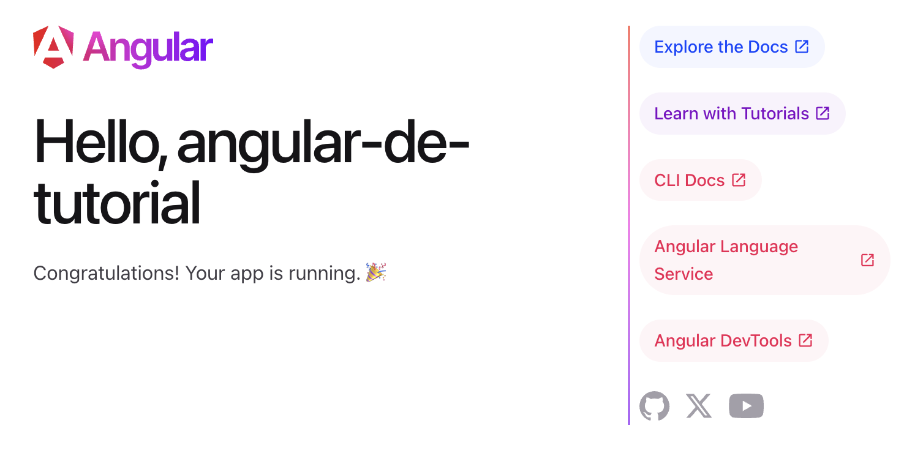

## Einführung

Dieses Tutorial erklärt euch die Grundlagen des Frameworks Angular. Wir behandeln hierbei Angular in der Version 2 und höher. Bewusst wird hierbei aber die Versionsnummer weggelassen, da das Framework nun semantische Versionierung benutzt. Kurz gesagt: Es ist einfach Angular.
Es ist  nicht erforderlich das AngularJS(Angular 1) Tutorial vorher durchzuarbeiten. Diese Einführung ist für Anfänger gedacht, die gerade mit Angular beginnen. Das Beispiel orientiert sich an den ersten Aufgaben unserer Workshop-Inhalten der [Angular Intensiv Schulung](https://workshops.de/seminare-schulungen-kurse/angular-typescript).

Unsere Didaktik behandelt dabei die Motivation, die Theorie und dann den Praxis-Teil. Ihr könnt hierbei alle Aufgaben selber Programmieren und über unseren Workshops.DE Classroom Hilfestsellungen und Musterlösungen für die Aufgaben erhalten.


Den Quellcode für das Tutorial findet ihr in unsererem GitHub-Repository: <a href="https://github.com/angularjs-de/angular2-tutorial" title="Tutorial Quellcode" target="_blank"><strong>Tutorial Quellcode</strong></a>

### Was wirst du in diesem Tutorial lernen?
Dieses Tutorial zeigt die die Grundlegenden Bestandteile einer Angular Anwendung anhand eines praktisches Beispieles welches du selber implementieren oder fertige Musterlösungen nutzen und verändern kannst.

Wir werden hierbei folgende Themen behandeln:
* Was ist Angular
* Unterschiede zu React und Vue
* Installation von Angular
* Komponenten
* Expressions und Schleifen
* Event & Property-Binding
* Services
* Dependency-Injection
* Anbinden einer Rest-API

Wir werden hierbei die Motivation und den Theoretischen Background kurz einleiten uns jedoch primär auf Praktische Beispiele konzentrieren. Wir werden eine kleine Anwendung bauen welche uns eine Liste von Daten von einer REST-API ausliest und diese anzeigt.

<p class="text-center">
  
</p>

<div class="alert alert-success">Dieser Artikel und unser Portal ist open-source. Wenn ihr Vorschläge zur Verbesserung des Artikels habt, fühlt euch jederzeit herzlich willkommen euch über unser <a href="https://github.com/workshops-de/angular.de" target="_blank">GitHub Repo</a> zu beteiligen. Wir freuen uns über jeden Input! </div>

## Was ist Angular?
Angular ist ein sehr erfolgreiches clientseitiges JavaScript-Webframework zur Erstellung von Single-Page-Webanwendungen. Es reiht sich neben den anderen großen Frameworks für Single Page Applications ein. Wobei das nicht ganz stimmt, da Angular sich mittlerweile sogar eher zur Platform weiterentwickelt hat. Es beinhaltet neben der reinen "API" um Anwendungen zu entwicklen mittlerweile auch Entwicklungs-Werkzeuge, Generatoren und mitgelieferte Architektur-Konzepte. Eine Ready-to-Rock Lösung um Enterprise-Anwendungen zu entwickeln. Es reiht sich ein neben den beiden anderen erfolgreichen Frontend Frameworks [React](https://reactjs.de) und [VueJS](https://vuejs.de).


### Unterschiede zu Vue und React
Alle drei Bibliotheken bzw Frameworks haben ihre Daseinsberechtigung, Stärken und Schwächen. Je nach Use-Case sollte hier entschieden werden, welche der Alternativen die beste Basis für das aktuelle Projekt liefert.

**Angular** zielt hierbei ganz klar auf die professionelle Entwicklung von Enterprise Software. Durch klare Vorgaben in Struktur und den Einsatz von Generatoren können langfristig wartbare und skalierbare Softwarelösungen erstellt werden. Konzepte wie Dependency Injection und ein Fokus auf TDD sind seit der ersten Stunde von Angular im Core verankert. Durch die klare Struktur von Projekten ist hierbei explizit die Skalierbarkeit von neuen Entwickler:innen hervorzuheben. Durch dieses Massive Grundgerüst wirkt Angular auf den ersten Blick oft etwas schwergewichtig - überzeugt jedoch in Production durch systematische Optimierungen und Erweiterbarkeit.

**ReactJS** zielt hierbei eher auf einen sehr minimalen Layer auf Komponenten-Ebene und ermöglicht/erfordert das Konzipieren einer eigenen Architektur vom Grund auf. Dies bietet sehr flexible Möglichkeiten für individuelle Problemstellungen sehr explizite Lösungen zu bauen. Es gibt eine Auswahl an verschiedensten Modulen für die verschiedene Anforderungen. Der Aufwand der Integration und Pflege ist hier höher als in Angular, allerdings ist das Projekt dadurch oftmals auch simpler und sehr leichtgewichtig.

**VueJS** bedient die Anforderungen zwischen diesen beiden Frameworks. Indem das Framework auf einen Generator und klare Strukturen setzt begünstigt es ebenfalls die Skalierung von Projekt-Teams. Allerdings versucht Vue gleichzeitig sehr leichtgewichtig zu bleiben und möglicht wenig "Framework-Magic" einzubringen. Es ist also die simple aber strukturiere Mittellösung.

Dies ist meine persöhnliche Einschätzung und ich habe bereits sehr gut mit allen dieser Frameworks gearbeitet. Es kommt individuell auf die Problemstellung und das Team an. Falls ihr gerade Neu im Bereich Web seid kann ich euch auch sehr unseren [Moderne Webentwicklung und Frontend-Architekur Kurs](https://workshops.de/seminare-schulungen-kurse/frontend-architektur) empfehlen, welcher euch einen Überblick in die moderne Webentwicklung von heute aufzeigt.


### Motivation
Angular selbst hat die Ursprünge in 2009, im "wilden Westen" der Webanwendungsentwicklung. Seitdem ist viel passiert - keine Angst, ich werde jetzt hier keine Geschichtsstunde starten. Es geht eher um den Punkt: In der wilden Welt von JavaScript Frameworks wo gefühlt jeden Tag 10 neue Frameworks raus kommmen ... wie konnte sich Angular sich auch seit über 10 Jahren noch als eines der erfolgreichsten Frameworks beweisen?
Dies lässt sich wahrscheinlich am einfachsten mit der Mission von Angular beschreiben:

* Apps that users ❤️ to use.
* Apps that developers ❤️ to build.
* A community where everyone feels welcome.

Durch diese Mission ist ein wunderbares Ökosystem mit einer wahnsinnig tollen Community entstanden.
Neben diesen ist aber der Fokus auf Qualität und Enterprise ebenfalls klar zu spüren.
Google selber selbst nutzt nach eigenen Angaben Angular in über 1600 Projekten ein.
(Google Teams nutzen übrigens AUCH React und VueJS für Projekte wo dieser Stack besser passt).

In 2016 hat sich das Angular-Team für ein kompletten Rewrite in TypeScript entschieden.
Damals wurde die Entscheidung größtenteils negativ wahrgenommen und von anderen Framework Benutzern zerrissen.


Heute sehen wir die Weitsicht dieser Entscheidungen, da mittlerweile viele andere Frameworks ebenfalls auf TypeScript setzen. Um Breaking Changes einfacher kommunizieren zu können hat sich das Team ebenfalls für ein fixen Relase Plan entschieden. So können Projekt-Teams Budgets für Updates bereits im Vorraus einplanen und werden nicht von Breaking-Changes in einem Release "überrascht".


### Die Angular Platform

Das Ökosystem von Angular ist sehr groß. Die Basis bildet hierbei das Core-Framework. Hier sind die fundamentalen Konzepte implementiert die für moderne Web-Anwendungen essentiell sind. Zwei weitere Core-Konzepe die jedoch als separant nutzbar sind ist die Angular-CLI und das die Verwaltung von Komponenten. Diese bilden die Kernfunktionalitäten ab welche in fast jeder Anwendung benötigt werden. Weitere Module lassen sich *optional einbinden* falls ihr diese benötigt:

* Routing - Routing für Single Page Applications
* forms - Formulare und Validierung
* i18n - Mehrsprachige Anwendungen
* Animations - Animationen für Transitionen
* PWA - Offline Fähigkeiten
* HTTP - HTTP, Rest und GraphQL Kommunikation
* und viele mehr


In diesem Tutorial werden wir uns primär um das Framework, die Angular CLI und Komponenten kümmern.

## Vorbereitung & Installation

Beginnen wir nun mit der Installation von NodeJS.
NodeJS ist die sogenannte "JavaScript Runtime" und dafür zuständig Programme auf unserem Rechner auszuführen welche in der Sprache JavaScript geschrieben sind wie z.B. das Command-Line-Interface von Angular welches wir gleich nutzen werden.

Ihr könnt NodeJS über folgenden Link herrunterladen und installieren: [https://nodejs.org/download/](https://nodejs.org/download/)

Mit NodeJS wird ebenfalls das Kommandozeilenwerkzeug `npm` installiert, welches uns ermöglicht weitere NodeJS Pakete auf unserem Rechner zu installieren.

<div class="alert alert-info">Hinweis: Falls ihr spezielle Proxy Einstellungen benötigt könnt ihr diese in der <a href="https://docs.npmjs.com/misc/config#https-proxy" target="_blank">NPM Dokumentation für HTTPS Proxies</a> nachlesen.</div>

Nachdem ihr die Installation erfolgreich abgeschlossen habt, könnt ihr nun über euren Terminal folgenden Befehl ausführen:

    npm i -g @angular/cli bookmonkey-api

Dieser Befehl installiert die `Angular-CLI` global auf eurem Rechner und ermöglicht euch somit nach der Installation mit dem Kommandozeilenwerkzeug `ng` zu arbeien. Als zweites Paket wird das Paket `bookmonkey-api` installiert, welches uns als simulierter Backend-Server in unserem Beispiel dient.

<div class="alert alert-success">👨‍💻👩‍💻Jetzt selber nachbauen im Classroom Task: <a href="#" target="_blank">Install Chrome, Node & IDE</a></div>

## Generieren der Angular App

Die Angular-CLI wird genutzt um neue Strukturen innerhalb unser Anwendungen zu generieren, anstatt wie oft in Projekten die Basis-Strukturen zu kopieren und über potentielle Fehler bei der Umbenennung zu stolpern. Es ist ein mächtiges Werkzeug welches euch mit `ng  --help` eine ausführlichen Hilfetext anbietet.

Um unsere erste Anwendung zu generieren verwenden wir den `new` command welcher als Argument den Namen eurer Anwendung entgegennimmt. Hierbei werdet ihr gefragt ob ihr das `Routing Module` installieren wollt: Ja. Weiterhin welches Stylesheet Format ihr nutzen wollt: Hierbei wählt ihr bitte SCSS.

```bash
$ ng new angular-de-tutorial

? Would you like to add Angular routing? No
? Which stylesheet format would you like to use? SCSS
```

Nun werden automatisch die Projektstrukturen für euch angelegt. Dies inkludiert eine Startseite, eine Komponente, die ersten End2End Tests, Linter-Regeln, GitIgnore-Regeln und eine TypeScript Konfigiration.

```bash
CREATE angular-de-tutorial/angular.json (3671 bytes)
CREATE angular-de-tutorial/package.json (1296 bytes)
CREATE angular-de-tutorial/README.md (1034 bytes)
CREATE angular-de-tutorial/tsconfig.json (543 bytes)
CREATE angular-de-tutorial/tslint.json (1953 bytes)
...
CREATE angular-de-tutorial/e2e/tsconfig.json (214 bytes)
CREATE angular-de-tutorial/e2e/src/app.e2e-spec.ts (652 bytes)
CREATE angular-de-tutorial/e2e/src/app.po.ts (301 bytes)
```

Nach dem Generieren werden ebenfalls notwendige Pakete via `npm` installiert. Dies kann durchaus einige Minuten dauern. Ist die Installation abgeschlossen könnt ihr die Entwicklungsumgebung starten.

Anschliessend können wir die Entwicklungsumgebung starten, wir müssen und mit der Console im Order der soeben Generierten App befinden.

```bash
$ cd angular-de-tutorial
$ ng serve

Angular Live Development Server is listening on localhost:4200
```

Eure Basisanwendung ist nun generiert und kann im Browser under http://localhost:4200 aufgerufen werden. Ihr solltet ein ähnliches Bild wie folgendes sehen:



<div class="alert alert-success">👨‍💻👩‍💻 Jetzt selber nachbauen im Classroom Task: <a href="#" target="_blank">Create a new project</a></div>

## Komponenten und Services

In Angular gibt es zwei primäre Bestandteile des Frameworks mit welchen wir uns zuerst auseinander setzen.

**Komponenten** sind Anzeige-Elemente. Sie werden als eigene HTML-Elemente definiert. Abhängig der definierten Anzeige-Logik und den aktuktellen Daten stellen diese Elemente den Zustand eurer Anwendung dar.

**Services** sind unabhängig von der Anzeige eurer Anwendung. Sie definieren Daten, Logig und Algorithmen eurer Anwendung. Sie sind modular und wiederverwendbar.

### Komponenten

Angular Komponenten sind die sogenannten "building blocks" jeder Anwendung. Die verschiedenen logischen  Bausteiner einer Anwendung werden also in Komponenten aufgeteilt. Jeder dieser Komponenten übernimmt dabei eine bestimmte Funktion und wird als eigenes HTML-Element definiert.


```html
<todo-title>ToDo App</todo-title>
<todo-list>
  <todo-item state="checked">Prepare Workshop</todo-item>
  <todo-item>Hold the Workshop</todo-item>
</todo-list>

```

<div class="alert alert-info">Hinweis: Diese Darstellung ist noch nicht 100% korrekt und dient in vereinfachter Form der schrittweisen Erklärung. 🙂</div>

Wie ihr in diesem kleinen Beispiel einer ToDo-Liste seht, gibt es für die verschiedenen Bereiche eigene Elemente die in diesem Fall mit dem Prefix `todo-` eingeleitet werden. Wie ihr gut an der `todo-list` erkennt ist es möglich und auch absolut üblich eigene Komponenten ineinander zu verschachteln. Ziel ist es immer wiederverwendbare und wartbare Elemente zu bauen. Ws hierbei die richtige Komponentengröße ist werdet ihr in euren Projekten selber entscheiden müssen und mit wachsender Erfahrungen ein immer besseres Gefühl dafür bekommen. Bei Unsicherheit könnt ihr euch aber auch jederzeit in unserem [Slack](https://workshops.de/slack) bei uns melden.


### Services

Für Daten und Logik die nicht zwingend nur an eine Komponente gekoppelt ist werden in Angular Services genutzt. Ein Service ist eine Klasse welche Attribuite und Methoden definiert welche von Komponenten und anderen Services genutzt werden können.


```typescript
export class TodoService {
  data = [
          {
            title: 'Prepare Workshop',
            state: 'checked'
          },
          {
            title: 'Hold the Workshop'
          }
        ];
}
```

Die eigentlichen Daten werden also aus einem Service referenziert, denn ggf werden auf Basis der aktuellen Todos auch noch andere Komponenten angezeigt wie z.B. eine Komponente welche  die aktuell offenen Todos zählt.

Als erste Übersicht soll dies an dieser Stelle reichen. Wir werden uns später Services noch einmal genauer ansehen.


## Die erste Komponente

Wenn wir uns nun die Komponenten-Definition anschauen kommen wir das erstse mal mit [TypeScript](https://typescript.org) in Berührung. TypeScript ist eine Erweiterung von JavaScript welche uns die Möglichkeit bietet die Daten unserer Anwendung explizit zu typisieren. Weiterhin führt diese Meta-Sprache auch Features ein die es in JavaScript (noch) nicht gibt wie `Decoratoren`. TypeScript "transpiled" unseren geschriebenen Quellcode, sodass der Browser nachher wieder ganz normales JavaScript sieht und interpretieren kann. Es is also ein Feature welches uns als Entwickler:innen die tägliche Arbeit angenehmer macht.

> **Klassen** wurden in ES2015 eingeführt, um Konzepte wie unter anderem Vererbung und Konstruktoren nicht mehr über Prototypen abbilden zu müssen. Diese können nun über eine einfache und saubere Syntax erstellt werden.

> **Decorator** sind strukturierte Meta-Daten einer Klasse. Ihr kennt diese vielleicht aus anderen Programmiersprachen wie z.B. Java. Das eigentliche fachliche Verhalten der Komponente bilden wir innerhalb der Klasse mit Methoden ab.

Eine Komponenten-Definition besteht primär aus folgenen Teilen:


* Einem **Component-Decorator** welcher die Komponente innerhalb von Angular bekannt macht.
* Einer **Selektor** welcher das HTML-Element beschreibt welches wir erzeugen
* Einem **HTML-Template** welches die Darstellung unserer Komponente definiert
* Einer **Klasse** welche das Interface und die Anzeige-Logik der Komponente beschreibt.


Unsere erste Komponente wird eine statische Info-Box sein. Um diese zu generieren nutzen wir wieder die Angular-CLI.
Ihr könnt hierzu ein neuen Terminal öffnen oder den laufenden `ng serve` kurzzeitig stoppen.
Der Serve-Prozess erkannt aber automatisch Veränderungen innerhalb eures Quellcode und kompiliert die jeweils aktuelle Version euerer Anwendung in wenigen Sekunden.
Ich würde euch also empfehlen einen zweiten Terminal zu öffnen und folgenden Befehl zu benutzen.

```bash
$ ng generate component info-box
CREATE src/app/info-box/info-box.component.scss (0 bytes)
CREATE src/app/info-box/info-box.component.html (23 bytes)
CREATE src/app/info-box/info-box.component.spec.ts (636 bytes)
CREATE src/app/info-box/info-box.component.ts (277 bytes)
UPDATE src/app/app.module.ts (0 bytes)
```

Die für uns aktuell relevanten Dateien sind zur Zeit die `info-box.component.ts` und unser Template `info-box.component.html`. Schauen wir uns zunächst einmal unsere Klasse an.

``` typescript
@Component({
  selector: 'app-info-box',
  templateUrl: './info-box.component.html',
  styleUrls: ['./info-box.component.scss']
})
export class InfoBoxComponent implements OnInit {

  constructor() { }

  ngOnInit() {
  }

}
```

Hier sehen wir wie erwartet eine Komponente. Unser Selektor hat den automatischen Prefix `app-` bekommen. Somit ist unsere neue Komponente nun unter dem HTML-Tag `<app-info-box></app-info-box>` benutzbar. Der Einsteigspunkt unser kompletten Anwendung ist ebenfalls eine Komponente mit dem Namen `AppComponent`.
Um unsere frisch generierete Komponente anzuzeigen, müssen wir diese in dem Template unser Anwendung aufrufen. Hierzu geht ihr in die Datei `app.component.html`, löscht dort den kompletten derzeitigen Inhalt und fügt eure Komponente via HTML-Tag ein.

```html
<app-info-box></app-info-box>
```

Wenn ihr nun eure Anwendung wieder im Browser öffnet solltet ihr die Ausgabe `info-box works!` sehen.
Ihr könnt an dieser Stelle gerne mit euerm Template in `info-box.component.html` etwas herunmspielen und auch mehrere dieser Info-Boxen erzeugen, indem ihr den HTML-Tag in eurem App-Template einfach kopiert.
Ein historischer Moment, nehmt euch ein paar Sekunden eure erste eigene Komponente zu bewundern. 😉

## Expressions
Eine rein statische Komponente ist natürlich nur sehr begrenzt in einer Anwendung nutzbar.
Um variable Daten anzuzeigen nutzt Angular sogenannte Expressions in den Templates.
Diese werden mit doppelten geschweiften Klammern eingeleitet und auch wieder geschlossen.

    {{ expression }}

Eine Expression wird von Angular dynamisch auf basis der aktuellen Properties eurer Klasse ausgewertet.
Führen wir also eine ein neues Property `text` ein und füllen dieses mit eine String, können wir diesen in unserem Template ausgeben.

```typescript
class InfoBoxComponent implements OnInit {
  text = 'Additional Info-Text on our Info Box! 🎊';

  constructor() { }

  ngOnInit() {
  }

}
```

```html
  <p>info-box works!</p>
  <p>{{text}}</p>
```


Sollte sich die Property `text` ändern z.B. durch externe Events wird diese automatisch von Angular aktuallisiert. Dieses Konzept nennt sich `Data-Binding`.

## Property- & Event-Bindings

Andere Komponenten können über sogenannte Property- und Event-Bindings eingebunden werden.
Angular verbindet sich hierbei mit den Eigenschaften und Events der nativen HTML-Elemente,
somit ist auch das Benutzen von anderen Elementen aus Frameworks wie ReactJS oder VueJS einfach möglich.

Um auf eine Properties von Elementen zuzugreifen nutzen wir die eckigen Klammern innerhalb unseres HTML Templates. Möchten wir also z.B. die [HTMLElement.hidden Property](https://developer.mozilla.org/en-US/docs/Web/API/HTMLElement/hidden) einer Komponente beeinflussen können wir das wie folgt erreichen:

```html
<p [hidden]="'true'">{{text}}</p>
```

Hier wird die Eigenschaft `hidden` des Elements auf `'true'` gesetzt und somit das Element ausgeblendet.
Um diese Eigenschaft dynamisch zu ändern, haben wir die Möglichkeit in unser Klasse selbst eine neue Property einzuführen und diese per `Property-Binding` an die Property des p-Elements zu binden.
Hierzu setzen wir statt dem string `'true'` den Namen des Attributes in unserer Klasse auf das Binding:


```typescript
class InfoBoxComponent implements OnInit {
  text = 'Additional Info-Text on our Info Box! 🎊';
  hidden = true;

  constructor() { }

  ngOnInit() {
  }

}
```

```html
  <p>info-box works!</p>
  <p [hidden]="hidden">{{text}}</p>
```

Um die Komponente nun durch User-Interaktion zu ändern, haben wie die Möglichkeit auf sogenannte `Events` zu hören und hierfür ebenfalls ein `Event-Binding` zu definieren.
Event-Bindings werden in Angular über Runde Klammern definiert welche den Namen des Events enthalten.
Wenn wir nun also auf das [click Event](https://developer.mozilla.org/en-US/docs/Web/API/Element/click_event) eines eines HTML-Elements hören wollen können wir das wie folgt erreichen.

    <button (click)="">

Innerhalb dieser Definition haben wir nun die Möglichkeit ein sogenanntes `Template-Statement` zu definieren. Dies kann sowohl eine `Template-Expression` sein welche z.B. direkt Änderungen an Attributen eurer Klasse macht oder eine Referenz auf eine Methode in eurer Klasse.
Um es einfach zu halten nutzen wir in diesem Fall erstmal eine `Template-Expression` welche den Wert von `hidden` jeweils negiert. Also aus `true` wird `false` und andersherum.


```html
  <p>info-box works!</p>
  <button (click)="hidden=!hidden">
  <p [hidden]="true">{{text}}</p>
```


Wir können natürlich auch jedes andere Event wie z.B. `keyup` benutzen. Mit diesem sehr simplen Mechanismus können wir generisch alle Arten von Komponenten benutzen und mit ihnen interagieren. Dies ist das unabhängig davon, ob sie in Angular oder einem anderem Framework geschrieben sind.

<div class="alert alert-success">👨‍💻👩‍💻Jetzt selber nachbauen im Classroom Task: <a href="#" target="_blank">Create Info Box</a>. </div>

### Strukturelle Template Direktiven
Wie schon erklärt sollten strukturelle Direktiven immer dann verwendet werden, wenn der DOM verändert wird, sprich Elemente hinzugefügt oder entfernt werden sollen. Ein Beispiel dafür ist die `ngIf-Direktive`.

```html
<button (click)="isVisible = !isVisible">anzeigen | verstecken</button>
<div *ngIf="isVisible">Wir sind Ihr Pizza-Dienstleister!</div>
```

Die Variable `isVisible` wird als Boolean-Wert interpretiert. Falls diese auf `true` bzw `truthy` steht, wird der div-Knoten in den DOM eingehangen, andernfalls entfernt.

Wie wir bereits gelernt haben, gibt es Event- und Property-Bindings in Angular. Ihre Anwendung kann durch die Verwendung von Klammern - `()` und `[]` - gesteuert werden. Im Falle einer strukturellen Direktive nutzen wir hierbei das `*-Symbol`.

#### Das * Symbol in Angular

Das Asterisk-Zeichen stellt die Kurzschreibweise einer strukturellen Direktive dar. Sie stellt auch automatisch das Data-Binding her.

```html
<pizza-list-item *ngFor="let pizza of menu"></pizza-list-item>
```

Strukturelle Direktiven würden im erweiterten Syntax den eigenen Quellcode sehr aufblähen. Das template-Tag gibt an, dass nachfolgend ein Angular-Template folgt, welches über die Bedingung entfernt oder hinzugefügt wird.

Intern wandelt Angular jedoch immer die Kurzschreibweise in die ausführliche um!

### Attribut-Direktive
Wie der Name schon sagt, werden diese Direktiven als Attribut an ein DOM-Element geschrieben und können dessen Aussehen und/oder Verhalten verändern. Als einfaches Beispiel setzen wir die Schriftfarbe eines Elementes via einer Attribut-Direktive.

```html
<div [style.color]="'red'">Wir sind Ihr Pizza-Dienstleister!</div>
```

**Tip**: Die eingebaute Direktive `ngStyle` sollte erst benutzt werden, wenn mehrere Style-Attribute gesetzt werden. Unser Beispiel würde jedoch mit ngStyle, wie folgt aussehen.

```html
<div [ngStyle]="{'color': 'red'}">Wir sind Ihr Pizza-Dienstleister!</div>
```

#### Eigene Attribut-Direktive
Als kleines Beispiel schreiben wir nun für das Ändern der Schriftfarbe eine eigene Direktive.

```typescript
import {Directive, ElementRef, Renderer} from '@angular/core';

@Directive({
  selector: '[redFont]'
})
export class RedFontDirective {
  constructor(el: ElementRef, renderer: Renderer) {
    // el.nativeElement.style.color = 'red';
    renderer.setElementStyle(el.nativeElement, 'color', 'red');
  }
}
```

[Code](https://github.com/angularjs-de/angular2-tutorial/blob/master/05-directives/src/app/shared/red-font.directive.ts) zur Definition einer eigenen Direktive

Eine Direktive wird über den Decorator `@Directive` definiert. Als wichtigste Meta-Daten muss wieder ein selector angegeben werden, damit unsere Direktive überhaupt ausgeführt wird. Im Unterscheid zur @Component wird der Selektor in [] geschrieben, wodurch ein Attribut-Name definiert wird. Im Beispiel werden zwei wichtige Bestandteile für die Arbeit mit Direktiven der Angular-Bibliothek genutzt.

<div class="alert alert-warning">Beachte: Lege wiederverwendbare Bestandteile in *shared*-Ordner ab. Über eine *index.ts* kannst du alle im Ordner enthaltene Funktionalitäten gebündelt anderen Anwendungsteilen freigeben. Dieses Verfahren nennt sich **barrels** und ist im Style-Guide verankert.</div>

* ElementRef - erlaubt Zugriff auf das verbundene DOM-Element
* Renderer - Framework zum performanten Ändern von DOM-Elementen

> Es ist natürlich möglich das DOM-Element direkt selbst zu ändern. Das kann jedoch in vielen Situationen auf Kosten der Anwendungs-Performance passieren. Der Renderer ermöglicht beispielsweise das Rendern an Web-Worker auszulagern.

### Benutzen von Komponenten und Direktiven

Damit eine Direktive oder Komponente überhaupt in einem Teil unser Anwendung genutzt werden kann, muss diese dem entsprechenden Modul, indem sie benutzt werden soll, bekannt gemacht werden. Hierzu importieren wir die Direktive via `import` und übergeben über die Eigenschaft `declarations` ein Array von Direktiven-Definitionen. Somit kann eine klare Abgrenzung geschaffen werden, welche Direktive wo benutzt werden kann und auch Naming-Kollisionen vermieden oder geschickt als Konfiguration genutzt werden.

```typescript
import { RedFontDirective } from './shared/red-font.directive';

@NgModule({
  declarations: [
    AppComponent,
    RedFontDirective
  ],
  // ...
})
export class AppModule { }
```

[Code](https://github.com/angularjs-de/angular2-tutorial/blob/master/05-directives/src/app/app.module.ts#L12) für die Verwendung von Direktiven in einem Modul

Am Ende packen wir die Direktive - mit Hilfe des festgelegten Attributsnamen - an einen DOM-Knoten mit Text. Voila!

## Schleifen mit NgFor

Wie bereits erfahren, existiert in Angular natürlich eine Direktive, die das Wiederholen von DOM-Elementen erlaubt. Im Gegensatz zu AngularJS 1 heißt diese nicht `ngRepeat`, sondern `ngFor`. Als strukturelle Direktive wird diese an einen bestehenden DOM-Knoten, wie folgt gebunden.

```html
<div *ngFor="let number of [1, 5, 34, 47]">
  Aktuelle Zahl ist: {{number}}
</div>
```

Das *-Symbol gibt an, dass es sich um eine strukturelle Direktive handelt. Das aktuelle Element der Schleife wird auf eine neue lokale Variable `number` geschrieben. Die Definition einer Variable wird über das #-Symbol ausgezeichnet. Die Liste an Elementen kann dabei natürlich auch aus einer Variable kommen.

Ebenso, wie in AngularJS, kann auch in der zweiten Version des Frameworks auf den aktuellen Index der Schleife zugegriffen werden. Dazu erweitern wir unsere Quellcode ein wenig.

```html
<div *ngFor="let number of [1, 5, 34, 47]; let currentIndex=index">
  Aktuelle Zahl ist: {{number}} ({{currentIndex}})
</div>
```

Nach der Angabe der Liste kann der aktuelle Index auf eine eigene Variable geschrieben werden, um auf sie zugreifen zu können.

[Code](https://github.com/angularjs-de/angular2-tutorial/blob/master/06-loops/src/app/app.component.ts) einer Schleife im Template

## Pipes (ehemals Filter)

In der neuen Angular-Version heißen Filter nun `Pipes`. Sie erlauben das Transformieren von Daten in Expressions. Pipe bedeutet im Deutschen Rohr bzw. Leitung. Viele kennen die Pipe als Operator aus der Unix-Shell, um Ausgabewerte zur weiteren Verarbeitung, Filterung oder Transformationen weiterzuleiten. Dabei können mehrere so genannter Pipes hintereinander ausgeführt werden. Wobei die Ausgabe einer Pipe die Eingabe der nächsten darstellt. In diesem Sinne trifft die neue Bezeichnung viel besser auf die eigentliche Funktionalität zu.

Wie in AngularJS, gibt es auch in der Version 2 schon ein paar vordefinierte Pipes, z.B. `CurrencyPipe` zur Währungsformatierung und `DatePipe` zur Datumsformatierung.

Als Beispiel wird eine Zahl im Template mit Hilfe der `CurrencyPipe` formatiert.

```html
<span>{{10.99 | currency}}</span>
```

Pipes erhalten als Eingabe den Wert vor dem `|-Symbol` und können eine Liste von weiteren Parametern entgegennehmen. Die `CurrencyPipe` kann dadurch den zu formatierenden Wert in verschiedenen Währungen, mit oder ohne Währungssymbol transformieren. Das Beispiel formatiert die Zahl nun als Euro und zeigt statt des Währungskürzels das €-Symbol.

```html
<span>{{10.99 | currency:'EUR':true}}</span>
```

### Eigene Pipes

Die Erstellung einer eigenen Pipe ist denkbar einfach. Ähnlich wie andere Bestandteile einer Angular Anwendung existiert dazu ein eigener Decorator `@Pipe`. Die eigene Pipe implementiert dann ein Interface mit dem Namen `PipeTransform`. Wer aus der objektorientierten Programmierung kommt, weiß dass ein Interface eine definierte Schnittstelle ist. Diese definiert welche Methoden eine Klasse, welche dieses Interface implementiert, implementieren muss. Im Falle einer Pipe ist das die `transform-Methode`.

Diese Pipe mit dem Namen *addTwo* addiert zur Eingabe die Zahl 2.

```typescript
import {Pipe, PipeTransform} from '@angular/core';

@Pipe({name: 'addTwo'})
export class AddTwoPipe implements PipeTransform {
  transform(number:number) : any {
    return number + 2;
  }
}
```

[Code](https://github.com/angularjs-de/angular2-tutorial/blob/master/07-pipes/src/app/shared/add-two.pipe.ts) zur Defintion eigener Pipes.

Um unsere Pipe benutzen zu können, müssen wir diese wieder unserem Modul hinzufügen. Also die entsprechende Klasse importieren und bei `declrations` anfügen.

```typescript
import { AddTwoPipe } from './shared/add-two.pipe';

@NgModule({
  declarations: [
    AppComponent,
    RedFontDirective,
    AddTwoPipe
  ],
  // ...
})
export class AppModule { }
```

[Code](https://github.com/angularjs-de/angular2-tutorial/blob/master/07-pipes/src/app/app.module.ts#L12) zur Nutzung von Pipes.

Einer Pipe können jeweils mit `:` getrennt weitere Parameter übergeben werden. Diese müssen dann in der transform-Funktion angegeben werden.

## Services

Eine einfache Möglichkeit wiederverwendbare Programmteile auszulagern oder Daten zwischen Komponenten auszutauschen sind Services. Dabei sind Services nichts weiter als Klassen, die als Abhängigkeit in anderen Komponenten injiziert werden können. Dabei werden zwei Arten unterschieden.

* Globale Services - eine Instanz für alle Komponenten
* Lokale Service - neue Instanz für jede Komponente

Somit können wir, ähnlich wie in AngularJS, Logik in plain JavaScript schreiben und an Komponenten weitergeben. Hiermit können wir unsere Implementierungen der Business-Logik später auch in anderen Frameworks wiederverwenden oder aber auch unsere Services als AngularJS sehr einfach in die Angular Welt bringen.

Damit die Typ-Informationen des Constructors, welche wir gleich für die Injection von anderen Services benötigen, beim der Kompilierung nicht verloren gehen, können wir mit dem Decorator `@Injectable` die Generierung dieser Metadaten erzwingen. Somit können wir auch später in der ES5 Version sicherstelle, dass wir den HTTP-Service anhand des Typs korrekt einbinden können.

```typescript
import {Injectable} from '@angular/core';

@Injectable()
export class PizzaService {
  getPizza() {
    return [{
      "id": 1,
      "name": "Pizza Vegetaria",
      "price": 5.99
    }, {
      "id": 2,
      "name": "Pizza Salami",
      "price": 10.99
    }, {
      "id": 3,
      "name": "Pizza Thunfisch",
      "price": 7.99
    }, {
      "id": 4,
      "name": "Aktueller Flyer",
      "price": 0
    }]
  }
}
```

[Code](https://github.com/angularjs-de/angular2-tutorial/blob/master/08-services/src/app/shared/pizza.service.ts) zur Defintion eines Services

Als nächstes kann der Service in einer Komponente importiert und genutzt werden. Danach werden Abhängigkeiten von Services über die `providers`-Eigenschaft von `@Component` bekannt gemacht. Jetzt kann der Service in die Klasse über die `Dependency-Injection` geladen werden.

```typescript
import {Component} from '@angular/core';

import {PizzaService} from './shared/index';

@Component({
  selector: 'pizza-root',
  providers: [PizzaService],
  template: `
    <span>Anzahl an Pizzen: {{pizzas.length}}</span>
  `
})
export class AppComponent {
  public pizzas = [];

  constructor(private pizzaService: PizzaService) {
    this.pizzas = this.pizzaService.getPizza();
  }
}
```

[Code](https://github.com/angularjs-de/angular2-tutorial/blob/master/08-services/src/app/app.component.ts) für das Importieren und Injecten eines Services

Durch die Angabe des Services als Provider der Component, wird beim Erstellen der Komponente eine neue Instanz des Services erzeugt. Diese ist auch nur für diese Komponente und ihre Kind-Komponenten, welche diesen Service gegebenenfalls auch benutzen, verfügbar.

Soll ein Service global - sprich anwendungsweit - verfügbar sein, kann dieser in unserem Hauptmodul der Anwendung geladen und verfügbar gemacht werden.

```typescript
import { PizzaService } from './shared/pizza.service';

@NgModule({
  // ..
  providers: [PizzaService],
  // ...
})
export class AppModule { }
```

<div class="alert alert-info">Hinweis: In Angular sollte die Nutzung eines Prefixes, wie *_*, zum Visualisieren einer privaten Funktion oder Variable vermieden werden.</div>


## HTTP in Angular

Ein wichtiger Bestandteil von Web-Anwendungen ist die Kommunikation mit Schnittstellen. Typischerweise basieren diese Schnittstellen auf dem HTTP-Protokoll. Für diesen Zweck existiert ein `HTTP-Service` innerhalb des Angular-HTTP Modules. Dieses können wir von `@angular/http` importieren unserem AppModule hinzufügen.

```typescript
import { HttpModule } from '@angular/http';

@NgModule({
  // ...
  imports: [
    BrowserModule,
    FormsModule,
    HttpModule
  ]
  // ...
})
export class AppModule { }
```


[Code](https://github.com/angularjs-de/angular2-tutorial/blob/master/09-http/src/app/app.module.ts#L16) für das benutzen des HttpModule.

Für die Kommunikation mit einer Schnittstelle sollte ein eigener Service angelegt werden. Aus diesem Grund wandeln wir nun unseren Pizza-Service so ab, dass er die Angebots-Daten aus einer JSON-Datei abfragt. Diese wird über eine GET-Anfrage abgerufen. Die dann in das JSON-Format umgewandelt, um damit in der Anwendung umgehen zu können.

```typescript
import {Http, Response} from '@angular/http';
import {Injectable} from '@angular/core';
import {Observable} from 'rxjs/Observable';
import 'rxjs/add/operator/map'; // add map function to observable

@Injectable()
export class PizzaService {
  constructor(private http: Http) {
  }

  getPizza() {
    return this.http.get('assets/pizza.json')
      .map((res: Response) => res.json());
  }
}
```

[Code](https://github.com/angularjs-de/angular2-tutorial/blob/master/09-http/src/app/shared/pizza.service.ts) für das Senden von Http-Anfragen

Zuerst wird der Http-Service von Angular importiert und dann über die Dependency-Injection dem Service bereitgestellt. Die Funktion `getPizza()` kann dann innerhalb einer Komponente aufgerufen werden, um die Daten abzurufen. Ein Request läuft asynchron, daher liefert der Http-Service ein so genanntes Observable zurück, welches über die RxJS-Bibliothek erzeugt wird.


### Observables in Angular
Ein Observable ist mit [JavaScript-Promises](/buecher/angularjs-buch/angularjs-promises/) vergleichbar. Ist der Programmcode des Observable abgeschlossen, wird allen Abonnenten Bescheid gegeben. Auf diesen Observables basiert auch das Event-System von Angular (Stichwort EventEmitter).

Um ein Observable zu abonnieren, muss dessen subscribe-Funktion aufgerufen werden. Als Callback erhält diese eine Funktion, welche wiederum als Parameter geänderte oder neue Daten erhält. In unserem Fall sind das, die Pizzen aus der JSON-Datei.

```typescript
import {Component} from '@angular/core';
import {PizzaService} from './shared/index';

@Component({
  selector: 'pizza-root',
  template: `
    <span>Anzahl an Pizzen: {{pizzas.length}}</span>
  `
})
export class AppComponent {
  public pizzas = <Object>[];

  constructor(private pizzaService: PizzaService) {
    this.loadData();
  }

  loadData() {
    this.pizzaService
      .getPizza()
      .subscribe((pizzas: Array<Object>) => this.pizzas = pizzas);
  }
}
```

[Code](https://github.com/angularjs-de/angular2-tutorial/blob/master/09-http/src/app/app.component.ts#L18-L20) zur Nutzung von Observables

Wenn du mehr über das Thema erfahren möchtest schau dir doch mal diesen Artikel an:
[Angular - Asynchronität von Callbacks zu Observables](/artikel/angular2-observables/).


## Component Lifecycle

Eine Komponente in Angular durchläuft verschiedene Zustände während der Ausführung. Diese werden auch Lebenszyklen genannt. Über die `Lifecycle-Hooks` können wir hier an verschiedenen Stellen eingreifen. Folgende Funktionen können dazu genutzt werden:

* ngOnInit - Komponente wird Initialisiert (nach erstem ngOnChanges → Eigenschaften initialisiert)
* ngOnDestroy - bevor Komponente zerstört wird
* ngDoCheck - eigene Änderungserkennung
* ngOnChanges(changes) - Änderungen in Bindings wurden erkannt
* ngAfterContentInit - Inhalt wurde initialisiert
* ngAfterContentChecked - jedes Mal, wenn Inhalt überprüft wurde
* ngAfterViewInit - Views wurden initialisiert
* ngAfterViewChecked - jedes Mal, wenn Views überprüft wurden

Unser Beispiel zur Verwendung des Http-Services wird nun so erweitert, dass die Pizzen nicht direkt im Konstruktor der AppComponent abgerufen werden, sondern erst wenn die Komponente initialisiert wurde.

```typescript
import {Component, OnInit} from '@angular/core';
import {PizzaService} from './shared/index';

@Component({
  selector: 'pizza-root',
  template: `
    <span>Anzahl an Pizzen: {{pizzas.length}}</span>
  `
})
export class AppComponent implements OnInit {
  public pizzas = <Object>[];

  constructor(private pizzaService: PizzaService) {
  }

  ngOnInit() {
    this.pizzaService
      .getPizza()
      .subscribe((pizzas: Array<Object>) => this.pizzas = pizzas);
  }
}
```

[Code](https://github.com/angularjs-de/angular2-tutorial/blob/master/10-component-lifecycle/src/app/app.component.ts) zur Implementierung eines Lifecycle-Hooks

Für jeden Hook existiert ein Interface, welches die Komponentenklasse implementieren sollte. Der Name der Hook-Funktion setzt sich dann aus *ng* und *Interface-Name* zusammen.


Wenn Ihr weitere Informationen zu [LifeCycles in Angular2](/artikel/angular-2-component-lifecycle/) wollt, haben wir hierzu auch einen ganzen Artikel für euch.

## Interfaces

*Interfaces* ist sicher vielen bereits ein Begriff. Wollt ihr in einer Java-Anwendung sicher gehen, dass eine Klasse bestimmte Eigenschaften besitzt und Funktionen impementiert, dann definiert ihr vorher ein *Interface*. Ihr könnt Interfaces aber auch zur einfachen Definition von eigenen Datenstrukturen nutzen. In unserem Fall wäre ein Pizza-Interface recht hilfreich, um den Rückgabewert unseres HTTP-Requests zu typisieren.

Ein Interface wird dazu meist in einer eigenen Datei über das Schlüsselwort *interface* definiert.

```typescript
export interface Pizza {
  id: number;
  name: string;
  price: number;
}
```

[Code](https://github.com/angularjs-de/angular2-tutorial/blob/master/11-interfaces/src/app/shared/pizza.ts) zur Definition eines Interfaces

Nach dem gleichen Prinzip können auch Funktionendefintionen angegeben werden. Es besteht auch optionale Bestandteile eines Interface zu definieren. Dazu hängt ihr an den Namen/Schlüssel einfach ein `?` an.

Über das vordefinierte Wort `implements` könnt ihr in einer Klassen-Definition ein oder mehrere Interfaces angeben, die hier implementiert werden **müssen**.

```typescript
import {Component} from '@angular/core';
import {Pizza, PizzaService} from './shared/index';

@Component({
  selector: 'pizza-root',
  template: `
    <span>Anzahl an Pizzen: {{pizzas?.length || 0}}</span>
  `
})
export class AppComponent {
  public pizzas: Pizza[];

  constructor(private pizzaService: PizzaService) {
  }

  ngOnInit() {
    this.pizzaService
      .getPizza()
      .subscribe((pizzas: Pizza[]) => this.pizzas = pizzas);
  }
}
```

[Code](https://github.com/angularjs-de/angular2-tutorial/blob/master/11-interfaces/src/app/app.component.ts) zur Nutzung von Interfaces

Durch Interfaces legt ihr nur die Struktur fest. Wollt ihr gleichzeitig eine sinnvolle Belegung von Standardwerten, könnt ihr auch ganz normale Klassen dazu nehmen.

## Fazit

Mit Angular ist vieles neu und bekannte Dinge funktionieren doch ein wenig anders. Dennoch lohnt sich bereits ein genauerer Blick auf die neue Version des Single-Page-Application Frameworks. Viel Spaß beim Lernen von Angular.


Wenn Ihr euch weiter mit uns und anderen Austauschen wollt, kommt in unseren [Slack Chat](/slack)!

<hr>
<div class="workshop-hint text-center">
  <div class="h3">Hat dir das Tutorial geholfen?</div>
  <div class="row mb-2">
    <div class="col-xs-12 col-md-6">
      <p> Wir bieten auch <a target="_blank" href="https://workshops.de/seminare-schulungen-kurse/angular-typescript?utm_source=angular.de&utm_campaign=tutorial&utm_medium=link&utm_content=text-buttom">Angular und TypeScript Schulungen</a>        an um dich möglichst effektiv in das Thema Angular zu begleiten. Im Kurs kannst Du die Fragen stellen, die Du nur
        schlecht googlen kannst, z.B. “Besserer Weg, um meine Applikation zu strukturieren”. Wir können sie Dir beantworten.
      </p>
      <p class="text-center">
        <a target="_blank" href="https://workshops.de/seminare-schulungen-kurse/angular-typescript?utm_source=angular.de&utm_campaign=tutorial&utm_medium=button&utm_content=text-buttom">
          <button class="btn btn-danger">Jetzt weiter lernen</button>
        </a>
      </p>
    </div>
    <div class="col-xs-12 col-md-6">
      
    </div>
  </div>
</div>
<hr>
