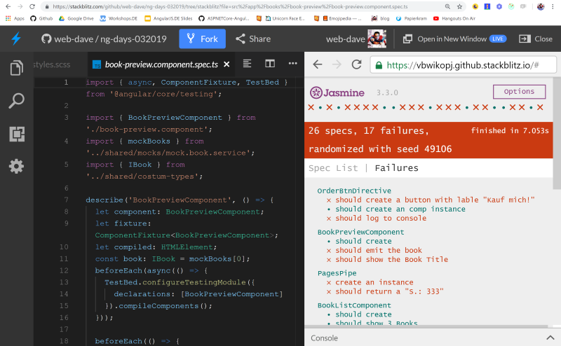

<strong>Ich liebe StackBlitz</strong>

Stackblitz ist das perfekte Tool um schnell mal einen Prototypen zu bauen oder um funktionierende Code Beispiele mit anderen zu teilen. Aber da geht noch mehr: In StackBlitz kannst du ein GitHub Repo ohne großen Aufwand importieren.

Und Unit Tests laufen auch.

Heute möchte ich euch zeigen, wie man in Stackblitz Unit Tests mit Karma und Jasmine zum laufen bekommt.

Aber erstmal einige grundlegende Funktionen.

### Was ist StackBlitz?


StackBlitz ist ein Online Live Editor basierend auf Visual Studio Code. Hier funktionieren die selben Keyboard Shortcuts, die man von seiner lokalen Installation kennt (und liebt).

#### Meine Lieblings Keyboard Shortcuts (Windows)

| Keys                            | Function                                                                        |
| ------------------------------- | ------------------------------------------------------------------------------- |
| <code>alt+key-up</code>         | Die Zeile in der der Cursor ist nach oben verschieben                           |
| <code>alt+key-down</code>       | Die Zeile in der der Cursor ist nach unten verschieben                          |
| <code>alt+shift+key-up</code>   | Eine Kopie der Zeile in der der Cursor ist in der Zeile darüber einfügen        |
| <code>alt+shift+key-down</code> | Eine Kopie der Zeile in der der Cursor ist in der Zeile darunter einfügen       |
| <code>ctrl+d</code>             | Setzt einen Multi Cursor auf das ausgewählte Wort und dem nächsten vorkommenden |
| <code>ctrl+#</code>             | Die Zeile in der der Cursor ist Ein-/Auskommentieren                            |

#### StackBlitz und GitHub

Oft findet man sich in der Situaton, dass man anderen ein Github Projekt zeigen oder schnell mal eben etwas testen möchte.

Mit StackBlitz ist das ein no-brainer.

Ruf dazu einfach folgende URL auf, natürlich nicht mit den Platzhaltern ;)

```bash
https://stackblitz.com/github/userName/repoName
```

Das öffnet den Master Branch in Stackblitz.

Willst du dagegen einen bestimmten Branch starten, muss eure URL wie folgt aussehen:

```bash
https://stackblitz.com/github/userName/repoName/tree/branch
```

Stackblitz kann dein JavaScript Projekt starten, egal welches Framework du verwendest, es muss nur eine package.json vorhanden sein.

#### Karma und Jasmine konfigurieren

Um deine unit Tests in StackBlitz zum laufen zu bringen, musst du die <code>main.ts</code> anpassen.

```javascript
// Import Jasmine from node_modules
import jasmineRequire from 'jasmine-core/lib/jasmine-core/jasmine.js';
import 'jasmine-core/lib/jasmine-core/jasmine-html.js';
import 'jasmine-core/lib/jasmine-core/boot.js';

import './polyfills';

import 'zone.js/dist/zone-testing';

import { getTestBed } from '@angular/core/testing';
import {
  BrowserDynamicTestingModule,
  platformBrowserDynamicTesting
} from '@angular/platform-browser-dynamic/testing';

// declare it in the window object
window['jasmineRequire'] = jasmineRequire;

// setup jasmine as a global var
declare var jasmine;

// Spec files to include in the StackBlitz tests
import './tests.sb.ts';

//

bootstrap();

//

function bootstrap() {
  if (window['jasmineRef']) {
    location.reload();
    return;
  } else {
    window.onload(undefined);

    window['jasmineRef'] = jasmine.getEnv();
  }

  // First, initialize the Angular testing environment.
  getTestBed().initTestEnvironment(
    BrowserDynamicTestingModule,
    platformBrowserDynamicTesting()
  );
}
```

StackBlitz fragt dann ob es das fehlende Paket <code>Jasmine-core</code> samt peerdependency installieren soll.

Danach sehen wir erstmal recht wenig oder es sieht nicht so aus wie wir es von Jasmine gewohnt sind.
Wir müssen noch das jasmine styling in der <code>styles.scss</code> einbinden

```css
@import '~jasmine-core/lib/jasmine-core/jasmine.css';
```

Wenn du nicht nur blind copy 'n paste gemacht hast, ist dir evtl. schon eine Zeile in der <code>main.ts</code> aufgefallen

```javascript
// Spec files to include in the StackBlitz tests
import './tests.sb.ts';
```

Über diese Datei (wir müssen sie noch anlegen), werden alle <code>(\*.spec.ts)</code> importiert.

Hier ein kurzes Beispiel:

```javascript
import './app/app.component.spec.ts';
import './app/my-nav/my-nav.component.spec.ts';
```

Das war es auch schon.

## Ja, es IST so einfach!



#### Danke

- <a href="https://twitter.com/gnomeontherun"  target="_blank">Jeremy Wilken</a> für die Inspiration.

Danke. #communityrocks!
