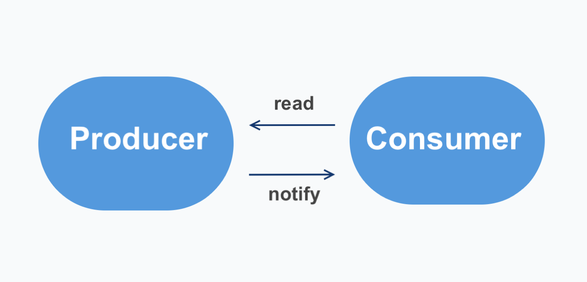
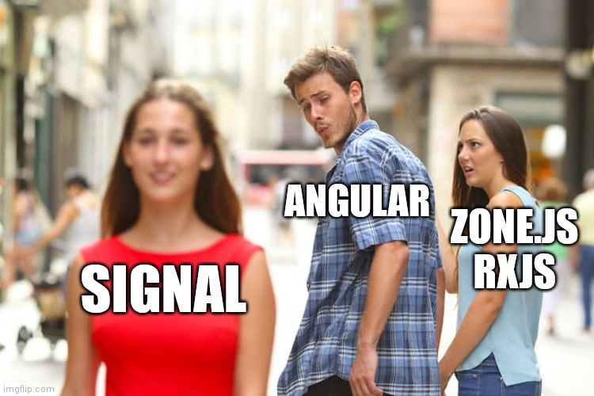
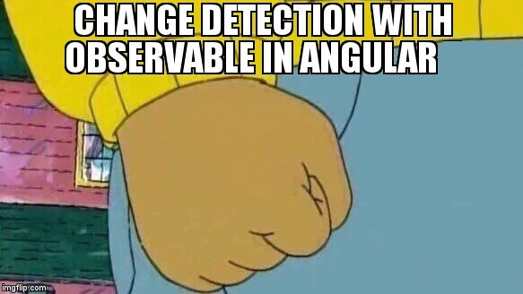
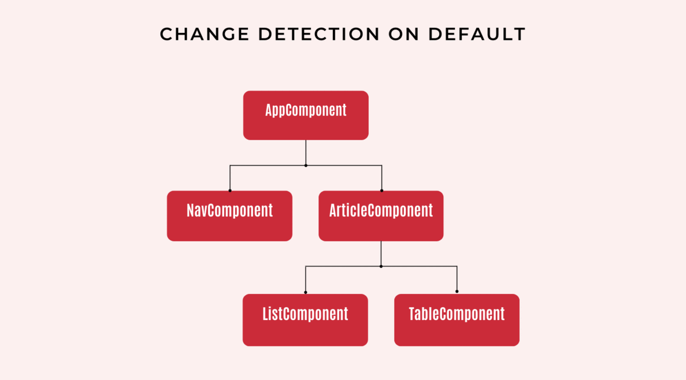
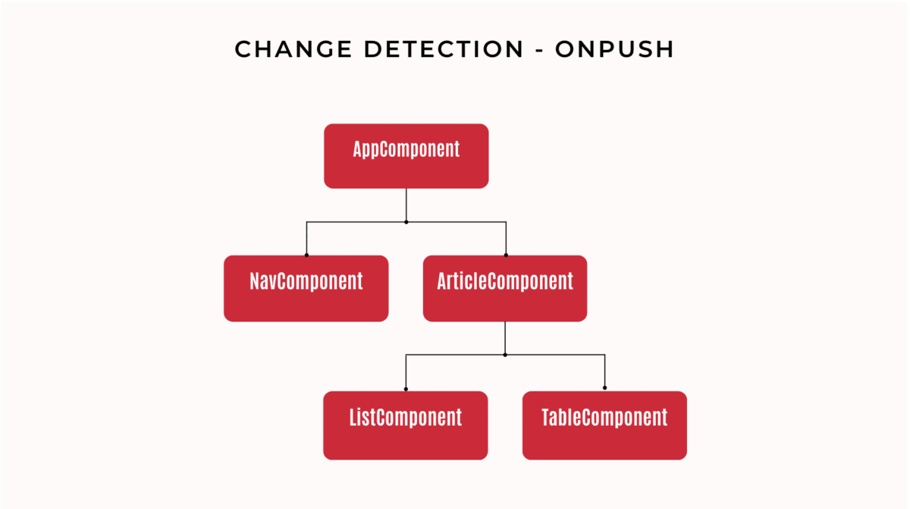
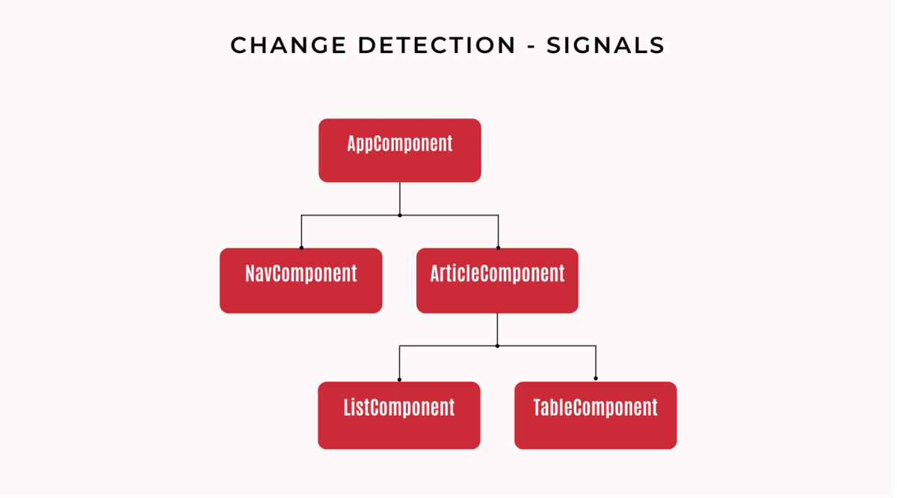

## Neue Reaktivität in Angular: Signals

Angular Signals sind das neue Tool in der reaktiven Programmierung mit Angular. Sie wurden erstmals im Mai dieses Jahres mit dem Update auf Version 16 als Developer Preview eingeführt und haben sich nun mit der Veröffentlichung von Angular 17 als festes Standbein des Frameworks etabliert.

Signals sind insbesondere für Junior Angular-Entwickler*innen ein hilfreiches Tool, da sie das reaktive Programmieren entscheidend erleichtern. Im Grunde sind sie - wie der Name es vermuten lässt - ein Signalgeber mit einem Wert, der alle verbundenen Consumer benachrichtigt, wenn sich dieser Wert ändert. Diese Werte können einfache Strings, ein Array oder auch komplexere Datentypen sein. Ändern sich diese Werte, werden automatisch alle Konsumenten informiert und aktualisieren ihre Werte. Im Vergleich zu Observables und RxJS bieten Angular Signals eine intuitivere und klarere Syntax. Dies führt zu einer verbesserten Lesbarkeit und Wartbarkeit des Codes und verbessert nebenbei auch signifikant die Leistung der Angular Anwendung.

Warum Signals leichter zu verstehen sind, was Observables und RxJS sind und inwiefern die Leistung der Angular App verbessert wird, wollen wir euch in diesem Artikel kurz erklären.

### Technische Implementierung: Ein Beispiel

Für unser Beispiel betrachten wir einen Onlineshop. Angenommen ihr erhaltet ein Ticket, den Einkaufswagen mit Angular Signals zu programmieren. Es ist gefordert, dass im Einkaufswagen sofort angezeigt wird, wenn jemand ein Produkt in den Warenkorb legt.

Das wichtigste zuerst: Um ein Signal zu erstellen, wird die Funktion `signal` aus der Angular-Core Bibliothek genutzt.

```ts
import { Component, inject, OnInit, signal } from '@angular/core';
import { data, data2 } from './data';


@Component({
 selector: 'signal-warenkorb',
 standalone: true,
 template: `
 <h2>Hier wird ein Signal genutzt </h2>
 <div class="container">
 <div class="child">
   @for(itm of sortiment;track $index){
 {{itm}}<button (click)="addItm(itm)">add</button><br>
 }</div>
  <div class="child">
 <ol>
 @for(itm of warenkorb();track $index){
   <li>{{itm}}</li>
 }
 </ol>
 </div>
 </div>
  `,
})
export class SignalWarenkorbComponent implements OnInit {
 i = 0;


 sortiment = data2;


 // so definiert man ein signal
 warenkorb = signal(['']);


 ngOnInit() {
   //ein weg um das value eines Signal zu setzen
   this.warenkorb.set(data);
 }


 addItm(newItm: string) {
   // ein web um das Value einen Signal upzudaten
   this.warenkorb.update((value) => [...value, newItm]);
   this.i++;
 }
}


```

In diesem Beispiel verwenden wir in der Komponente ListComponent ein Signal mit dem Namen warenkorb. Das warenkorb-Signal speichert die Listenelemente und wird initial mit data gesetzt. Der “Add”-Button löst die addItm-Methode aus, die wiederum warenkorb reaktiv mit neuen Elementen aus data2 aktualisiert. Eine Aktualisierung wird durch warenkord.update ausgelöst, was das Echtzeit-Update im Template bewirkt.

Kudos an Dave aka [Webdave](https://webdave.de/start) für das [Code-Beispiel auf Stackblitz](https://stackblitz.com/edit/stackblitz-starters-cv9u63?file=src%2Fsignal-warenkorb.component.ts). Hier findest du den gesamten Angular Prototypen.

### Producer vs. Consumer in Angular
Producer und Consumer sind zwei grundlegende Konzepte in Angular, die für die Kommunikation zwischen Komponenten verwendet werden. Producer sind für die Erzeugung von Daten verantwortlich, während Consumer diese Daten verarbeiten. Beispiele für Producer sind Functions, Promises, oder Observables. Consumer verarbeiten diese Werte dann weiter. Natürlich können Producer auch gleichzeitig Consumer sein. Signals spielen eine entscheidende Rolle in diesem Muster, indem sie eine vereinfachte Schnittstelle zwischen Datenproduzenten und -konsumenten bieten.




In unserem Code-Beispiel oben können wir ebenfalls zwischen einem Producer und einem Consumer unterscheiden:

Als Producer können wir die addItm-Methode benennen. Sie wird immer dann aufgerufen, wenn Nutzer:innen auf unseren "Add"-Button klicken. Mit ihr erzeugen wir neue Daten. Das ist in unserem Beispiel das Hinzufügen eines neuen Listenelements aus data2.

Der Consumer in diesem Beispiel ist das Template der Komponente, das auf diese Daten reagiert und sie anzeigt. Jedes Mal, wenn das warenkorb-Signal durch die addItm-Methode aktualisiert wird, wird die Liste im Template entsprechend aktualisiert.

### Observer vs. Observables in RxJS

Für erfahrene Angular-Entwickler*innen sind diese Konzepte ein alltäglicher Bestandteil ihrer Arbeit. "Observer" und "Observable" sind in der Bibliothek RxJS, die eng mit Angular integriert ist, zentrale Konzepte für die reaktive Programmierung und die Verwaltung von Datenströmen. Observer und Observables sind die reaktiven Äquivalente von Consumer und Producer. Der Observer ist der Consumer, der die Daten vom Observable empfängt. Das Observable ist der Producer, der die Daten an den Observer aussendet. Man spricht in diesem Zusammenhang auch von Subscriptions und Push. Dieses Beziehungsmuster bildet das Herzstück der reaktiven Programmierung in Angular.
Zur Veranschaulichung betrachten wir wieder unser Code-Beispiel mit dem Warenkorb in unserem Onlineshop des Vertrauens. Dieses Mal setzen wir das ganze “klassisch” mit Hilfe der Bibliothek RxJS um.
```ts
import { AsyncPipe } from '@angular/common';
import { Component, OnInit } from '@angular/core';
import { BehaviorSubject } from 'rxjs';
import { data, data2 } from './data';


@Component({
 selector: 'observable-list',
 standalone: true,
 imports: [AsyncPipe],
 template: `
 <hr>
 Hier wird ein Signal genutzt <br/>
 <button (click)="addItm()">Add</button>
 <ul>
 @for(itm of list| async;track $index){
<li>{{itm}}</li>
 }
 </ul>
 `,
})
export class ObservableListComponent implements OnInit {
 i = 0;


 // So definierst du ein Subject
 list = new BehaviorSubject(['']);


 ngOnInit() {
   //So kannst du den value eines Subjects setzen
   this.list.next(data);
 }


 addItm() {
   const newItm = data2[this.i];
   const newValue = [...this.list.value, newItm];


   // Wichtig! Ein Subject kann nicht ubgedatetd werden.
   // Es muss neu gesetzt werden.
   this.list.next(newValue);
   this.i++;
 }
}


```

Auch in diesem Beispiel können Nutzer:innen neue Elemente zu der Liste über den Button “Add” hinzufügen. Bei einem Klick wird erst die addItm-Methode  und dann warenkorb.next(newValue) aufgerufen. Jedes Mal, wenn warenkorb einen neuen Wert durch warenkorb.next() bekommt, wird die Anzeige automatisch aktualisiert, um die neuesten Daten zu zeigen.
Ein BehaviorSubject ist eine Art von Observable, das zwei Hauptmerkmale hat:
Anfänglicher Wert: Ein BehaviorSubject benötigt einen Anfangswert, den es seinen Abonnenten sofort zur Verfügung stellt, wenn sie sich abonnieren. Das bedeutet, dass jeder Abonnent sofort einen Wert erhält, wenn er sich abonniert, im Gegensatz zu normalen Observables, die möglicherweise keinen Wert senden, bis ein Ereignis eintritt.
Speicherung des letzten Wertes: Ein BehaviorSubject speichert den letzten emittierten Wert und gibt diesen an jeden neuen Abonnenten weiter. Das ist nützlich, wenn Sie sicherstellen möchten, dass der Abonnent immer den aktuellen Stand eines Wertes hat, auch wenn er sich abonniert, nachdem der Wert emittiert wurde.

Kudos an Dave aka [Webdave](https://webdave.de/start) für das [Code-Beispiel auf Stackblitz](https://stackblitz.com/edit/stackblitz-starters-cv9u63?file=src%2Fobservable-warenkorb.component.ts). Hier findest du den gesamten Angular Prototypen.

### Angular Signals vs. Observables in RxJS

Unterscheiden sich dann Angular Signals und Observer/Observables in RxJS überhaupt?

Ein "Observer" ist ein Objekt mit Callbacks, das auf die Werte reagiert, die von einem Observable geliefert werden. Es enthält in der Regel drei Hauptmethoden: next(), error() und complete(). Die next() muss aufgerufen werden, um jeden neuen Wert im Datenstrom zu verarbeiten. Die error() wird aufgerufen, wenn im Datenstrom ein Fehler auftritt, und die complete() signalisiert das Ende des Datenstroms. Bisher musste aber für jedes Observable immer manuell eine Subscription gesetzt und gemanagt werden. Das ist nicht nur zeitintensiv und code-lastig, sondern erfordert auch tiefgreifende Kenntnisse der Web-Entwickler*in in RxJS.



Angular Signals übermitteln ihre Werte (im Gegensatz zu den Datenströmen bei Observables!) automatisch und müssen nicht manuell ein- und abgestellt werden. Das spart nicht nur wertvolle Arbeitszeit, sondern erleichtert auch den Einstieg für angehende Angular Entwickler*innen!

Ist das also der Anfang vom Ende von RxJS in Angular?

Jein!


Für Aufgaben, bei denen es um fortlaufende und asynchrone Datenströme geht, sind Observables in Angular immer noch die erste Wahl. RxJS bietet eine umfangreiche API, mit der Entwickler*innen asynchrone Datenflüsse filtern, transformieren und kombinieren können. Ein Beispiel für asynchrone Ereignisse in Angular ist eine HTTP-Anfrage, die Daten von einem Server holt. Diese Anfrage gibt ein Observable zurück, das irgendwann in der Zukunft ein Ergebnis liefert. Dies macht Observables flexibler und mächtiger in komplexen asynchronen Szenarien gegenüber Angular Signals. In absehbarer Zeit wird sich das wohl auch nicht ändern.

>Oder in einfacher Sprache:
>
>Stell dir Observables in Angular wie einen Wasserhahn vor, aus dem Wasser (Daten) in einem kontinuierlichen Fluss kommt. Dieser Wasserfluss kann schnell oder langsam sein, und manchmal kommen auch größere Wassermengen auf einmal heraus – das ist wie bei asynchronen Daten, sie kommen nicht immer alle auf einmal.
>Angular Signals sind eher wie ein Lichtschalter, der einfach an oder aus ist. Sie sind gut, um einfache Dinge schnell zu erledigen.
>Wenn du nun kompliziertere Aufgaben hast, bei denen Daten über einen längeren Zeitraum in verschiedenen Mengen ankommen (wie das Wasser aus dem Hahn), sind Observables besser geeignet. Sie können mit diesen "Wasserströmen" besser umgehen und haben Werkzeuge, um das Wasser (Daten) zu filtern oder umzuleiten.

## Change Detection

Der andere große Vorteil der Angular Signals ist, dass für die Change Detection nicht mehr der gesamte Komponentenbaum der Anwendung überprüft werden muss. Es werden nur noch direkt die Views aktualisiert, an denen sich etwas geändert hat. Das ist signifikant performativer und ressourcenschonender.



Was heißt das? Um das besser einzuordnen, werden wir die Begriffe Change Detection und View kurz erklären.

Change Detection ist der Mechanismus, der Statusänderungen in der Ansicht unserer Anwendung erkennt und die HMTL-Browseransicht entsprechend aktualisiert. Als Beispiel: Wenn du im Online-Shop deines Vertrauens Produkte in den Warenkorb legst, sorgt die Change Detection Angular dafür, dass die Änderungen auch in deiner HTML-Ansicht angezeigt werden.

Die visuelle Darstellung einer Komponente wird in Angular eine "View" genannt. Angular Views sind hierarchisch aufgebaut. Das bedeutet, dass Sie eine Haupt-View (oder auch Root-View) haben, in die andere Views eingebettet sind. Diese Verschachtelung kann mehrere Ebenen tiefgehen, was es ermöglicht, komplexe Anwendungen aus kleineren, wiederverwendbaren Teilen zu erstellen. Wenn wir in unserem Beispiel mit dem Warenkorb bleiben: Ein Warenkorb besteht aus verschiedenen Elementen. Oft haben wir einen Button in der Navigationsleiste, dann die Ansicht im Main Bereich, die oft aus einer Tabelle, einer Liste, diversen Buttons und anderen Bedienelementen besteht. Jeder dieser sichtbaren Teile kann in Angular eine eigene "View" sein.

Bisher gab es zwei Hauptstrategien für die Change Detection in Angular: Default und OnPush.

### Change Detection Default Strategy



In der Default Methode prüft Angular bei jedem Auslöser, ob sich die Daten geändert haben, d.h. bei jeder Änderung wird der gesamte Komponentenbaum der App überprüft. Auslöser können ein Klick oder eine Tastatureingabe - in unserem Beispiel war das der Warenkorb für unseren Online Shop - oder aber HTTP-Anfragen durch HttpClient und Timer wie setTimeout.

### Change Detection On-Push Strategy



Die OnPush-Strategie sagt Angular, dass es nur dann prüfen soll, ob sich Daten geändert haben, wenn sich die Eingabedaten der Komponente (das sind die sogenannten Input Properties) geändert haben. Das hat den Vorteil, dass nur noch die Views aktualisiert werden, bei denen sich etwas geändert hat. Es hat aber den Nachteil, dass für jede Komponente die Change Detection Strategie manuell mit Hilfe von Observables auf On Push gesetzt werden muss.

### Change Detection Signals



Verwenden wir nun stattdessen Signals, muss die Change Detection nur noch die Views aktualisieren, die die Liste der Produkte darstellt. Außerdem kann das Signal von mehreren Komponenten abonniert werden. Damit können wir mit geringem Aufwand auch Änderungen für das Warenkorb-Icon im Hauptmenü an die Shop-Besucher kommunizieren.

>Oder in einfacher Sprache:
>
>Wir können die Change Detection in Angular anhand eines Briefkastens veranschaulichen.
>In der Default Change Detection sind wir uns nicht sicher, wann die Post kommt. Daher gehen wir ständig hinaus und überprüfen den Briefkasten, selbst wenn kein neuer Brief angekommen ist. Das ist ineffizient, weil Sie viel Energie und Zeit verbrauchen, nur um festzustellen, dass das nichts Neues ist.
>Bei der OnPush Change Detection läutet der Briefträger deine Klingel, wenn er einen neuen Brief einwirft. Solange kein neuer Brief kommt, bleibt alles ruhig. Du musst jedoch jedem Briefträger oder Paketdienstleister oder Werbe-Prospektverteiler manuell Bescheid geben, dass er Glocke klingeln muss. Und du weißt nicht, was angekommen ist, solange du nicht zum Briefkasten gehst.
>In der Angular Signals Change Detection ist dein Briefkasten "intelligent". Er weiß nicht nur, dass ein Brief eingeworfen wurde, sondern auch, ob es ein Brief, Paket oder Werbung ist. Der Briefkasten sendet dir ein spezifisches Signal, je nach Art des Briefes.

## Conclusion

Wir haben in diesem Artikel die wichtigsten Konzepte zu Signals kurz erklärt. Dazu gehören eine kurze Einführung in Signals, die Unterschiede zwischen Signals und Observables, die Vorteile der Signals für die Change Detection und einige Beispiele für die Verwendung von Signals.
Angular Signals sind in kürzester Zeit bereits nicht mehr wegzudenken aus dem Alltag für Angular-Entwickler*innen. Ihr großer Vorteil liegt in ihrer einfachen Syntax und verbesserten Performance. Für fortgeschrittene Anwendungsfälle, in denen asynchrone Datenflüsse eine Rolle spielen, bleiben dennoch RxJS Observables weiterhin die erste Wahl.

## Fragen an die Community

Für die erfahrenen Angular Entwickler*innen unter euch, haben wir ein paar Fragen:
*Nutzt ihr Signals zusammen mit der On Push-Change Detection?
*In welchen Fällen findet ihr es besser, Signals statt Observables auch bei asynchronen Datenströmen zu nutzen?
*Habt ihr bereits Signals in Kombination mit Promises verwendet?

## Werde Teil unserer Community

Wie immer laden wir euch ein, Teil unserer [Angular Community auf Discord](https://workshops.de/join-discord) zu werden. Seit 2013 bieten wir euch hier Tutorials, Artikel und Schulungen rund um das Angular Framework. Gestartet durch unsere Begeisterung für die modernen Möglichkeiten der Webentwicklung hat sich mittlerweile eine ganze Community dazu entwickelt. Mit mittlerweile 18 Meetups, die insgesamt über 10.000 Angular-Entwickler*innen:innen als Plattform für regelmäßigen Austausch dienen, sind wir damit in Europa die Region mit den meisten Angular-Entwickler*innen.
[Werde Teil unserer Community!](https://workshops.de/join-discord)

## Quellen

### Quellen: Signals/Realitivity/Producer-Consumer-Pattern

- [How to build an event emitter in JavaScript - educative.io](https://www.educative.io/answers/how-to-build-an-event-emitter-in-javascript){:rel="noopener noreferrer nofollow"}

- [How Angular Signals Solves an Age-Old Problem - betterprogramming.pub](https://betterprogramming.pub/how-angular-signals-solves-an-age-old-problem-ae7ec60f042f){:rel="noopener noreferrer nofollow"}

- [Angular’s Signal Revolution: Effortless Change Detection Explained - netbasal.com](https://netbasal.com/angulars-signal-revolution-effortless-change-detection-explained-unveiling-the-inner-workings-8a5e44c95b65){:rel="noopener noreferrer nofollow"}

### Quellen: Change Detection

- [Deep dive into the OnPush change detection strategy in Angular - Max Koretskyi](https://medium.com/angular-in-depth/deep-dive-into-the-onpush-change-detection-strategy-in-angular-fab5e4da1d69){:rel="noopener noreferrer nofollow"}

- [Understating Angular Change Detection with example - DHANANJAY KUMAR](https://debugmode.net/2018/06/05/understating-angular-change-detection-with-example/){:rel="noopener noreferrer nofollow"}
  [https://www.thinktecture.com/en/angular/whats-the-hype-onpush/](https://www.thinktecture.com/en/angular/whats-the-hype-onpush/){:rel="noopener noreferrer nofollow"}

- [Future of Change Detection in Angular with Signals - Thomas Laforge](https://medium.com/ngconf/future-of-change-detection-in-angular-with-signals-fb367b66a232){:rel="noopener noreferrer nofollow"}

### Quellen: Memes

- [Angular Memes - github.com](https://github.com/dzhavat/angular-memes){:rel="noopener noreferrer nofollow"}

