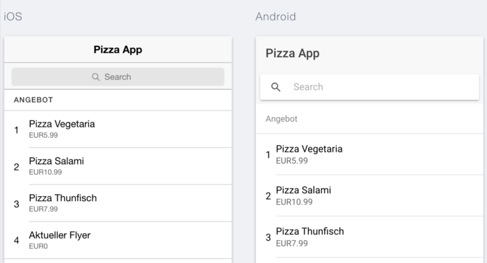
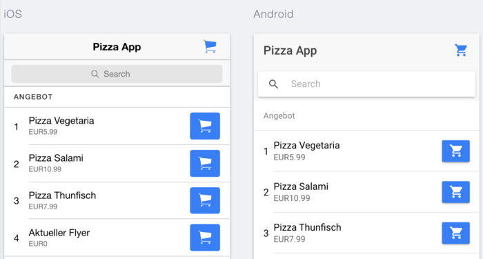
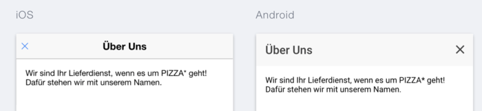

Aufbauend auf dem [ersten Teil](/artikel/ionic2-tutorial-deutsch/) unseres Ionic 2 Tutorials wollen wir uns nun anschauen, wie ihr in Ionic 2 eure Inhalt ansprechend präsentieren und strukturieren könnt.

Den [kompletten Quellcode](https://github.com/angularjs-de/ionic2-pizza-service "Quellcode Ionic 2 Pizza App") der in diesem Tutorial entwickelten App findet unter unserem GitHub-Account. Außerdem gibt es auch eine [Live-Vorschau](http://angularjs-de.github.io/ionic2-pizza-service/www/ "Ionic 2 Pizza App") der App.

**Teil 2: Strukturierung von Inhalten**
1. Einfache und komplexe Listen - `ionList`, `ionItem` und `ionItemSliding`
2. Ladehandling - Ladelayer und - spinner mit `Loading` und `ionSpinner`
3. Aktualisierung von Inhalten durch den `ionRefresher`
4. Strukturierung von Inhalten durch Cards und `ionCard`
5. Anzeigen zusätzlicher Informationen in Dialogen mit `Modal`
6. Realisierung von Hinweisen und kurzer Nutzerabfragen durch `Alert`s
7. Statusmeldungen über `Toast`s


## Einfache und komplexe Listen

Listen sind überall, ob als einfache Aufzählung oder Darstellung komplexerer HTML-Strukturen. In Ionic 2 sind im Vergleich zu Version 1 ein paar weitere Komponenten zur Listendefinition hinzugekommen. Wir behandeln in diesem Tutorial nur ein paar davon, die restlichen sind mit der entsprechenden Stelle in der Ionic Dokumentation verlinkt.

**Typen**

- einfache Liste  - ionList und ionItem
- [gruppierte Liste](http://ionicframework.com/docs/v2/components/#list-dividers "Gruppierte Listen") - ionItemGroup, ionItemDivider
- Listenkopfzeile - ionListHeader
- [Icons in Listen](http://ionicframework.com/docs/v2/components/#icon-list "Icons in Listen") - ionIcon
- Bilder in Listen - [ionAvatar](http://ionicframework.com/docs/v2/components/#avatar-list "Avatar Bilder in Listen") und [ionThumbnail](http://ionicframework.com/docs/v2/components/#thumbnail-list "Thumbnails in Listen")
- erweiterte Listen - ionItemSliding, ionItemOptions

Wir werden auch in unserer Pizza-App Listen verwenden. Auf unserer Bestell- bzw. Startseite wollen wir unser Angebot ausgeben. Dazu erstellen wir einen Ordner `providers` im `src` Ordner. Dort legen wir nun eine Datei mit dem Namen `pizza.service.ts` an. Sie stellt uns zwei Funktionen zur Verfügung.

1. getPizzas - lädt das komplette Angebot
2. getPizza(id) - gibt uns eine bestimmte Pizza zurück

Unser Angebot speichern wir in einer extra `pizza.json` ab. Diese legen wir in einen `assets` Verzeichnis im `src`-Ordner der Anwendung, da wir in der gebauten Anwendung Zugriff darauf brauchen.

Wir haben natürlich auch noch ein `Pizza` Interface erstellt, um unsere Schnittstellendaten auch zu typisieren.

Die wichtigsten Dateien findet ihr hier:

1. [pizza.service.ts](https://github.com/angularjs-de/ionic2-pizza-service/blob/master/src/providers/pizza.service.ts "Quellcode der pizza.service.ts")
2. [pizza.model.ts](https://github.com/angularjs-de/ionic2-pizza-service/blob/master/src/models/pizza.model.ts "Quellcode des Pizza Interfaces")
3. [pizza.json](https://github.com/angularjs-de/ionic2-pizza-service/blob/master/src/assets/pizza.json "Inhalt der pizza.json")
4. barrels - der `providers` Ordner erhält eine `index.ts`

Sollte euch davon noch etwas unklar sein, dann empfehlen wir euch nochmals einen Blick in unser Angular 2 Tutorial zu werfen.

### Einfache Liste

Für einfache Listen hat sich im Vergleich zu Ionic 1 nicht viel verändert. Es bleiben die bekannten Komponenten `ionList` und `ionItem`. Wir wollen nun unser Angebot auf der Startseite in einer einfachen Liste ausgeben.

Sind alle Dateien an Ort und Stelle laden wir unser Angebot in der `OrderComponent`. Wir wollen den `PizzaService` und die Daten in unserer gesamten App nutzen. In einer reinen Angular2 Anwendung würden wir aus diesem Grund die `providers` Eigenschaft des  `@NgModule` Decorators nutzen.

```javascript
@NgModule({
  ...
  providers: [PizzaService]
})
```

Danach können wir diese eine Service Instanz in jeder anderen Seite/Komponente einfach per Dependency Injection erhalten.

```javascript
@Component({
  templateUrl: 'order.component.html'
})
export class OrderComponent implements OnInit {
  pizzas: Pizza[] = [];

  constructor(
    private pizzaService: PizzaService
  ) {}

  ngOnInit() {
    this.pizzaService.getPizzas().subscribe(pizzas => {
      this.pizzas = pizzas;
    });
  }
}
```


Im Template greifen wir nun auf unser `pizzas` Array zu. Wir definieren eine Liste mit `ionList` und für jede Pizza erzeugen wir einen Listeneintrag über `ionItem`.

```html
<ion-content class="order">
  <ion-list>
    <ion-item *ngFor="let pizza of pizzas">
      {{pizza.name}}
    </ion-item>
  </ion-list>
</ion-content>
```


Wir können natürlich auch ein paar Informationen zu unserer Pizza ausgeben. Dazu brauche wir nur den Inhalt des `ion-item` Tags anpassen. Als nächsten möchten wir unserer Liste noch einen Titel *Angebot* geben. Dazu nutzen wir einfach die `ionListHeader` Komponente in unserer `ionList`.

```html
<ion-content class="order">
  <ion-list>
    <ion-list-header>
      Angebot
    </ion-list-header>
    <ion-item *ngFor="let pizza of pizzas">
      <span item-left text-left>{{pizza.id}}</span>
      <h2>{{pizza.name}}</h2>
      <p>{{pizza.price | currency:'EUR'}}</p>
    </ion-item>
  </ion-list>
</ion-content>
```



### Komplexe Liste

Als nächste Funktion erweitern wir unsere App um einen [Warenkorb](https://github.com/angularjs-de/ionic2-pizza-service/tree/master/src/pages/cart "Warenkorb Quelltexte"). Dieser besteht aus einer `Component`, einem Service und einem `CartItem` Interface. Für Interfaces legen wir das Verzeichnis `models` in den `src` Ordner. Auf unserer Startseite fügen wir einen Warenkorb-Button in die Navigationsleiste ein und bieten die Möglichkeit Angebote in den Warenkorb zu legen. Der Warenkorb ist per Klick über die Schaltfläche (`ionButtons` mit `end` Direktive) in unserer Navigationsleiste erreichbar.

In Ionic 2 wird die Positionierung von Elementen in den meisten Fällen mit `Flexbox` erledigt. Zur einfacheren Nutzung stellt das Framework Positionierungs Direktiven bereit. So könnt ihr unter anderem Schaltflächen in `ionItems` einfach durch die Attributdirektiven `item-right` und  `item-left` ausrichten.

```html
<ion-item *ngFor="let pizza of pizzas">
  <span item-left text-left>{{pizza.id}}</span>
  <h2>{{pizza.name}}</h2>
  <p>{{pizza.price | currency:'EUR'}}</p>
  <button item-right ion-button icon-only (click)="addToCart($event, pizza)" default>
    <ion-icon name="cart"></ion-icon>
  </button>
</ion-item>
```



Wir gehen jetzt nicht mehr näher auf die Implementierung der einzelnen Funktionen ein, da dies weniger mit Ionic, sondern mehr mit Angular 2 zu tun hat. Entnehmt eine mögliche Umsetzung einfach unserem [GitHub-Repository](https://github.com/angularjs-de/ionic2-pizza-service/tree/master/src/cart "Warenkorb Quelltexte").

<div class="alert alert-info"><em>Hinweis:</em> Benötigt ihr eine weitere Aktion auf einem <code>ionItem</code>, z.B. Navigieren zu einer anderen Seite, solltet ihr den <code>ionItem</code>-Tag in einen <code>a</code>-Tag umwandeln und <code>ion-item</code> als Attribut setzen.</div>

Im Warenkorb bauen wir eine Liste von Warenkorbeinträgen auf. Jeder Einträg soll natürlich auch wieder entfernt werden können. Dazu benötigen wir eine erweiterte Liste. Ein Listeneintrag soll dabei nach links geslidet werden, wodurch ein Löschen-Knopf zum Vorschein kommt. Beim Klick darauf wird der Warenkorbeintrag entfernt.

Ein Listeneintrag wird *slidebar* in dem wir das `ionItem` mit der `ionItemSliding` Komponente umschließen. Als Geschwisterknoten bekommt das `ionItem` nun die `ionItemOptions` Komponente. Sie kann wiederum eine Liste von Schaltflächen enthalten.

```html
<ion-list *ngIf="cart.length">
  <ion-item-sliding *ngFor="let item of cart; let index=index">
    <ion-item>
      <h2>{{item.name}}</h2>
      <p>{{item.price | currency:'EUR'}}</p>
    </ion-item>
    <ion-item-options>
      <button (click)="removeFromCart(index)" danger default ion-button icon-left>
        <ion-icon name="trash"></ion-icon>
        Delete
      </button>
    </ion-item-options>
  </ion-item-sliding>
</ion-list>
```


<div class="alert alert-info"><em>Hinweis:</em> Seit Beta 9 können nun auf beiden Seiten Option-Buttons eingebaut werden. Dazu müsst ihr dem ion-item-options Tag einfach die entsprechende Seite angeben. Beispiel: <code>&lt;ion-item-options side="right"></code>.</div>


## Ladehandling - Ladelayer und - spinner

In viele Fällen wollen oder müssen wir sogar dem Nutzer in einer App verdeutlichen, dass gerade ein Verarbeitungsprozess im Hintergrund läuft. Sei es zum Beispiel das Abspeichern oder das Laden von Daten, der Anwender sollte Erfahren das etwas passiert. In vielen Fällen möchten wir vielleicht sogar die Eingabe weiterer Daten solange sperren, bis ein Prozess abgeschlossen ist.

In Ionic 2 passiert das - wie schon in Ionic 1 - über zwei unterschiedliche Bestandteile des Frameworks.

 1. `Loading`
   - programmatisches Einblende eines Ladelayers (über die ganze Seite)
   - kann Interaktionen des Nutzers unterbinden
   - zusätzlicher Hinweistext
 2. `ionSpinner`
   - Komponente, die im Template genutzt wird
   - rotierende Ladeanzeige auf der Seite

**Loading**

Beginnen wir dem Ladelayer und `Loading` Controller. Er besitzt nur eine `create` Funktion, die uns erlaubt - unter Angabe von verschiedener Konfigurationsparametern - ein Lade-Overlay zu erzeugen.

Als Optionen können folgende Eigenschaften gesetzt werden.

 - *spinner* - Name des anzuzeigenden Lade-Spinners, default: plattformspezifisch
 - *content* - eigener Inhalt, z.B. Hinweistext
 - *cssClass* - eigene CSS Klasse zum Stylen
 - *showBackdrop* - `true` oder `false`, legt abgedunkeltem Overlay über Inhalt
 - *dismissOnPageChange* - `true` oder `false`, Ausblenden des Ladelayers beim Seitenwechsel
 - *duration* - Dauer in Millisekunden, falls Layer automatisch ausgeblendet werden soll

Im Code könnte ein Layer so erzeugt werden.

```javascript
import {LoadingController} from 'ionic-angular';
...
constructor(private loadingCtrl: LoadingController) {...}

let loading = this.loadingCtrl.create({
  content: 'Loading...',
  dismissOnPageChange: true
});
```

Damit dieser auch sichtbar wird, muss er noch über die aktuelle Seite gelegt werden. Dies geschieht über die `present` Funktion auf dem entsprechenden Overlay-Element - hier ein Loading Overlay.

```javascript
loading.present();
```


Ausblenden könnt ihr das Overlay über die `dismiss` Funktion.

```javascript
loading.dismiss();
```

Wollt ihr beim Ausblenden noch speziellen Programmcode ausführen, dann könnt ihr dies über den `onDidDismiss` Hook tun.

```javascript
loading.onDidDismiss(() => {
  console.log('Dismissed loading');
});

loading.dismiss();
```

*ionSpinner*

Zu dieser Komponente gibt es im Prinzip nicht viel zu erzählen. Wird sie ins Template geschrieben, erscheint an der entsprechenden Stelle der plattformspezifische Ladekringel.

```html
<ion-spinner></ion-spinner>
```

Sie kann über drei Attribute konfiguriert werden.

  - *name* - Spinner Name
  - *duration* - Dauer bis sich Spinner Icon komplett gedreht hat
  - *paused* - Spinner anhalten

In unserem Fall wollen wir über eine `isLoading` Variable unsere Angebotsliste erst einblenden, wenn die Daten geladen wurden. Bis dahin soll ein Ladespinner angezeigt werden.

Unsere OrderComponent class.

```javascript
export class OrderComponent implements OnInit {
  pizzas: Pizza[] = [];
  isLoading = true;
  ...
  ngOnInit() {
    this.pizzaService.getPizzas().subscribe(pizzas => {
      this.pizzas = pizzas;
      this.isLoading = false;
    });
  }
}
```

Ausschnitte des Templates und das Resultat.

```html
<ion-content>
  <div text-center padding [hidden]="!isLoading">
    <ion-spinner></ion-spinner>
  </div>
  <ion-list [hidden]="isLoading">
    ...
  </ion-list>
</ion-content>
```


Das war schon die ganze Magie hinter dem Ladehandling in Ionic 2.


## Aktualisierung von Inhalten

Eine oft gewünscht und genutzte Funktionalität in Apps ist das Aktualisierung von Inhalten über einen so genannten *Pull-To-Refresh* Mechanismus. Dabei könnt ihr den Seiteninhalt nach unten Ziehen bis ein Schwellwert erreich wird. Danach wird der Seiteninhalte automatisch aktualisiert. Während des Ziehens wird dem Nutzer der aktuelle Status angezeigt, z.B. wann losgelassen werden kann, ob die Aktualisierung läuft oder ob noch weiter gezogen werden muss.

In Ionic 2 besteht das ganze Unterfangen, wie auch schon Ionic 1 aus zwei Teilen.

 1. Umsetzung im Template - `ionRefresher` und `ionRefresherContent`
 2. Programmatischer Zugriff - `Refresher`

Ein Refresher besitzt immer einen Status aus folgender Liste:

  - *inactive* - nicht sichtbar, Nutzer zieht nicht im Inhalt
  - *pulling* - Nutzer zieht am Inhalt und Refresher wird sichtbar (noch kein Refresh)
  - *cancelling* - Nutzer lässt vor Aktualisierungsschwellwerten los, wird zu inactive, wenn Refresher wieder ausgeblendet wurde
  - *ready* - Nutzer hat Inhalt über den minimalen Schwellwert gezogen, lässt er los, wird aktualisiert
  - *refreshing* - Aktualisierung läuft und wartet auf den Aufruf von `complete()` auf der Refresher Instanz
  - *completing* - Aktualisierung abgeschlossen, ist Refresher wieder ausgeblendet, wechselt der Zustand zu inactive

**ionRefresher**

Im Template wird ein Refresher über die `ionRefresher` Komponente eingebunden. Sie ist ein direktes und das erste Kind des `ionContent`s. Über die folgenden Inputs könnt ihr den Refresher auch noch konfigurieren.

  - *pullMin* - minimale Distanz bis beim Loslassen aktualisiert wird (default: 60)
  - pullMax - maximale Distanz bis automatisch aktualisiert wird (pullMin + x, default pullMin: + 60)
  - *closeDuration* - Dauer in Millisekunden, die der Refresher zum Schließen/Ausblenden benötigt, default: 280
  - *snapbackDuration* - Dauer in Millisekunden bis Refresher wieder zum Refreshing Zustand springt, default: 280
  - *enabled* - aktiviert/deaktiviert Refresher, sollte anstatt `*ngIf` genutzt werden, default: `true`

```html
<ion-refresher></ion-refresher>
```

Zusätzlich könnt ihr auch noch auf Zustandsänderungen reagieren (Outputs) und in bestimmten Situationen Code ausführen lassen.

  - *ionStart* - Nutzer beginnt am Inhalt zu ziehen
  - *ionPull* - Während des Ziehens
  - *ionRefresh* - pullMin Grenze überschritten - Status wechselt beim Loslassen auf `refreshing`, Spinner wird angezeigt bis `complete()` ausgeführt wird.

Damit sind wir jedoch im Template noch nicht fertig.

**ionRefresherContent**

Ein `ionRefresher` benötigt als Kind eine `ionRefresherContent` Komponente. Sie gibt dem Refresher erst sein Aussehen. Dies passiert über folgende Attribute.

  - *pullingIcon* - Icon Name, wenn am Inhalt gezogen wird
  - *pullingText* - Text, der beim Ziehen angezeigt wird
  - *refreshingSpinner* - Spinner Name, wenn aktualisiert wird
  - *refreshingText* - Aktualisierungstext

Jetzt sieht unserer Refresher schon mal nach etwas aus.

```html
<ion-refresher>
  <ion-refresher-content
  pullingText="aktualisieren..."
>
  </ion-refresher-content>
</ion-refresher>
```

Es fehlt nur noch unsere Aktualisierungslogik.

### `Refresher`

Um Zugriff auf den aktuellen Refresher auf einer Seite erhalten, müsst ihr für die Typisierung die `Refresher` Komponente aus Ionic importieren und im Constructor der `@Component` injizieren.

```javascript
import {Refresher} from 'ionic-angular';
```

Als nächstes benötigen wir noch eine Funktion, die unsere Daten aktualisiert und am Ende müssen wir dem Refresher Bescheid geben, dass der Aktualisierungsprozess abgeschlossen ist. Dies machen wir über die schon mehrfach erwähnte `complete` Funktion. Zugriff auf die aktuelle Refresher Instanz erhalten wir über das `$event` Objekt eines Outputs.

```javascript
doRefresh(refresher: Refresher) {
  const subscription = this.pizzaService
    .getPizzas()
    .subscribe(pizzas => {
      this.pizzas = pizzas;
      refresher.complete();
      subscription.unsubscribe();
  });
}
```

Im Template sieht der Aufruf der `doRefresh` folgendermaßen aus.

```html
<ion-refresher (refresh)="doRefresh($event)">
  <ion-refresher-content
    pullingText="aktualisieren..."
  >
  </ion-refresher-content>
</ion-refresher>
```


## Strukturierung von Inhalten durch Cards

Der Einsatz von Cards zum Strukturieren und Trennen von Inhalten wird immer beliebter. Dabei kann ihr Inhalt aus reinem Text bis hin zu komplexen HTML-Strukturen bestehen.

Wir wollen Cards auf den Detailseiten zu unseren Angeboten nutzen. Dazu nutzen wir unseren Pizza Service und die `getPizza` Funktion. Sie macht erstmal nichts anderes als unsere `getPizzas` Funktion. Jedoch erwartet sie die ID des zu suchenden Angebots als Funktionsparameter, denn wir wollen nur ein bestimmtes Angebot anzeigen.

Jetzt müssen wir noch eine `DetailComponent` mit einem entsprechendem Template anlegen. Beim Klick auf ein Angebot soll sich ihre Detailseite anhand der `ID`  öffnen. Dort wird das entsprechende Angebot geladen und angezeigt. Die Funktion zum Navigieren in unserer Bestellseite könnte wie folgt aussehen.

```javascript
openPizza(id: number) {
  this.nav.push(DetailComponent, {
    id: id
  });
}
```

Nun schauen wir uns die verschiedene Möglichkeiten an Cards zu nutzen. Eine Card wird in Ionic immer über die `ionCard` Komponente im Template genutzt.

```html
<ion-card></ion-card>
```

Im einfachsten Fall enthält eine Card nur reinen Text. Damit dieser automatisch richtig angezeigt wird, existiert die `ionCardContent` Komponente. Sie umschließt den eigentlichen Inhalt einer Card. Auf unsere Detailseite angewandt, könnte der HTML-Code ungefähr so aussehen.

```html
<ion-card>
  <ion-card-content>
    <h2>{{pizza?.name}}</h2>
    <p>Ist in unserem Angebot die Nummer {{pizza?.id}}</p>
  </ion-card-content>
</ion-card>
```

Und das Ergebnis sieht schon mal gar nicht so schlecht aus.


Zum expliziten Auszeichnen eines Card-Titels stehen uns zwei Möglichkeiten zur Verfügung.

 1. `ionCardTitle` - Setzen des Titels im `ionCardContent`
 2. `ionCardHeader` - Titel für die ganze Card

Wir schauen uns den jeweiligen Quellcode und das damit verbundene visuelle Resultat an. Wir beginnen mit dem `ionCardTitle`.

```html
<ion-card>
  <ion-card-content>
    <ion-card-title>{{pizza?.name}}</ion-card-title>
    <p>Ist in unserem Angebot die Nummer {{pizza?.id}}</p>
  </ion-card-content>
</ion-card>
```


Und im Vergleich dazu die Lösung mit `ionCardHeader`.

```html
<ion-card>
  <ion-card-header>
    {{pizza?.name}}
  </ion-card-header>
  <ion-card-content>
    <p>Ist in unserem Angebot die Nummer {{pizza?.id}}</p>
  </ion-card-content>
</ion-card>
```


Wann ihr was benutzt, hängt immer von eurem Anwendungsfall ab. Wie wir gleich sehen werden, kann eine Card auch komplexere Strukturen beinhalten. Dabei wird dann der `ionCardHeader` wirklich immer am Anfang und als erstes in der Card angezeigt. Wollt ihr jedoch einen Titel einfach im Inhaltsbereich der Karte ausrichten, dann bietet sich `ionCardTitle` an.

<div class="alert alert-info"><em>Hinweis:</em> Die Nutzung von <code>ionCardContent, ionCardHeader, ionCardTitle</code> sind nicht Pflicht. ihr könnt auch einfach das Styling selbst übernehmen. Sobald ihr `ionCard` nutzt, erhaltet ihr immer das Basislayout einer Card.</div>

Des Weiteren könnt ihr auch weitere Ionic Komponenten, wie `ionAvatar`, `ionNote` und `ionItem`, zum Füllen eurer Cards nutzen.

Lasst euch von ein paar Ideen aus der Ionic Dokumentation inspirieren. Gerade das [Arbeiten mit Bildern](http://ionicframework.com/docs/v2/components/#card-background) macht etwas her.


Eine etwas komplexere Card für unser Angebot könnte dann so aussehen.

```html
<ion-card *ngIf="pizza">
  <ion-item>
    <ion-icon name="pizza" item-left large></ion-icon>
    <h2>{{pizza.name}}</h2>
    <p>Ist in unserem Angebot die Nummer {{pizza.id}}</p>
  </ion-item>

  <ion-card-content>
    {{pizza.description}}
  </ion-card-content>

  <ion-item>
    <span primary clear item-right>
      <ion-icon balanced></ion-icon>
      {{pizza.price ? (pizza.price | currency:'EUR') : 'kostenlos'}}
    </span>
  </ion-item>
</ion-card>
```


Damit sind wir mit dem nächsten großen Punkt auf dem Weg zu unserer Pizza-App fertig.


## Anzeigen zusätzlicher Informationen in Dialogen

Modale und Dialoge sind - und waren es auch schon in Ionic 1 - fester Bestandteil von Webseiten und Apps. Natürlich findet ihr diese wichtige Funktion auch in Ionic 2 wieder.

### Erstellen und Öffnen eines Modals

Ein Modal ist dabei eine normale `Component` Klasse, welche über die `create` Funktion des `Modal` Controllers erst zu einem richtigen Modal wird.

Dort wo der Modal aufgerufen wird, erzeugen wir aus der `Component` einen Modal und haben die Möglichkeit, wie schon bei den Ladelayern, ihn mittels der `present` Funktion unseres erzeugten Overlay-Elements - in diesem Falle eine `ModalController`-Instanz - über die aktuelle Seite zu legen.

Ziel dieses Abschnittes ist es aus unserer Über Uns Seite einen Modal zu machen, welcher sich beim Klick auf den Eintrag im Seitenmenü öffnet. Wir benennen deshalb die Component und die dazugehörigen Dateien um.

```javascript
// about/about-modal.component.ts
@Component({ ... })
export class AboutModalComponent { ... }
```

Im Template ersetzen wir die `ionNavBar` mit einer ganz normalen `ionToolbar`.

```html
// about/about-modal.component.html
<ion-header>
  <ion-toolbar>
    <ion-title>Über Uns</ion-title>
  </ion-toolbar>
</ion-header>
```

Als nächsten Schritt müssen wir in unserer App-Klasse, die Logik zum Öffnen des Dialogs einbauen.

```javascript
import {ModalController, ...} from 'ionic-angular';
...
constructor(private modalCtrl: ModalController) {...}
openAboutModal() {
  // create modal
  const modal = this.modalCtrl.create(AboutModalComponent);
  // open modal
  modal.present();
}
```

Im Template weisen wir dem Klick-Event des Über Uns Eintrags die `openAboutModal` Funktion zu.

```html
<button ion-item menuClose (click)="openAboutModal()">
  <ion-icon name="people"></ion-icon>
  Über Uns
</button>
```

Das Ergebnis ist schon gar nicht mal so schlecht.


### Schließen eines Modals

Aber wie schließen wir das ganze wieder? Ganz einfach!
Wir können einfach unsere `NavController` Instanz nutzen und führen ein `pop` aus, beispielsweise beim Klick auf einen Schließen-Button im Modal Template.

Es gibt aber noch eine andere Möglichkeit, die uns sogar erlaubt noch zusätzlich Daten beim Schließen aus dem Modal heraus zu übertragen. Dazu nutzen wir die `dismiss` Funktion des zum Modal gehörenden `ViewController`s. Jede Seite besitzt einen ViewController, welcher Informationen und zusätzliche Funktionen zur aktuellen View bereitstellt. Bei einem Modal nutzen wir die `dismiss` Funktion, die die View schließt und entfernt.

```javascript
import {Component} from '@angular/core';
import {ViewController} from 'ionic-angular';

@Component({
  templateUrl: 'about-modal.component.html'
})
export class AboutModalComponent {
  constructor(private viewCtrl: ViewController) {}

  closeModal(): void {
    this.viewCtrl.dismiss();
  }
}
```

Der Schließen-Knopf könnte dann im Template so eingebaut werden:

```html
<ion-toolbar>
  <ion-buttons start>
    <button (click)="closeModal()" ion-button ion-icon>
      <ion-icon name="close"></ion-icon>
    </button>
  </ion-buttons>
  <ion-title>Über Uns</ion-title>
</ion-toolbar>
```



### Daten aus dem Modal extrahieren

Vorteil dabei ist, dass `dismiss` ein optionales Objekt an Daten entgegennimmt. Auf dieses kann dann auf der `Modal` Instanz über den `onDidDismiss` Hook zugegriffen werden. Es folgt ein kleines Beispiel.

```javascript
modal.onDidDismiss(data => {
  console.log(data);
});
```

### Daten an den Modal übergeben

Nun kann ich Daten aus dem Modal nach außen geben, aber wie bekomme ich Daten von außen in den Modal? Nichts leichter als das. `this.modalCtrl.ceate()` kann mit einem optionalen zweiten Parameter ausgestattet werden. Dabei handelt es sich um ein Parameter-Objekt.

```javascript
const modal = this.modalCtrl.create(AboutModalComponent, { data: 123 });
```

Die Klasse unseres Modal erhält die Daten dann als Navigationsparameter, welche über die Dependency Injection geladen werden können.

```javascript
constructor(params: NavParams) {
  console.log('data', params.get('data'));
}
```


## Realisierung von Hinweisen und kurzer Nutzerabfragen

In Ionic 1 noch Popups genannt, müssen wir uns jetzt an den Begriff `Alert` gewöhnen. Daran ist nichts schlechtes und ihre Nutzung hat sich doch stark verbessert. Sie sind flexibler und generischer geworden. Anstatt für grundlegende Anwendungen extra Funktionen anzubieten, haben wir jetzt nur noch eine generelle Funktion.

### Alert erzeugen und öffnen

Ähnlich zum Modal gibt es einen extra Controller (`AlertController`) mit einer `create` Funktion. Ein Alert wird jedoch anstatt mit einer Klasse über ein einfaches Konfigurationsobjekt erstellt, welches über folgende Schlüssel konfiguriert werden kann.

  - *title* - Titel der Hinweisbox
  - *subTitle* - Untertitel der Hinweisbox
  - *message* - Hinweistext
  - *cssClass* - eigene Klasse zum Stylen
  - *inputs* - Liste und Konfiguration von Eingabefeldern
  - *buttons* - Liste von Schaltflächen
  - *enableBackdropDismiss* - Klick auf den Backdrop schließt Alert (`true` | `false`)

Dabei kann ein `input` wiederum folgende Eigenschaften besitzen.

  - *type* - Typ des Feldes (text, email, number, ...)
  - *name* - Name des Eingabefeldes
  - *placeholder* - Platzhaltertext
  - *value* - Standardwert
  - *checked* - falls Checkbox, wird diese angehakt
  - *id* - Setzt Id Attribut

Schalflächen haben dagegen einen anderen Aufbau.

  - *text* - Beschriftung
  - *handler* - Callback Funktion, wenn auf Button geklickt wird
  - *cssClass* - Styling über zusätzlich Klasse
  - *role* - setzt `role` Attribut, `cancel` oder `null`

In unserer App wollen wir, wenn der Warenkorb leer ist und er aufgerufen wird, ein Alert auf der Warenkorb Seite anzeigen. Er zeigt dann einen Hinweis, dass es erst Produkte in den Warenkorb gelegt werden sollten.

Dazu müssen wir einmal einen `Alert` über `create()` erzeugen, ihn dann auf die aktuelle Seite legen (`Alert Instanz`, `present()`). Um den passenden Moment abzuwarten und keine störenden Effekte zu erzeugen, warten wir bis die Transition abgeschlossen ist. Dazu bietet sich der `ionicView` Lifecycle Hook `onIonicViewDidEnter` an.

```javascript
import {AlertController, ...} from 'ionic-angular';
...
constructor(private alertCtrl: AlertController) {...}
ionViewDidEnter(): void {
  if (this.cart.length) {
    return;
  }

  const alert = this.alertCtrl.create({
    title: '<b>Dein Warenkorb ist leer!</b>',
    subTitle: 'Füge zuerst Produkte aus Unserem Angebot zu Deinem Warenkorb hinzu.',
    buttons: ['OK']
  });
  alert.present();
}
```

Ein Button kann auch nur über seinen Text definiert werden. Dadurch sparen wir uns Schreibarbeit.


### Alert schließen

Im Normalfall wird das Alert automatisch beim Klick auf einen definierten Button automatisch geschlossen. Würde jedoch seine `handler` Funktion `false`  zurückgeben, wird das automatische Schließen unterbunden.

Eine `Alert` Instanz besitzt zusätzlich auch eine  `dismiss` Funktion, die einfach aufgerufen werden kann.

```javascript
alert.dismiss();
```

**Weitere Funktionen zu Alerts**

Darüber hinaus könnt ihr das `Alert` nachträglich auch flexibel programmatisch über nachstehende Funktionen auf ihrer Instanz ändern.

  - *setTitle(title)* - setzt den Titel
  - *setSubTitle(setSubTitle)* - setzt den Untertitel
  - *setMessage(message)* - ändert Hinweistext
  - *setCssClass(class)* - setzt die eigene CSS Klassse
  - *addInput(input)* - Fügt ein Eingabefeld hinzu
  - *addButton(button)* - fügt einen weiteren Button hinzu


## Statusmeldungen über `Toast`s

Oft sind Alerts einfach zu viel. In vielen Fällen reicht das Einblenden einer kurzen und unauffälligen Meldung. Aus nativen Anwendungen sicher bekannt, sind die so genannten `Toast`-Nachrichten. Ionic hat sie in die neue Version des Frameworks integriert. Das bedeutet endlich das Ende vom Einbinden externer Module oder gar nativer Plugins für solch eine simple Funktionalität.

### `Toast` anlegen und anzeigen

Toasts funktionieren genauso einfach, wie ein `Modal` oder `Alert`. Wir importieren den `ToastController` und rufen die `create` Funktion auf, welche wieder ein Konfigurationsobjekt entgegennimmt.

  - *message* - Nachrichtentext
  - *duration* - automatisch nach x Millisekunden ausblenden
  - *cssClass* - zusätzliche CSS Klasse
  - *showCloseButton* - optionaler Schließen-Button (default: false)
  - *closeButtonText* - optionaler Schließen-Text (default: Close)
  - *dismissOnPageChange* - automatisches Schließen beim Seitenwechsel (default: false)

In unserer App wollen wir nun beim Hinzufügen und Löschen eines Warenkorbeintrags eine `Toast` Nachricht anzeigen. Im folgenden zeigen wir dies nur an dem Beispiel des Hinzufügens. Dazu erweitern wir unsere `addToCart` Funktion in unserer `OrderComponent`.

```javascript
addToCart($event, pizza: Pizza) {
  $event.stopPropagation();

  this.cartService.addCartItem(pizza);
  const toast = this.toastCtrl.create({
    message: 'Erfolgreich hinzugefügt',
    duration: 500
  });

  toast.present();
}
```


### `Toast`s schließen

Wenn keine `duration` für das automatisch Ausblenden oder kein Schließen-Button angezeigt wird, passiert das Schließen wieder ganz einfach über die `dismiss` Funktion auf dem Toast. Auch hier habt ihr die Möglichkeit auf das Schließen über den `onDidDismiss` Hook zu reagieren.

```javascript
toast.onDidDismiss(() => {
  console.log('Toast closed');
});
toast.dismiss();
```

<div class="alert alert-info"><em>Hinweis:</em> Wollt ihr schon darauf reagieren, dass ein Overlay-Element gleich geschlossen wird, gibt es auch den <code>onWillDismiss</code> Hook.</div>

Generell müsst ihr einfach folgende Schritte zum Erstellen von Komponenten, die die View überlagern, beachten.

1. Entsprechenden Controller von `ionic-angular` importieren
2. Mittels Dependency Injection im Konstruktur eurer Komponente laden
3. `create()`-Funktion der Controller-Instanz aufrufen und das Ergebnis auf einer Variablen speichern
4. `present()`-Funktion aufrufen


## Fazit

Auch in Ionic 2 stehen euch viele Möglichkeiten zur Verfügung eure Inhalte zu strukturieren und anzuzeigen. Hier hat das Ionic Team an vielen Stellschrauben gedreht und sogar neue Features eingebaut. Dabei erkennt man schnell das Grundkonzept der meisten Komponenten, da ihre Nutzung im Code doch recht ähnlich ist.

Im [letzten Teil](/artikel/ionic2-advanced-tutorial-deutsch/) unseres Ionic 2 Tutorials erfahrt ihr noch mehr über spezielle bzw. besondere Bestandteile des Frameworks.
