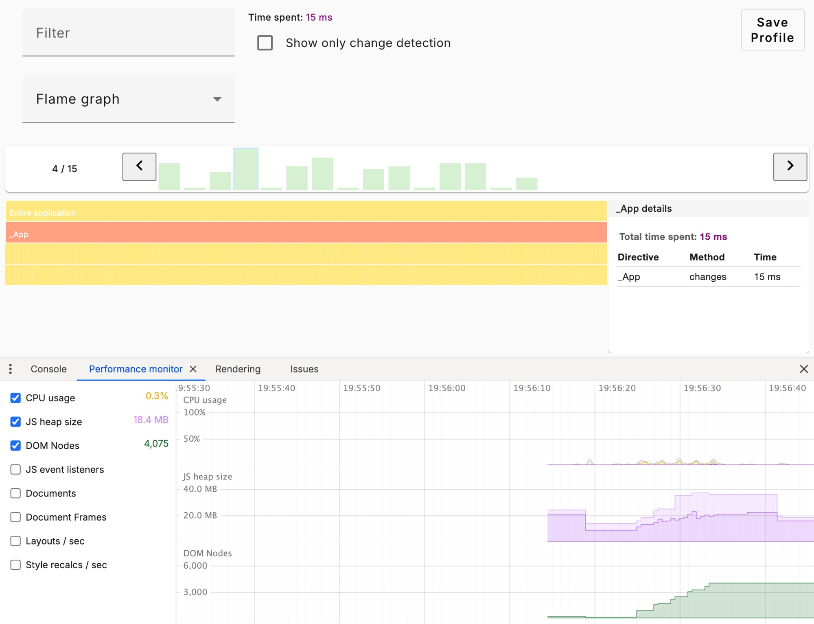
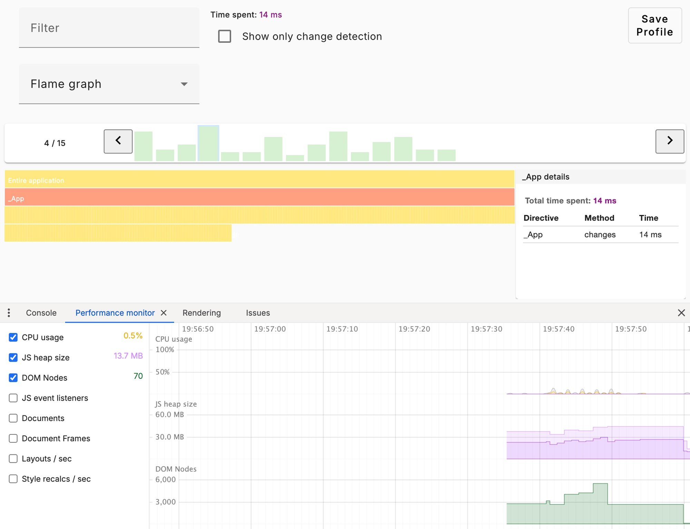
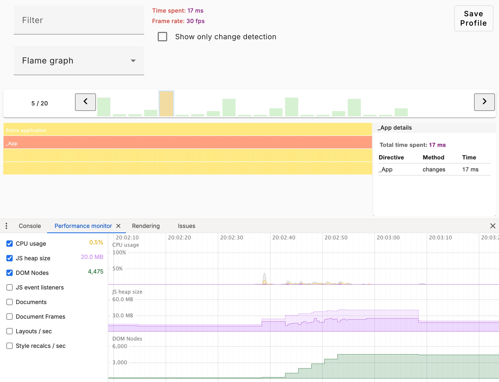
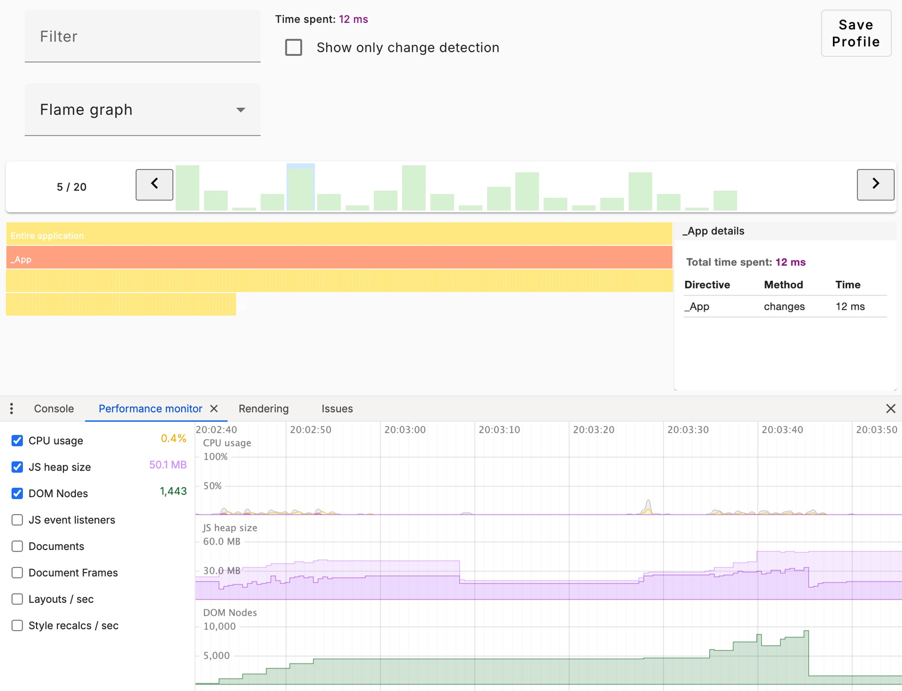
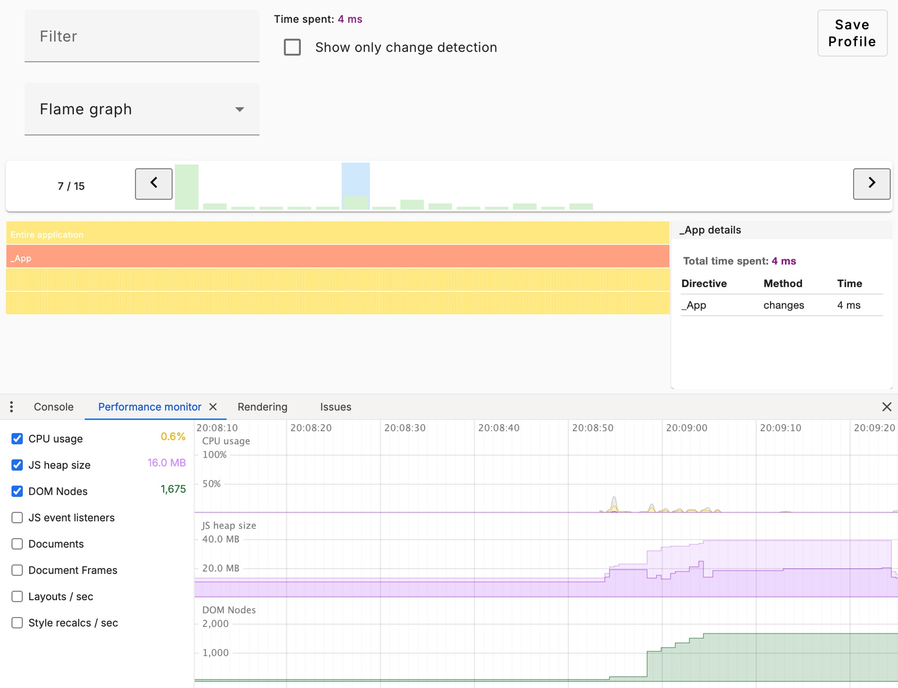
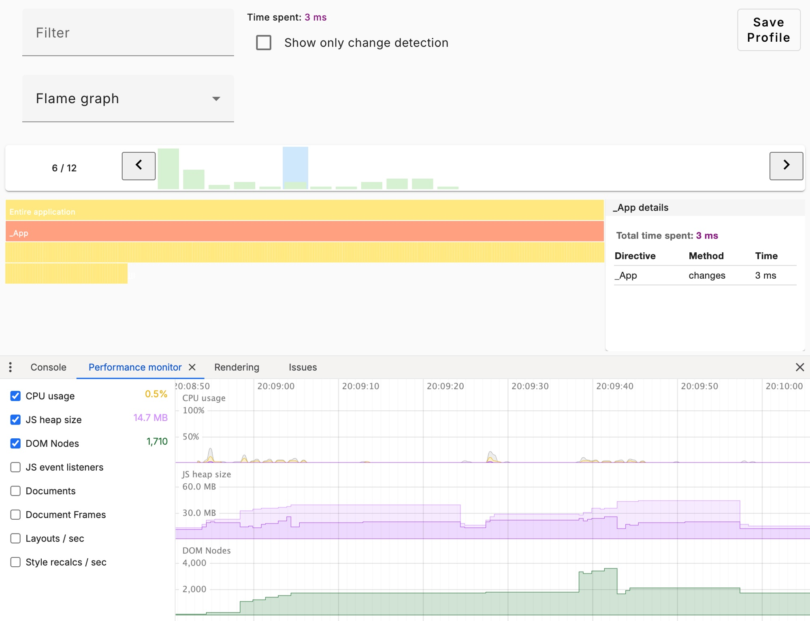

Oft frage ich mich, gerade für Anwendungen mit vielen dynamisch gerenderten Komponenten, wie ich diese noch besser programmieren kann, um die Latenz oder Layout-Shifts zu verringern. Ich mache mir deshalb immer viele Gedanken, wie ich etwas programmiere, auch weil wir in Zukunft, bei mir im Unternehmen, ein Refactoring unseres Formular-Moduls planen. Deshalb wollte ich herausfinden, wo wir mit kleinen Änderungen bessere Render-Performance erzielen können. In diesem Artikel beschreibe ich mein Vorgehen und etwas unsere interne Modulstruktur.

Das Formular-Modul bekommt aktuell eine JSON-Konfiguration, entweder vom Backend oder direkt aus der App, welche dann mit Rows und Cols zu einem Formular mit Seiten und Gruppen umgesetzt wird. Die Bestandteile setzen sich wie folgt zusammen:

- **Formular-Service**: verwaltet u.a. `FormGroup` und persistente Formulardaten sowie Helper-Funktionen
- **Layout-Modul**: baut die Rows, Cols, etc.
- **Die Eingabefelder**: Standalone Komponenten, welche auch für sich existieren können ohne Formular-Komponente; Input, Checkbox, Date, etc.
- **Der Feldtyp-Komponente**: rendert ein Eingabefelder basierend auf einer Typ-Property aus der Konfiguration

Da Angular vor kurzem die Control-Flow Syntax herausgebracht hat, wollte ich diese auch hier nutzen. Aktuell rendert die Feld-Typ-Komponente die Eingabefelder per `ViewContainerRef.createComponent`. Die Komponenten liegen mit dem Typen in einem Objekt. Per `ViewChild` wird dann auf ein `ng-template` zugegriffen und anschließend das Eingabefeld dort hinein generiert.

Das sieht in etwa so aus:

```typescript
@Component({
  template: `<ng-template #placeholder></ng-template>`,
})
class TypeComponent {
  @ViewChild("placeholder", { read: ViewContainerRef })
  private readonly view!: ViewContainerRef;

  @Input({ required: true }) field!: FormFieldType;

  ngAfterViewInit(): void {
    this.view.clear();
    this.view.createComponent(formFields[this.field.type]);
  }
}
```

Nun, dieser Code-Teil ist bereits drei Jahre alt und ich wusste nicht, ob das hier noch eine moderne Lösung ist oder dem typischen Angular-Paradigma entspricht. Also wollte ich einen Vergleich haben zu einer anderen Methodik mit der neuen Control-Flow-Syntax: `@switch {}`. Dieser war vergleichsweise damals weitaus langsamer und komplexer zu bauen mit Typisierung.

Da sich in Angular in den letzten Jahren viel getan hat, dachte ich, dass es doch sein kann, dass andere Methoden nun viel bessere Performance erzielen. Nun bin ich aber nicht sehr tief in der Materie zu Change Detection und Rendering in Angular an sich bewandert.

Deshalb startete ich einen neuen Post in der mit im deutschen Raum bekanntesten Angular Community [Angular.de](https://angular.de). Hier habe ich mir, zusammen mit David Müllerchen aka Webdave, Gedanken darüber gemacht, was die richtige Herangehensweise wäre und wie die Performance in Angular am besten verglichen werden kann.

## Vor- und Nachteile der Möglichkeiten

Da wir schon seit Jahren mit ComponentRef arbeiten (und man sagt “Never change a running system”), wollte ich erst mal wissen, ob dies nicht mit der neuen Control-Flow-Syntax, zu Change Detection Problemen kommt und ob es andere Möglichkeiten gibt. Gerade weil wir sehr viele Feld-Typ-Komponenten laden, also aus dem Backend kommen, de Felder , die dem Frontend erstmal unbekannt sind (200 pro Formular im Schnitt, mit Seiten und Kategorien).

Webdave schrieb mir hierzu:

> `ViewContainerRef.createComponent`, `@defer` und `@if` sind für unterschiedliche Use Cases. Die flow syntax ist für statisch bekannte Komponenten, wobei du mit `.createComponent` auch dynamisch erzeugte Komponenten, oder hinzugefügte Komponenten einbinden kannst.

Da all meine Komponenten bekannt sind, war seine Antwort dann `@switch`. Da wir bei 14 verschiedenen Eingabekomponenten das `@switch` aber zu groß und unschön wurden, wollte ich wissen, ob ich denn hier nicht einfach schauen kann, welche der beiden wirklich besser ist. Gerade auch, weil Angular doch theoretisch mit `@switch` besser die Change Detection bemessen kann, weil die Komponenten direkt im Template bekannt sind.

## Performance in Angular Vergleichen

[[cta:training-top]]

Auf dem Gebiet bin ich quasi neu, ich wusste zwar, dass es eine Angular-Erweiterung für Chromium-Browser gibt, nur hab ich sie noch nie genutzt.

Also war das der Anfang. Erweiterung installiert, App aufgemacht, “Profiler” geöffnet und gestartet.

[Mehr zum Profiler der Angular Devtools erfährst du hier](https://angular.dev/tools/devtools#profile-your-application).

Nach einigen Tests kam ich damit ganz gut klar. Wichtig war mir hier, dass ich die FPS sehen kann, wie lange Komponenten laden bis sie gerendert sind und wie sich die Werte verändern beim Ein- und Ausblenden (re-render) bzw. beim Hinzufügen von neuen Elementen oder entfernen.

Für einen wirklichen Vergleich hab ich mir in Chrome noch den “Performance Monitor” aufgemacht, um die DOM Nodes und Auslastung live zu sehen. Per “Rendering” und “Frame Rendering Stats” dann noch die FPS. Die Angular-Erweiterung nimmt das alles dann auf und ich kann es exportieren als JSON oder Screenshots davon machen (siehe weiter unten).

## Das Repl und die Tests

[Angular Component Ref vs Switch - StackBlitz](https://stackblitz.com/edit/angular-componentref-vs-switch?embed=1&file=src/main.ts)

Während ich für beide Möglichkeiten ein Repl geschrieben habe, kam ich auch schon in einige Fehler mit ComponentRef und Signals. Hier konnte ich mit Webdave’s Unterstützung dann herausfinden, wie man an die `component` Signals übergibt. Interessant dabei war, dass ich dazu nahezu nichts in der API Dokumentation von Angular fand, ggf. liegt das auch daran, dass das alles sehr neu ist und die Dokumentation und auf [angular.dev](https://angular.dev) zu finden ist.

```typescript
component.setInput("options", this.options());
```

Nachdem mein Use-Case nachgebaut war, baute ich noch etwas Style drum herum (ich habs gerne etwas Stylisch), ein paar Buttons zum ein- und ausblenden, zu generieren weitere Eingabefelder und Szenario-Beispiele zu generieren. In meinem Repl sind diese aber nur Text mit Signals, um es nicht zu Komplex zu gestalten.

<aside>
🔥 Ein großes Plus, das Repl ist Zoneless (unsere App inzwischen auch) und nutzt ChangeDetection.OnPush.
</aside>

## Das Ergebnis und Auswertung

Ich habe Anfangs mit 200 Elementen für beide Möglichkeiten gestartet. Hier bin ich einige Tests durchgegangen: mehrfach Neuladen und per Button rendern, ein- und ausblenden, schnelles ein- und ausblenden und neue Elemente hinzufügen. So das, was unsere Benutzer auch machen würde oder die Applikation während der Laufzeit.

Abweichungen können entstehen, je nachdem in welchem Browser getestet oder Gerät ein Szenario gestartet wird.

<aside>
ℹ️ Den StackBlitz Browser, welcher als Splitview gestartet wird, kann auch als neues Tab geöffnet werden, was ein realeres Szenario darstellt, da es nicht als iFrame in StackBlitz geöffnet ist.
</aside>

### Szenario 1


_ComponentRef_


_Switch_

Dieses Szenario blendet nur nach einem Intervall die gesamte Liste ein und wieder aus. Hier wollte ich einfach sehen, wie gut beide in einem Szenario performen, wo bspw. ein Wechsel von Formularseiten simuliert wird.
Wie man gut sehen kann, liefern die Tests schon mal gute Ergebnisse. Leider kann man die Dom-Nodes nicht zurücksetzen. Aber man erkennt gut, dass Type A hier weitaus mehr generiert und Type B mehr wiederverwendet. Eine Sache, die ich bis jetzt noch nicht näher ergründen konnte.
Darüber hinaus sieht man, dass beide Initials so gut wie gleich sind, was die FPS, die Schnelligkeit zum Anzeigen der Komponenten, angeht.

### Szenario 2


_ComponentRef_


_Switch_

Dieses Szenario weicht kaum vom ersten ab, hier werden nur zusätzlich “Eingabefelder” hinzugefügt und wieder entfernt. Dies würde in unserem Fall simulieren, wenn eine Formularaktion, ein anderes Feld ein- und ausblendet oder verändert.
Hier sieht man ganz gut, dass Type A ein wenig schlechter performt als Type B. Das könnte unter anderem daran liegen, dass Angular evtl. die Komponente nicht richtig Cacht, da sie im Template nicht existiert.

### Szenario 3


_ComponentRef_


_Switch_

Im letzten Szenario, wollte ich sehen, was passiert, wenn nichts mehr ein- und ausgeblendet wird, aber neue “Eingabefelder” hinzugefügt werden und anschließend zufällig entfern werden.

Nun sieht man etwas sehr interessantes, Angular scheint weitaus mehr ChangeDetections auszuführen mit Type A, da die Komponenten nicht im Template existieren!

[[cta:training-bottom]]

## Auswertung und Zusammenfassung

Während den Tests sind mir natürlich immer wieder Verbesserungen aufgefallen, welche ich direkt umgesetzt habe, deshalb gab es mehrere Iterationen.
Abschließend muss ich sagen, dass mir zwar Type A weitaus besser gefällt, wenn es um die Lesbarkeit in der Typ-Komponente geht, aber Type B performant weitaus besser. Gerade die ChangeDetections sind etwas, was in unserer Applikation sehr wichtig ist. Das ist deshalb so wichtig, weil eine Feldkomponente Aktionen ausführen kann: ein-/ausblenden anderer Komponenten, öffnen von Dialogen oder Automationen anstoßen.
Schließlich werde ich nun bei Type A erst mal bleiben, aber im Refactoring Type B umsetzen und noch mals bei uns in der Staging-Umgebung testen.

### Änderungen während der Tests

- Mit `@defer` wurde Type B deutlich besser in der Performance
- Splitten vom Effects in Type A verbesserte dessen Performance
- Szenarien automatisieren erzielte genauere Ergebnisse zwischen den Tests
- Vereinheitlichung der Console.logs stellt Fairen vergleich dar

Ich muss sagen, dass der Prozess außerordentlich viel Spaß gemacht hat und ich muss [Webdave](https://webdave.de/start) ganz großen Dank schenken, für seine Expertise und Hilfe.
