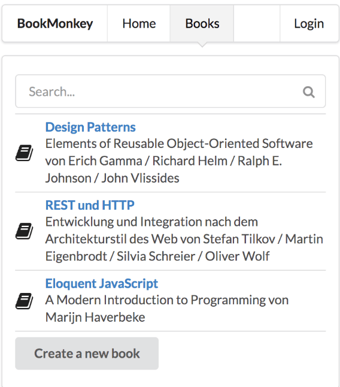
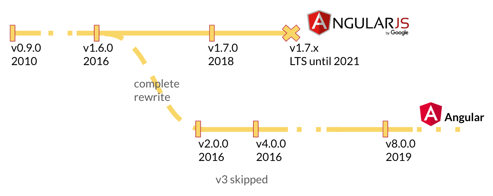
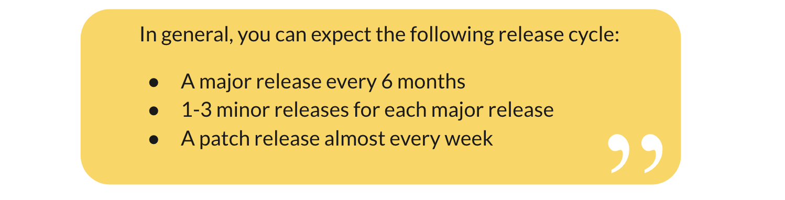
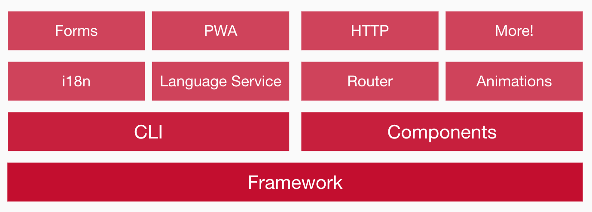
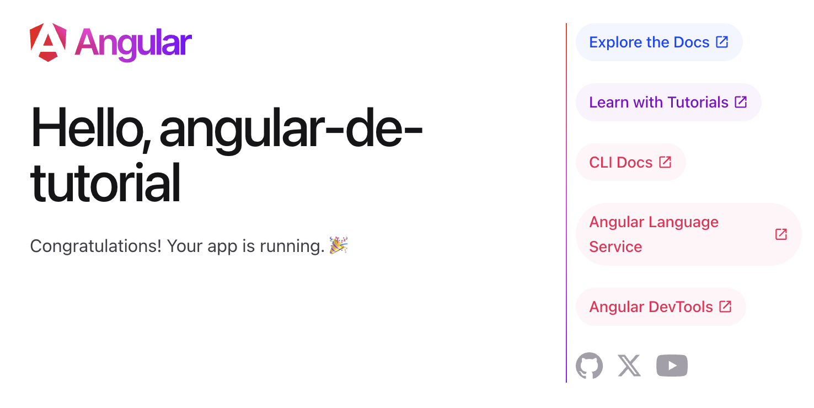
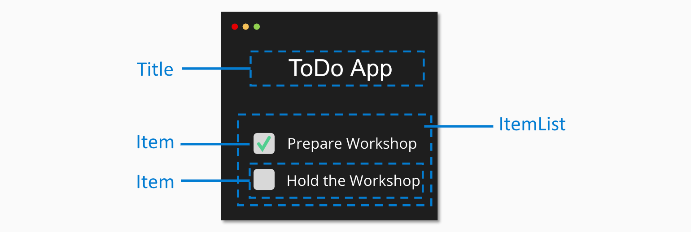
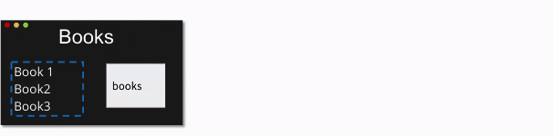
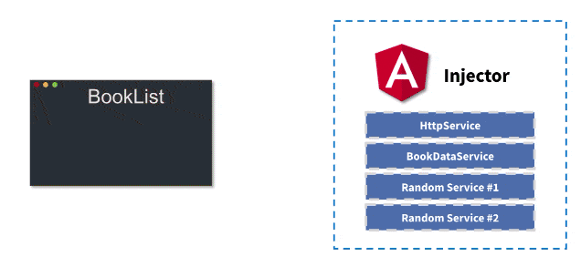
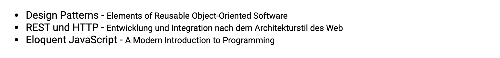

## Einführung

Dieses Tutorial erklärt dir die Grundlagen des Frameworks Angular in der aktuellen Version. Angular bringt viele spannende Neuerungen mit sich, darunter moderne Template-Syntax mit @if/@for/@switch, Zoneless Change Detection und vieles mehr. Das Framework nutzt semantische Versionierung und wird kontinuierlich weiterentwickelt.

Diese Einführung ist für Anfänger gedacht, die gerade mit Angular beginnen. Das Beispiel orientiert sich an den ersten Aufgaben unserer Workshop-Inhalte der [Angular Intensiv Schulung](https://workshops.de/seminare-schulungen-kurse/angular-modul-1?utm_source=angular_de&utm_campaign=tutorial&utm_medium=portal&utm_content=text-article-intro).

Unsere Didaktik behandelt dabei die Motivation, die Theorie und dann den Praxis-Teil.

### Was wirst du in diesem Tutorial lernen?

Dieses Tutorial zeigt dir die grundlegenden Bestandteile einer Angular-Anwendung anhand eines praktischen Beispiels, welches du selber implementieren oder mit fertigen Musterlösungen nutzen und verändern kannst.

Wir werden hierbei folgende Themen behandeln:

- Was ist Angular?
- Unterschiede zu React und Vue
- Installation von Angular
- Komponenten und moderne Template-Syntax
- Expressions und Schleifen
- Event- & Property-Binding
- Services und Dependency-Injection
- Anbinden einer REST-API

Wir werden hierbei die Motivation und den theoretischen Background kurz einleiten, uns jedoch primär auf praktische Beispiele konzentrieren. Wir werden eine kleine Anwendung bauen, welche uns eine Liste von Daten von einer REST-API ausliest und diese anzeigt.



<div class="alert alert-success">Dieser Artikel und unser Portal ist open-source. Wenn du Vorschläge zur Verbesserung des Artikels hast, fühl dich jederzeit herzlich willkommen, dich über unser <a href="https://github.com/workshops-de/angular.de" target="_blank">GitHub Repo</a> zu beteiligen. Wir freuen uns über jeden Input! </div>

## Was ist Angular?

[[cta:training-top]]

Angular ist ein sehr erfolgreiches, clientseitiges JavaScript-Web-Framework zur Erstellung von Single-Page-Webanwendungen. Angular hat sich mittlerweile zu einer vollständigen Plattform weiterentwickelt, die neben der reinen "API" zur Anwendungsentwicklung auch moderne Entwicklungs-Werkzeuge, Generatoren und durchdachte Architektur-Konzepte bietet.

Angular reiht sich neben den beiden anderen erfolgreichen Frontend Frameworks [React](https://reactjs.de) und [VueJS](https://vuejs.de) ein, bietet aber durch seine opinionated Architektur besonders für Enterprise-Anwendungen klare Vorteile.

### Unterschiede zu VueJS und React

Alle drei Bibliotheken, beziehungsweise Frameworks, haben ihre Daseinsberechtigung, Stärken und Schwächen. Je nach Use-Case sollte hier entschieden werden, welche der Alternativen die beste Basis für das aktuelle Projekt liefert.

**Angular** zielt hierbei ganz klar auf die professionelle Entwicklung von Enterprise Software ab. Durch klare Vorgaben in der Struktur und den Einsatz von Generatoren können langfristig wartbare und skalierbare Softwarelösungen erstellt werden. Konzepte wie Dependency Injection und ein Fokus auf TDD sind seit der ersten Stunde von Angular im Core verankert. Durch die klare Struktur von Projekten ist hierbei explizit die Skalierbarkeit von neuen Entwickler:innen hervorzuheben. Durch dieses massive Grundgerüst wirkt Angular auf den ersten Blick oft etwas schwergewichtig - überzeugt jedoch in Production durch systematische Optimierungen und Erweiterbarkeit.

**ReactJS** zielt hierbei eher auf einen sehr minimalen Layer auf Komponenten-Ebene ab und ermöglicht/erfordert das Konzipieren einer eigenen Architektur von Grund auf. Das bietet sehr flexible Möglichkeiten, um für individuelle Problemstellungen sehr explizite Lösungen zu bauen. Es gibt eine Auswahl an verschiedensten Modulen für die verschiedenen Anforderungen. Der Aufwand der Integration und Pflege ist hier höher als in Angular, allerdings ist das Projekt dadurch oftmals auch simpler und sehr leichtgewichtig.

**VueJS** bedient die Anforderungen zwischen diesen beiden Frameworks. Indem das Framework auf einen Generator und klare Strukturen setzt, begünstigt es ebenfalls die Skalierung von Projekt-Teams. Allerdings versucht VueJS gleichzeitig sehr leichtgewichtig zu bleiben und möglichst wenig "Framework-Magic" einzubringen. Es ist also die simple, aber strukturierte Mittellösung.

Dies ist meine persönliche Einschätzung und ich habe bereits sehr gut mit allen diesen Frameworks gearbeitet. Es kommt individuell auf die Problemstellung und das Team an. Falls du gerade neu im Bereich Web bist, kann ich dir auch sehr unseren [Moderne Webentwicklung und Frontend-Architekur Kurs](https://workshops.de/seminare-schulungen-kurse/frontend-architektur) empfehlen, der dir einen Überblick über die moderne Webentwicklung von heute aufzeigt.

### Motivation

Angular selbst hat die Ursprünge in 2009, im "wilden Westen" der Webanwendungsentwicklung. Seitdem ist viel passiert - keine Angst, ich werde jetzt hier keine Geschichtsstunde starten. Es geht eher um diesen Punkt: Wie konnte sich Angular in der wilden Welt von JavaScript Frameworks, in der gefühlt jeden Tag 10 neue Frameworks erscheinen, trotzdem als eines der erfolgreichsten Frameworks beweisen?
Dies lässt sich wahrscheinlich am einfachsten mit der Mission von Angular beschreiben:

- Apps that users ❤️ to use.
- Apps that developers ❤️ to build.
- A community where everyone feels welcome.

Durch diese Mission ist ein wunderbares Ökosystem mit einer wahnsinnig tollen Community entstanden.
Dabei ist aber der Fokus auf Qualität und Enterprise ebenfalls klar zu spüren.
Google selbst nutzt nach eigenen Angaben Angular in über 1600 Projekten.
(Google Teams nutzen übrigens AUCH React und VueJS für Projekte, wo dieser Stack besser passt).

In 2016 hat sich das Angular-Team für einen kompletten Rewrite in TypeScript entschieden.
Damals wurde die Entscheidung größtenteils negativ wahrgenommen und von anderen Framework-Benutzern zerrissen.



Heute sehen wir die Weitsicht dieser Entscheidungen, da mittlerweile viele andere Frameworks ebenfalls auf TypeScript setzen. Um Breaking Changes einfacher kommunizieren zu können, hat sich das Team ebenfalls für einen fixen Release-Plan entschieden. So können Projektteams Budgets für Updates bereits im Voraus einplanen und werden nicht von Breaking-Changes in einem Release "überrascht".



[[cta:training-top]]

### Die Angular Plattform

Das Ökosystem von Angular ist sehr groß. Die Basis bildet hierbei das Core-Framework. Hier sind die fundamentalen Konzepte implementiert, die für moderne Webanwendungen essenziell sind. Zwei weitere Core-Konzepte, die jedoch separat nutzbar sind, sind die Angular-CLI und die Verwaltung von Komponenten. Diese bilden die Kernfunktionalitäten, welche in fast jeder Anwendung benötigt werden. Weitere Module lassen sich _optional einbinden_, falls du diese benötigst:

- Routing - Routing für Single Page Applications
- forms - Formulare und Validierung
- i18n - Mehrsprachige Anwendungen
- Animations - Animationen für Transitionen
- PWA - Offline Fähigkeiten
- HTTP - HTTP, Rest und GraphQL Kommunikation
- und viele mehr



In diesem Tutorial werden wir uns primär um das Framework, die Angular CLI und Komponenten kümmern.

## Vorbereitung & Installation

Beginnen wir nun mit der Installation der erforderlichen Tools für Angular.

### System-Anforderungen für Angular

Angular benötigt eine aktuelle Node.js Version.

Du kannst die neueste Node.js Version über folgenden Link herunterladen und installieren: [https://nodejs.org/download/](https://nodejs.org/download/)

Mit Node.js wird ebenfalls das Kommandozeilenwerkzeug `npm` installiert, welches uns ermöglicht, weitere Node.js Pakete auf unserem Rechner zu installieren.

<div class="alert alert-info">Hinweis: Falls du spezielle Proxy Einstellungen benötigst, kannst du diese in der <a href="https://docs.npmjs.com/misc/config#https-proxy" target="_blank">NPM Dokumentation für HTTPS Proxies</a> nachlesen.</div>

### Die Angular CLI

Angular stellt ein mächtiges Kommandozeilenwerkzeug bereit: die Angular CLI. Damit kannst du neue Projekte anlegen, Komponenten generieren und vieles mehr. Du musst die CLI nicht global installieren, sondern kannst sie direkt über `npx` nutzen.

Überprüfe deine Umgebung mit:

```bash
npx @angular/cli version
```

Du solltest eine Ausgabe ähnlich dieser sehen:

```
Angular CLI: x.y.z
Node: x.y.z
Package Manager: npm x.y.z
OS: darwin x64

Angular:
...

Package                      Version
------------------------------------------------------
@angular-devkit/architect    x.y.z
@angular-devkit/core         x.y.z
@angular-devkit/schematics   x.y.z
@schematics/angular          x.y.z
```

## Generieren der Angular App

Die Angular-CLI wird genutzt, um neue Strukturen innerhalb unserer Anwendungen zu generieren, anstatt wie oft in Projekten die Basis-Strukturen zu kopieren und über potenzielle Fehler bei der Umbenennung zu stolpern. Es ist ein mächtiges Werkzeug, welches dir mit `npx @angular/cli --help` einen ausführlichen Hilfetext anbietet.

Um unsere erste Anwendung zu generieren, verwenden wir den `new` command, welcher als Argument den Namen deiner Anwendung entgegennimmt:

```bash
$ npx @angular/cli new angular-de-tutorial

✔ Which stylesheet system would you like to use? CSS             [ https://developer.mozilla.org/docs/Web/CSS ]
✔ Do you want to enable Server-Side Rendering (SSR) and Static Site Generation (SSG/Prerendering)? No
✔ Which AI tools do you want to configure with Angular best practices? https://angular.dev/ai/develop-with-ai None
```

Wenn du die Angular CLI später verwendest um Code zu erzeugen, oder das Projekt auszuführen, stellt die CLI die Frage, ob du deine Nutzungsdaten anonymisiert zur Verfügung stellen möchtest, um die Angular CLI zu verbessern.

```bash
? Would you like to share anonymous usage data about this project with the Angular Team at
Google under Google's Privacy Policy at https://policies.google.com/privacy? For more
details and how to change this setting, see http://angular.io/analytics. Yes|No
```

Nun werden automatisch die Projektstrukturen für dich angelegt. Dies inkludiert eine Startseite, eine Komponente, die ersten End2End Tests, Linter-Regeln, GitIgnore-Regeln und eine TypeScript Konfiguration.

```bash
CREATE angular-de-tutorial/angular.json (3809 bytes)
CREATE angular-de-tutorial/package.json (1209 bytes)
CREATE angular-de-tutorial/README.md (1026 bytes)
CREATE angular-de-tutorial/.editorconfig (274 bytes)
CREATE angular-de-tutorial/.gitignore (631 bytes)
CREATE angular-de-tutorial/tsconfig.json (737 bytes)
CREATE angular-de-tutorial/tslint.json (3185 bytes)
CREATE angular-de-tutorial/.browserslistrc (703 bytes)
...
CREATE angular-de-tutorial/src/app/app.module.ts (314 bytes)
CREATE angular-de-tutorial/src/app/app.component.scss (0 bytes)
CREATE angular-de-tutorial/src/app/app.component.html (25725 bytes)
CREATE angular-de-tutorial/src/app/app.component.spec.ts (979 bytes)
CREATE angular-de-tutorial/src/app/app.component.ts (224 bytes)
...
CREATE angular-de-tutorial/e2e/protractor.conf.js (904 bytes)
CREATE angular-de-tutorial/e2e/tsconfig.json (274 bytes)
CREATE angular-de-tutorial/e2e/src/app.e2e-spec.ts (670 bytes)
CREATE angular-de-tutorial/e2e/src/app.po.ts (274 bytes)
```

Nach dem Generieren werden ebenfalls notwendige Pakete via `npm` installiert. Dies kann durchaus einige Minuten dauern. Ist die Installation abgeschlossen, kannst du die Entwicklungsumgebung starten.

```bash
$ cd angular-de-tutorial
$ npx @angular/cli serve

Angular Live Development Server is listening on localhost:4200
```

Deine Basisanwendung ist nun generiert und kann im Browser unter http://localhost:4200 aufgerufen werden. Du solltest ein ähnliches Bild wie folgendes sehen:



## Komponenten und Services

In Angular gibt es zwei primäre Bestandteile des Frameworks, mit welchen wir uns zuerst auseinandersetzen.

**Komponenten** sind Anzeigeelemente. Sie werden als eigene HTML-Elemente definiert. Abhängig der definierten Anzeige-Logik und den aktuellen Daten stellen diese Elemente den Zustand der Anwendung dar.

**Services** sind unabhängig von der Anzeige deiner Anwendung. Sie definieren Daten, Logik und Algorithmen der Anwendung. Sie sind modular und wiederverwendbar.

### Komponenten

Angular Komponenten sind die sogenannten "building blocks" jeder Anwendung. Die verschiedenen logischen Bausteine einer Anwendung werden also in Komponenten aufgeteilt. Jeder dieser Komponenten übernimmt dabei eine bestimmte Funktion und wird als eigenes HTML-Element definiert.



```html
<todo-title>ToDo App</todo-title>
<todo-list>
  <todo-item state="checked">Prepare Workshop</todo-item>
  <todo-item>Hold the Workshop</todo-item>
</todo-list>
```

<div class="alert alert-info">Hinweis: Diese Darstellung ist noch nicht 100% korrekt und dient in vereinfachter Form der schrittweisen Erklärung. 🙂</div>

Wie du in diesem kleinen Beispiel einer ToDo-Liste siehst, gibt es für die verschiedenen Bereiche eigene Elemente, die in diesem Fall mit dem Prefix `todo-` eingeleitet werden. Wie du gut an der `todo-list` erkennst, ist es möglich und auch absolut üblich, eigene Komponenten ineinander zu verschachteln. Ziel ist es, immer wiederverwendbare und wartbare Elemente zu bauen. Was hierbei die richtige Komponentengröße ist, wirst du in deinen Projekten selber entscheiden müssen und mit wachsender Erfahrung ein immer besseres Gefühl dafür bekommen. Bei Unsicherheit kannst du dich aber auch jederzeit in unserem [Discord](https://workshops.de/discord) bei uns melden.

### Services

Für Daten und Logik, die nicht zwingend nur an eine Komponente gekoppelt sind, werden in Angular Services genutzt. Ein Service ist eine Klasse, welche Attribute und Methoden definiert, die von Komponenten und anderen Services genutzt werden können.


```typescript
export class TodoService {
  data = [
    {
      title: "Prepare Workshop",
      state: "checked",
    },
    {
      title: "Hold the Workshop",
    },
  ];
}
```

Die eigentlichen Daten werden also aus einem Service referenziert, denn gegebenenfalls werden auf Basis der aktuellen To-dos auch noch andere Komponenten angezeigt, wie z.B. eine Komponente, welche die aktuell offenen To-dos zählt.

Als erste Übersicht soll dies an dieser Stelle reichen. Wir werden uns später Services noch einmal genauer ansehen.

## Die erste Komponente

Wenn wir uns nun die Komponenten-Definition anschauen, kommen wir das erste Mal mit [TypeScript](https://www.typescriptlang.org/) in Berührung. TypeScript ist eine Erweiterung von JavaScript, welche uns die Möglichkeit bietet, die Daten unserer Anwendung explizit zu typisieren. Weiterhin führt diese Meta-Sprache auch Features ein, die es in JavaScript (noch) nicht gibt, wie `Decorators`. TypeScript "transpiled" unseren geschriebenen Quellcode, sodass der Browser nachher wieder ganz normales JavaScript sieht und interpretieren kann. Es ist also ein Feature, welches uns als Entwickler:innen die tägliche Arbeit angenehmer macht.

> **Klassen** wurden in ES2015 eingeführt, um Konzepte wie Vererbung und Konstruktoren nicht mehr über Prototypen abbilden zu müssen. Diese können nun über eine einfache und saubere Syntax erstellt werden.

> **Decorator** sind strukturierte Metadaten einer Klasse. Du kennst diese vielleicht aus anderen Programmiersprachen wie z.B. Java. Das eigentliche fachliche Verhalten der Komponente bilden wir innerhalb der Klasse mit Methoden ab.

Eine Komponenten-Definition besteht primär aus folgenden Bestandteilen:

- Einem **Component-Decorator**, welcher die Komponente innerhalb von Angular bekannt macht.
- Einer **Selektor**, welcher das HTML-Element beschreibt, welches wir erzeugen.
- Einem **HTML-Template**, welches die Darstellung unserer Komponente definiert.
- Einer **Klasse**, welche das Interface und die Anzeige-Logik der Komponente beschreibt.


Unsere erste Komponente wird eine statische Infobox sein. Um diese zu generieren, nutzen wir wieder die Angular-CLI.
Du kannst hierzu einen neuen Terminal öffnen oder den laufenden `npx @angular/cli serve` kurzzeitig stoppen.
Der Serve-Prozess erkennt aber automatisch Veränderungen innerhalb deines Quellcodes und kompiliert die jeweils aktuelle Version deiner Anwendung in wenigen Sekunden.
Ich würde dir also empfehlen, ein zweites Terminal zu öffnen und folgenden Befehl zu benutzen:

```bash
$ npx @angular/cli generate component info-box
CREATE src/app/info-box/info-box.component.scss (0 bytes)
CREATE src/app/info-box/info-box.component.html (23 bytes)
CREATE src/app/info-box/info-box.component.spec.ts (636 bytes)
CREATE src/app/info-box/info-box.component.ts (277 bytes)
UPDATE src/app/app.module.ts (0 bytes)
```

Die für uns aktuell relevanten Dateien sind zur Zeit die `info-box.component.ts` und unser Template `info-box.component.html`. Schauen wir uns zunächst einmal unsere Klasse an.

```typescript
@Component({
  selector: "app-info-box",
  templateUrl: "./info-box.component.html",
  styleUrls: ["./info-box.component.scss"],
  // standalone: true ist der Standard
})
export class InfoBoxComponent implements OnInit {
  constructor() {}

  ngOnInit() {}
}
```

Hier sehen wir wie erwartet eine Standalone Component. Unser Selektor hat den automatischen Prefix `app-` bekommen. Somit ist unsere neue Komponente nun unter dem HTML-Tag `<app-info-box></app-info-box>` nutzbar.

**Wichtig**: Da Standalone Components der Standard sind, müssen wir die Komponente direkt in der `AppComponent` importieren. Der Einstiegspunkt unserer kompletten Anwendung ist ebenfalls eine Standalone Component mit dem Namen `AppComponent`.

Um unsere frisch generierte Komponente anzuzeigen, müssen wir diese zuerst in der `AppComponent` importieren und dann in dem Template aufrufen. Hierzu gehst du in die Datei `app.component.ts` und fügst den Import hinzu:

```typescript
import { Component } from "@angular/core";
import { InfoBoxComponent } from "./info-box/info-box.component";

@Component({
  selector: "app-root",
  imports: [InfoBoxComponent], // Hier importieren wir unsere Komponente
  templateUrl: "./app.component.html",
  styleUrls: ["./app.component.scss"],
})
export class AppComponent {
  title = "angular-de-tutorial";
}
```

Anschließend gehst du in die Datei `app.component.html`, löschst dort den kompletten derzeitigen Inhalt und fügst deine Komponente via HTML-Tag ein.

```html
<app-info-box></app-info-box>
```

Wenn du nun deine Anwendung wieder im Browser öffnest, solltest du die Ausgabe `info-box works!` sehen.
Du kannst an dieser Stelle gerne mit deinem Template in `info-box.component.html` etwas herumspielen und auch mehrere dieser Info-Boxen erzeugen, indem du den HTML-Tag in deinem App-Template einfach kopierst.
Ein historischer Moment – nimm dir ein paar Sekunden Zeit, um deine erste eigene Komponente zu bewundern. 😉

## Expressions

Eine Komponente mit statischen Inhalten ist natürlich nur sehr begrenzt in einer Anwendung nutzbar.
Um variable Daten anzuzeigen, nutzt Angular sogenannte Expressions in den Templates.
Diese werden mit doppelten geschweiften Klammern eingeleitet und auch wieder geschlossen.

{{ expression }}

Eine Expression wird von Angular dynamisch auf Basis der aktuellen Properties deiner Klasse ausgewertet.
Führen wir also ein neues Property `text` ein und füllen dieses mit einem String, können wir diesen in unserem Template ausgeben.

```typescript
class InfoBoxComponent implements OnInit {
  text = "Additional Info-Text on our Info Box! 🎊";

  constructor() {}

  ngOnInit() {}
}
```

```html
<p>info-box works!</p>
<p>{{text}}</p>
```


Sollte sich die Property `text` ändern, z. B. durch externe Events, wird diese automatisch von Angular aktualisiert. Dieses Konzept nennt sich `Data-Binding`.

## Property- & Event-Bindings

Andere Komponenten können über sogenannte Property- und Event-Bindings eingebunden werden.
Angular verbindet sich hierbei mit den Eigenschaften und Events der nativen HTML-Elemente.
Somit ist auch das Benutzen von anderen Elementen aus Frameworks wie ReactJS oder VueJS einfach möglich.

Um auf Properties von Elementen zuzugreifen, nutzen wir die eckigen Klammern innerhalb unseres HTML Templates. Möchten wir also z.B. die [HTMLElement.hidden Property](https://developer.mozilla.org/en-US/docs/Web/API/HTMLElement/hidden) einer Komponente beeinflussen, können wir das wie folgt erreichen:

```html
<p [hidden]="'true'">{{text}}</p>
```

Hier wird die Eigenschaft `hidden` des Elements auf `'true'` gesetzt und somit das Element ausgeblendet.
Um diese Eigenschaft dynamisch zu ändern, haben wir die Möglichkeit, in unserer Klasse selbst eine neue Property einzuführen und diese per `Property-Binding` an die Property des p-Elements zu binden.
Hierzu setzen wir statt dem string `'true'` den Namen des Attributes in unserer Klasse auf das Binding:

```typescript
class InfoBoxComponent implements OnInit {
  text = "Additional Info-Text on our Info Box! 🎊";
  hidden = true;

  constructor() {}

  ngOnInit() {}
}
```

```html
<p>info-box works!</p>
<p [hidden]="hidden">{{text}}</p>
```

Um die Komponente nun durch User-Interaktion zu ändern, haben wir die Möglichkeit, auf sogenannte `Events` zu hören und hierfür ebenfalls ein `Event-Binding` zu definieren.
Event-Bindings werden in Angular über runde Klammern definiert, welche den Namen des Events enthalten.
Wenn wir nun also auf das [click Event](https://developer.mozilla.org/en-US/docs/Web/API/Element/click_event) eines HTML-Elements hören wollen, können wir das wie folgt erreichen.

```html
<button (click)="someFunction()">Button Text</button>
```

Innerhalb dieser Definition haben wir nun die Möglichkeit, ein sogenanntes `Template-Statement` zu definieren. Dies kann sowohl eine `Template-Expression` sein, die z. B. direkt Änderungen an Attributen deiner Klasse als auch eine Referenz auf eine Methode in deiner Klasse macht.
Um es einfach zu halten, nutzen wir in diesem Fall erstmal eine `Template-Expression`, welche den Wert von `hidden` jeweils negiert. Also aus `true` wird `false` und andersherum.

```html
<p>info-box works!</p>
<button (click)="hidden=!hidden">Toggle</button>
<p [hidden]="hidden">{{text}}</p>
```


Wir können natürlich auch jedes andere Event, wie z. B. `keyup` benutzen. Mit diesem sehr simplen Mechanismus können wir generisch alle Arten von Komponenten benutzen und mit ihnen interagieren. Dies ist unabhängig davon, ob sie in Angular oder einem anderen Framework geschrieben sind.

## Schleifen mit \*ngFor

Ein weiteres Core-Feature ist wie in jedem Framework die Ausgabe von listenartigen Datenstrukturen.
Hierfür gibt es in Angular die Direktive `*ngFor`.

> Direktiven sind HTML Attribute, welche an DOM-Elementen genutzt werden können.
> Hierbei können wir zwischen `Attribute Directives` und `Structural directives` unterscheiden.
> Attribute Directives verändern oder beeinflussen das Verhalten eines Elements, an dem sie angehangen werden, wie z. B. `ngStyle` zum Setzen von CSS-Styles auf Basis von Daten.
> Structural directives erzeugen oder entfernen DOM-Elemente, wie z.B. `ngIf` oder `ngFor`.
> Strukturelle Direktiven werden mit dem Prefix `*` gekennzeichnet.

Die Direktive ist angelehnt an eine For-Schleife, iteriert über eine listenartige Struktur und erzeugt für jedes Element eine Kopie des DOM-Elements, auf das es angewandt wird.

```html
<!-- book-list.component.html -->

<ul>
  <li *ngFor="let book of books">
    <span>{{book.title}}</span> - <small>{{book.subtitle}}</small>
  </li>
</ul>
```

Hierbei wird eine sogenannte `Looping Variable`, in unserem Beispiel `book` und eine Liste, in unserem `books` definiert. Die Variable Buch enthält somit jeweils den Wert des aktuellen Listeneintrags.

Um `*ngFor` auszuprobieren, erzeugen wir eine neue Komponente mit der Angular CLI.
Dazu führen wir den command `npx @angular/cli generate component book-list` aus.

**Wichtig**: Da wir Standalone Components verwenden, müssen wir die neue Komponente in der `AppComponent` importieren:

```typescript
// app.component.ts
import { Component } from "@angular/core";
import { InfoBoxComponent } from "./info-box/info-box.component";
import { BookListComponent } from "./book-list/book-list.component";

@Component({
  selector: "app-root",
  imports: [InfoBoxComponent, BookListComponent], // BookListComponent hinzufügen
  templateUrl: "./app.component.html",
  styleUrls: ["./app.component.scss"],
})
export class AppComponent {
  title = "angular-de-tutorial";
}
```

Anschließend fügen wir das Tag `<app-book-list></app-book-list>` in das Template der `app.component.html` ein.
Wenn wir also in der `BookListComponent` (siehe _book-list.component.ts_) eine Variable `books` mit einer Liste von Büchern definieren, erhalten wir hierfür 3 DOM-Elemente.

```typescript
books = [
  {
    title: "Book #1",
    subtitle: "Subtitle #1",
  },
  {
    title: "Book #2",
    subtitle: "Subtitle #2",
  },
  {
    title: "Book #3",
    subtitle: "Subtitle #3",
  },
];
```


[[cta:training-bottom]]

## Der erste Service

Wer genau aufgepasst hat, dem ist aufgefallen, dass die Daten in einer Angular Anwendung nicht in die Komponente gehören.
Wir vermischen hier die Anzeige-Logik mit der Verwaltung unserer Daten.
Nehmen wir also ein kurzes Refactoring unserer Anwendung vor und extrahieren die Daten in einen separaten Service.



Ein Service sollte sich immer um eine explizite Aufgabe kümmern und dementsprechend auch benannt werden.
In unserem Fall wollen wie die Daten von Büchern verwalten.
Wir nennen unseren Service also `BookDataService`.
Um diesen zu generieren, können wir wie gewohnt die Angular-CLI benutzen.

```bash
$ npx @angular/cli generate service book-data
```

```typescript
export class BookDataService {
  books = [
    {
      title: "Book #1 from Service",
      subtitle: "Subtitle #1",
    },
    {
      title: "Book #2 from Service",
      subtitle: "Subtitle #2",
    },
    {
      title: "Book #3 from Service",
      subtitle: "Subtitle #3",
    },
  ];

  constructor() {}

  getBooks() {
    return this.books;
  }
}
```

Somit haben wir die Daten aus unserer Komponente gezogen.
Die Frage ist jetzt nur: Wie bekomme ich die Daten nun wieder in meine Komponente verbunden?
An dieser Stelle kommt der Begriff `Dependency Injection` ins Spiel.

### Dependency Injection

Unter `Dependency Injection` versteht man ein Design-Pattern, welches ebenfalls `Inversion of Control` genannt wird. Hierbei geht es darum, dass die erforderliche Abhängigkeit (Dependency) nicht von der aufrufenden Stelle selbst erzeugt wird, sondern diese Komponente die Kontrolle abgibt und lediglich definiert, welche Abhängigkeiten bestehen.

In unserem kleinen Beispiel erstellt also die `BookListComponent` nicht unseren Service, sondern gibt dem Angular Framework lediglich Bescheid, dass sie einen `BookDataService` benötigt, um zu funktionieren.



<div class="alert alert-info">Hinweis: Dies ist eine sehr vereinfachte Darstellung von Dependency Injection in Angular, um das Grundkonzept zu verstehen. </div>

Innerhalb des Angular Frameworks werden die verschiedenen Services von dem sogenannten `Injector` verwaltet.
Dieser gibt der aufrufenden Stelle eine Referenz auf den angefragten Service, sofern dieser definiert ist.

Die Definition der Abhängigkeit wird hierbei über den Konstruktor abgebildet. In dem Beispiel unserer `BookListComponent` definieren wir die Abhängigkeit auf `BookDataService` und binden diese an das Feld `bookData` unserer Komponente.

<div class="alert alert-info">Hinweis: Wir benutzen hier die Typisierung von TypeScript, indem wir `: BookDataService` nach unserer Variablen schreiben. Dies bedeutet, dass die Variable `bookData` den Typ `BookDataService` hat und essenziell für den Dependency Injection Mechanismus ist. An den anderen Stellen dieses Tutorials haben wir die Typisierung nicht benutzt, um die Komplexität des Tutorials möglichst klein zu halten.</div>

Innerhalb des Konstruktors rufen wir dann die `getBooks()` Methode des Services auf und beschaffen uns unsere Daten.

```typescript
export class BookListComponent {
  books: { title: string; subtitle: string }[];

  constructor(private bookData: BookDataService) {
    this.books = this.bookData.getBooks();
  }
}
```

Meist importiert deine IDE den `BookDataService` automatisch.
Sollte dies nicht der Fall sein, kannst du dies selbst vornehmen und folgenden import an den Anfang der `book-list.component.ts` schreiben.

```typescript
import { BookDataService } from "../book-data.service";
```

## Daten via REST-API nachladen

Die aktuelle Version hat uns die Konzepte von Angular Stück für Stück näher erklärt. In der Realität werden Daten jedoch meist von einem Server asynchron nachgeladen.

Wir laden diese Daten von einer Beispiel-API, welche du mit folgendem Befehl starten kannst:

```bash
$ npx bookmonkey-api
JSON Server is running on port 4730
```

Unter folgender URL kannst du dir nun die Daten ansehen, welche vom Server ausgegeben werden: <a href="http://localhost:4730/books" target="_blank">http://localhost:4730/books</a>

Im nächsten Schritt wollen wir diese Daten aus unserem `BookDataService` heraus abrufen. Dazu benötigen wir den sogenannten `HttpClient` Service. Dieser bietet uns eine sehr einfache API, um verschiedene Operationen auf eine HTTP-Schnittstelle auszuführen.

**Wichtig**: Da wir Standalone Components verwenden, gibt es keine `app.module.ts` mehr. Stattdessen konfigurieren wir HTTP-Services in der `main.ts`:

```typescript
// main.ts
import { bootstrapApplication } from "@angular/platform-browser";
import { provideHttpClient } from "@angular/common/http";
import { AppComponent } from "./app/app.component";

bootstrapApplication(AppComponent, {
  providers: [
    provideHttpClient(), // HTTP-Client Provider hinzufügen
    // Weitere Providers...
  ],
});
```

Alternativ können wir den `HttpClient` auch direkt in der Komponente importieren, die ihn benötigt:

```typescript
// book-list.component.ts
import { Component } from "@angular/core";
import { HttpClient } from "@angular/common/http";

@Component({
  selector: "app-book-list",
  templateUrl: "./book-list.component.html",
  styleUrls: ["./book-list.component.scss"],
})
export class BookListComponent {
  // ...
}
```

Ist dies erledigt, kennt unser `Injector` auch einen Service vom Typ `HttpClient`, welchen wir nun über den Konstruktor unseres `BookDataService` einbinden können.

```typescript
import { Injectable } from "@angular/core";
import { HttpClient } from "@angular/common/http";

@Injectable({
  providedIn: "root",
})
export class BookDataService {
  constructor(private http: HttpClient) {}

  getBooks() {
    return this.http.get("http://localhost:4730/books");
  }
}
```

Der Service bietet uns die Methode `.get(url:string)`, welcher wir den API-Endpoint für unsere Abfrage angeben können. Wir nutzen hier die Adresse des lokal gestarteten JSON-Servers.

### Umgang mit Asynchronität

<div class="alert alert-info">Hinweis: Wir gehen in diesem Tutorial davon aus, dass Asynchronität in JavaScript bereits bekannt ist. Es gibt dazu eine sehr gute Einführung in den <a href="https://developer.mozilla.org/en-US/docs/Learn/JavaScript/Asynchronous" target="_blank">Mozilla Web Docs über Asynchronous JavaScript</a>. </div>

Der Rückgabewert der get-Methode des HTTP-Services liefert ein [Observable](https://v17.angular.io/guide/observables-in-angular) zurück. Dies ist eine Datenstruktur, welche uns den Umgang mit asynchronen Daten erleichtert. Angular nutzt dafür die [RxJS Observables](https://rxjs.dev/guide/observable).

Es hat sich als guter Stil etabliert, Variablen und Felder, welche asynchrone Datenstrukturen halten, mit einem `$` postfix zu kennzeichnen. Es hat rein funktional keinen Einfluss, hilft jedoch beim langfristigen Zurechtfinden und der Wartung deiner Anwendung.

```typescript
export class BookListComponent {
  books$: Observable<any>;

  constructor(private bookData: BookDataService) {
    this.books$ = this.bookData.getBooks();
  }
}
```

Meist importiert deine IDE den `Observable` automatisch.
Sollte dies nicht der Fall sein, kannst du dies selbst vornehmen und folgenden import an den Anfang der `book-list.component.ts` schreiben.

```typescript
import { Observable } from "rxjs";
```

Der Aufruf innerhalb unserer Komponente ändert sich also im Grunde nicht. Die Auswertung innerhalb unseres HTML-Templates muss jedoch etwas angepasst werden. Mithilfe einer sogenannten `async` Pipe können wir der `*ngFor` Direktive den Umgang mit der asynchronen Datenstruktur ermöglichen.

```html
<ul>
  <li *ngFor="let book of books$ | async">
    <span>{{book.title}}</span> - <small>{{book.subtitle}}</small>
  </li>
</ul>
```

Die `async` Pipe in Verbindung mit `*ngFor` registriert sich auf asynchrone Updates der `books$` Variable. Durch diese Anpassung unseres Templates können wir nun auch die Daten von unseren JSON-Server wie folgt anzeigen:



## Fazit

Angular ist für langlebige Enterprise Projekte eine ausgezeichnete Wahl. Andere Frameworks wie React und VueJS sollten aber ebenfalls in Betracht gezogen werden, um objektiv die beste Entscheidung für die aktuellen Herausforderungen zu treffen.

Angular bleibt in vielerlei Hinsicht sehr opinionated (meinungsstark), was besonders für Enterprise-Projekte von Vorteil ist. Die einheitliche Struktur und die klaren Architektur-Vorgaben ermöglichen es Teams, sich voll auf die Feature-Entwicklung zu konzentrieren.

Wenn du dich weiter mit uns und anderen austauschen willst, komm in unseren [Discord Chat](/discord) mit über 2000 wunderbaren anderen Menschen! Zusammen lernt es sich besser! :)

[[cta:training-bottom]]
