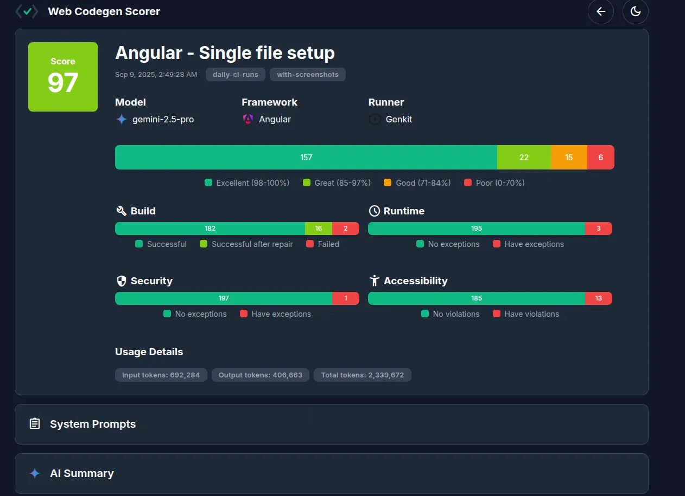

"Das sieht nach sauberem Angular-Code aus, aber läuft es auch?" – Diese Frage kennt jeder Angular-Entwickler, der schon mal mit KI-Tools experimentiert hat. Das Angular-Team hat endlich eine Antwort darauf und revolutioniert damit, wie wir KI-generierten Code bewerten.

Die Zahlen sprechen eine klare Sprache:
- ⚡ **100% automatisierte** Angular-Code-Qualitätsmessung
- 🅰️ **Angular-optimierte Metriken** für Components, Services und Module
- 🤖 **Modell-agnostisch** – funktioniert mit GPT-4, Claude, Gemini und Co.
- 📊 **TypeScript-native Bewertung** mit Angular-spezifischen Best Practices

Das Geheimnis? Der **Web Codegen Scorer** – ein brandneues Open-Source Tool direkt vom Angular-Team, das KI-generierten Angular-Code mit derselben Präzision bewertet wie deine besten Code-Reviews.

## Das Angular-spezifische Problem

Stell dir vor: Du bist Angular-Architekt in einem größeren Team und experimentierst mit verschiedenen LLMs für die Generierung von Components, Services und Pipes. Montags schwört das Team auf Claude für Reactive Forms, dienstags ist GPT-4 der Held für NgRx-Code, und mittwochs diskutiert ihr über Gemini für Angular Material Components.

**Das frustrierende Ergebnis:** 85% dieser Entscheidungen basieren auf Bauchgefühl statt auf harten Fakten:
- Kompiliert der generierte Angular-Code überhaupt?
- Sind die Components wirklich OnPush-kompatibel?
- Folgt der Service-Code den Angular-Dependency-Injection-Patterns?
- Sind die generierten Templates barrierefrei?
- Nutzt der Code moderne Angular-Features wie Signals richtig?

**Das ist, als würde man einen Ferrari kaufen und nur prüfen, ob die Farbe schön ist** – ohne jemals den Motor zu testen.

## Enter: Web Codegen Scorer für Angular

[[cta:training-top]]

Das Angular-Team hat ein Tool entwickelt, das speziell die Eigenarten von Angular-Code versteht und bewertet. Es ist wie ein **Angular-Experte, der niemals müde wird** und jeden generierten Code mit derselben Gründlichkeit prüft.



### Was macht es so Angular-spezifisch?

🅰️ **Angular-native Qualitätsprüfung**
Das Tool versteht Angular-Konzepte wie Components, Services, Pipes, Guards und Directives – und prüft sie entsprechend.

⚡ **Signals & Modern Angular**
Automatische Bewertung, ob der generierte Code moderne Angular-Features wie Signals, Standalone Components oder die neue Control Flow Syntax korrekt nutzt.

🔄 **RxJS-Patterns-Analyse**
Spezielle Checks für Observable-Streams, Memory Leaks und Anti-Patterns in Reactive Programming.

📱 **Angular Material Integration**
Bewertung der korrekten Nutzung von Angular Material Components und deren Accessibility-Features.

## Die Angular-Superkräfte im Detail

### 1. Angular-spezifische Qualitätsdimensionen

```typescript
// Was der Scorer speziell für Angular checkt:
interface AngularQualityChecks {
  buildSuccess: boolean;           // ng build erfolgreich?
  componentStructure: boolean;     // Korrekte Component-Architektur?
  dependencyInjection: boolean;    // DI-Patterns korrekt verwendet?
  changeDetection: boolean;        // OnPush-kompatibel?
  rxjsPatterns: boolean;          // Keine Memory Leaks?
  signalsUsage: boolean;          // Moderne Signals korrekt genutzt?
  accessibilityAngular: boolean;   // Angular CDK a11y Features?
  angularMaterialUsage: boolean;   // Material Components korrekt?
}
```

### 2. Intelligente Angular-Code-Reparatur

Das Tool kann typische Angular-Probleme automatisch beheben:

```typescript
// Automatische Fixes für häufige Angular-Probleme:
const angularAutoFixes = {
  missingImports: "HttpClient, ReactiveFormsModule automatisch hinzufügen",
  incorrectDI: "Constructor Injection Pattern korrigieren",
  memoryLeaks: "takeUntil() Pattern für Subscriptions einfügen",
  changeDetection: "OnPush Strategy und Immutability sicherstellen",
  standaloneComponents: "Imports Array korrekt konfigurieren"
};
```

### 3. Angular-Framework-Integration

```bash
# Nahtlose Integration in Angular-Projekte
ng add web-codegen-scorer  # Bald verfügbar!

# Oder klassische Installation
npm install -g web-codegen-scorer
```

## Praktisches Angular-Setup

### Schritt 1: Angular-optimierte Installation

```bash
# Global installieren für alle Angular-Projekte
npm install -g web-codegen-scorer

# API-Keys für die KI-Modelle konfigurieren
export GEMINI_API_KEY="dein-gemini-key"
export OPENAI_API_KEY="dein-openai-key"
export ANTHROPIC_API_KEY="dein-claude-key"
```

### Schritt 2: Angular-spezifische Konfiguration

```javascript
// angular-eval-config.mjs
export default {
  framework: 'angular',
  angularVersion: '18', // Oder deine Version
  features: {
    signals: true,
    standaloneComponents: true,
    newControlFlow: true,
    angularMaterial: true
  },
  prompts: [
    'Create a reactive form with validation using Angular Signals',
    'Build a data table component with Angular Material and CDK',
    'Implement a service with HTTP interceptors and error handling',
    'Create a lazy-loaded feature module with routing guards'
  ],
  checks: {
    buildSuccess: true,
    angularSpecific: true,
    accessibility: true,
    rxjsPatterns: true,
    performanceOptimizations: true
  },
  repairAttempts: 3
};
```

### Schritt 3: Erste Angular-Evaluation

```bash
# Mit Angular-spezifischen Beispielen starten
web-codegen-scorer eval --env=angular-example

# Eigene Angular-Konfiguration nutzen
web-codegen-scorer eval --env=angular-eval-config.mjs --model=gpt-4o
```

## Real-World Angular Use Cases

### Use Case 1: Das Component-Generator-Labor

**Problem:** Dein Team hat verschiedene Prompts für Angular Component-Generierung getestet.

**Angular-spezifische Lösung:**
```bash
# Teste systematisch verschiedene Component-Patterns
web-codegen-scorer eval \
  --env=angular-components \
  --prompts="standalone-component,smart-dumb-pattern,reactive-forms" \
  --check-signals=true \
  --check-onpush=true
```

**Ergebnis:** Objektive Bewertung, welcher Prompt die besten Angular Components generiert.

### Use Case 2: Der Service-Pattern-Shootout

**Problem:** Welches LLM generiert die besten Angular Services?

```typescript
// service-patterns-config.mjs
export default {
  framework: 'angular',
  prompts: [
    'Create a data service with HTTP client and error handling',
    'Build a state management service using Signals',
    'Implement a service with RxJS operators and caching'
  ],
  models: ['gpt-4o', 'claude-3-5-sonnet', 'gemini-2.0-flash'],
  angularChecks: {
    dependencyInjection: true,
    rxjsPatterns: true,
    errorHandling: true,
    testability: true
  }
};
```

### Use Case 3: Angular Material Mastery

**Problem:** Generiert die KI wirklich barrierefreie Angular Material Components?

```bash
# Spezielle Angular Material Evaluation
web-codegen-scorer eval \
  --env=material-components \
  --check-a11y=true \
  --check-material-theming=true \
  --check-responsive=true
```

## Angular-spezifische Metriken verstehen

### Component Quality Score
```typescript
interface ComponentScore {
  structure: number;      // 0-100: Korrekte Component-Architektur
  lifecycle: number;      // 0-100: Lifecycle Hooks korrekt verwendet
  templates: number;      // 0-100: Template-Syntax und Binding
  styling: number;        // 0-100: CSS/SCSS Integration
  accessibility: number;  // 0-100: Angular CDK a11y Features
}
```

### Service Quality Score
```typescript
interface ServiceScore {
  injection: number;      // 0-100: Dependency Injection Pattern
  rxjs: number;          // 0-100: Reactive Programming Patterns
  errorHandling: number; // 0-100: Error Handling & Resilience
  testing: number;       // 0-100: Testbarkeit des Services
  performance: number;   // 0-100: Caching & Optimization
}
```

## Behind the Scenes: Angular-Architektur

### Phase 1: Angular-bewusste Code-Generierung
```
Angular Prompt → LLM → TypeScript/HTML Output → ng new Project Setup
```

Automatische Angular-spezifische Schritte:
- Angular CLI Project Initialization
- TypeScript Configuration
- Angular Dependencies Installation
- `ng build` Attempt

### Phase 2: Angular-native Qualitätsprüfung
```
ng build → ng test → ng lint → Angular-spezifische Checks → Accessibility Audit
```

Spezielle Angular-Checks:
- **Component-Architektur:** Korrekte @Component Decorator Usage
- **Service-Patterns:** Proper @Injectable und DI-Patterns
- **RxJS-Usage:** Memory Leak Detection und Best Practices
- **Template-Syntax:** Angular Template Syntax Validation
- **Performance:** OnPush Strategy und Change Detection

### Phase 3: Angular-intelligente Reparatur
```
Angular-Fehler → Angular-spezifischer Fix-Prompt → LLM Repair → ng build Retry
```

Typische Angular-Repairs:
- Missing Imports in Standalone Components
- Incorrect RxJS Operator Usage
- Memory Leak Fixes mit takeUntil Pattern
- OnPush Compatibility Issues

## Die Angular-Zukunft des Tools

Das Angular-Team arbeitet bereits an Angular-spezifischen Features:

**Angular Schematics Integration** 🛠️
- Automatische Generierung von Angular Schematics basierend auf bewerteten Patterns
- "Dieser Prompt generiert gute Components – mach daraus eine Schematic!"

**Angular DevKit Integration** 🔧
- Native Integration in Angular CLI
- `ng generate component --ai-assisted` mit automatischer Qualitätsprüfung

**Angular Universal Support** 🌐
- SSR-spezifische Checks für generierten Code
- Hydration-Kompatibilität bewerten

**Nx Workspace Support** 📦
- Multi-App und Library Code-Generierung bewerten
- Dependency Graph Analysis für generierte Module

## Angular Community Insights

> "Endlich können wir objektiv bewerten, welche KI die besten Angular Reactive Forms generiert. Unsere Produktivität ist um 60% gestiegen!"
> — Lisa Müller, Senior Angular Developer

> "Der RxJS-Pattern-Check hat uns vor so vielen Memory Leaks bewahrt. Das Tool versteht Angular besser als manche Entwickler!"
> — Thomas Schmidt, Angular Architect

> "Die Angular Material Accessibility-Checks sind Gold wert. Wir generieren jetzt standardmäßig barrierefreie Components."
> — Maria González, Frontend Lead

[[cta:training-bottom]]

## Fazit: Angular-Code-Generierung erwachsen gemacht

Web Codegen Scorer bringt die Angular-Code-Generierung auf das nächste Level. Es ist nicht nur ein Testing-Tool – es ist ein **Angular-Experte in Softwareform**, der deine KI-generierten Components, Services und Pipes mit der Expertise des Angular-Teams bewertet.

**Die wichtigsten Angular-Erkenntnisse:**
1. **Angular-spezifische Metriken sind unverzichtbar** – generische Code-Bewertung reicht nicht
2. **RxJS-Pattern-Checks verhindern Production-Bugs** – Memory Leaks gehören der Vergangenheit an
3. **Signals und moderne Angular-Features werden korrekt bewertet** – zukunftssicher entwickeln

### Starte deine Angular-KI-Revolution! 🚀

```bash
# 1. Installation
npm install -g web-codegen-scorer

# 2. Angular-spezifische Konfiguration
export GEMINI_API_KEY="your-key"

# 3. Erste Angular-Evaluation
web-codegen-scorer eval --env=angular-example --framework=angular
```

**Angular-spezifische Ressourcen:**
- 📚 [GitHub Repository](https://github.com/angular/web-codegen-scorer)
- 🅰️ [Dokumentation](https://github.com/angular/web-codegen-scorer/blob/main/docs/)

Die Zukunft der Angular-Entwicklung ist KI-unterstützt und messbar. Mit Web Codegen Scorer wird jeder generierte Angular-Code zum Qualitätscode – versprochen vom Angular-Team selbst!

**P.S.:** Das Tool ist Open Source und das Angular-Team freut sich besonders über Angular-spezifische Contributions. Vielleicht ist dein Custom Angular-Check das nächste Standard-Feature? 😉
