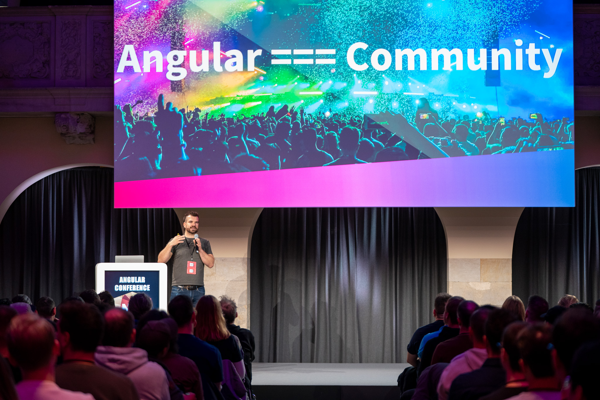
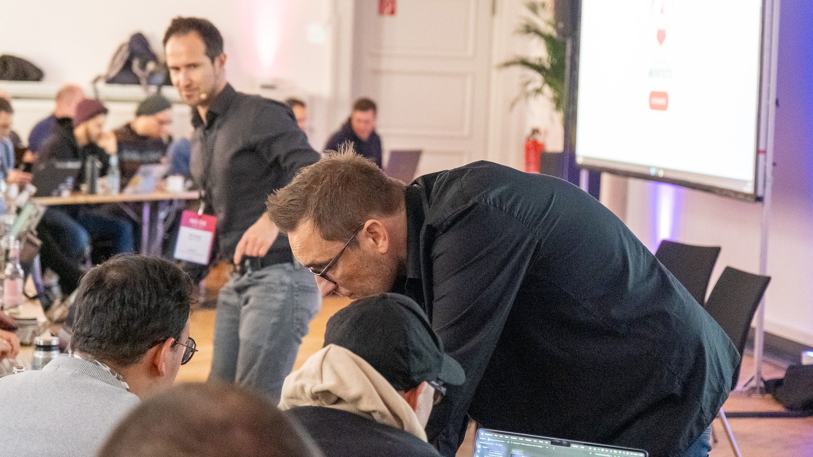
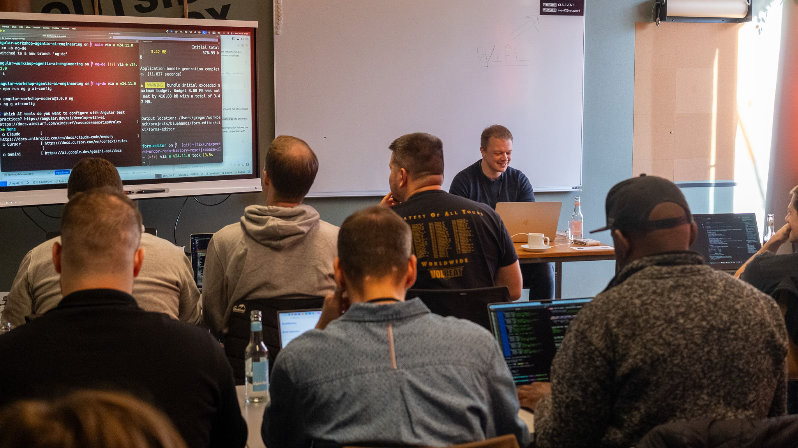
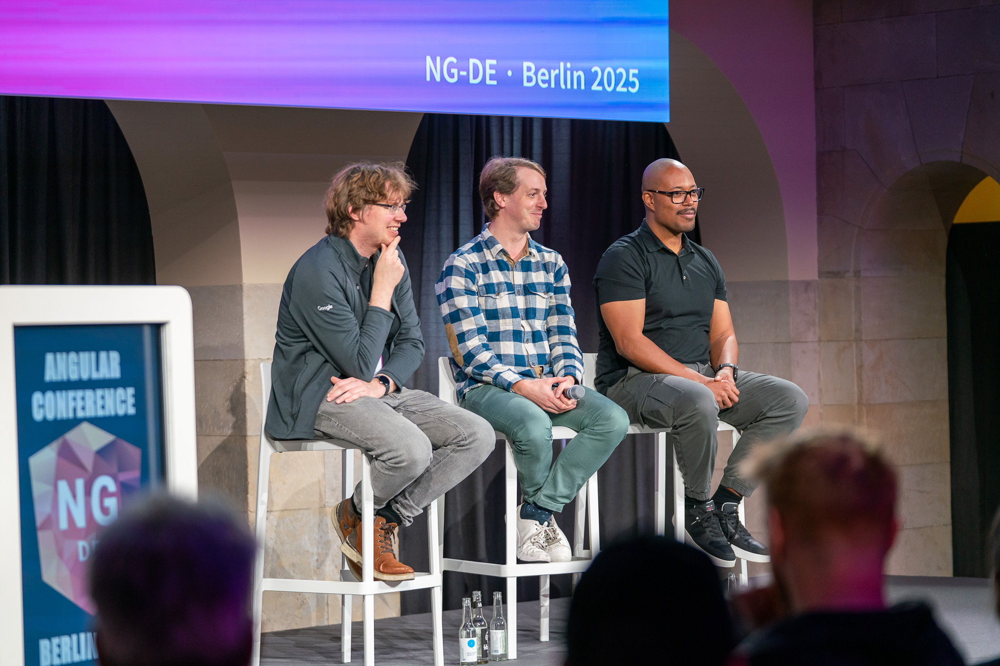
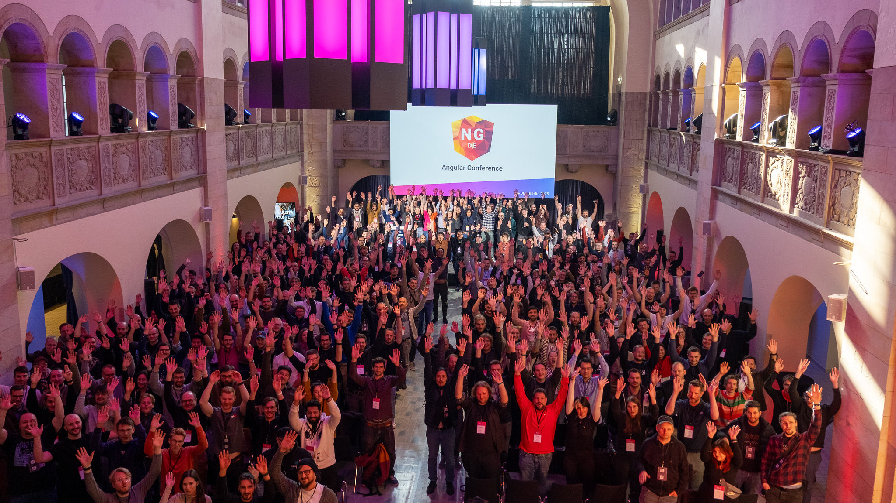
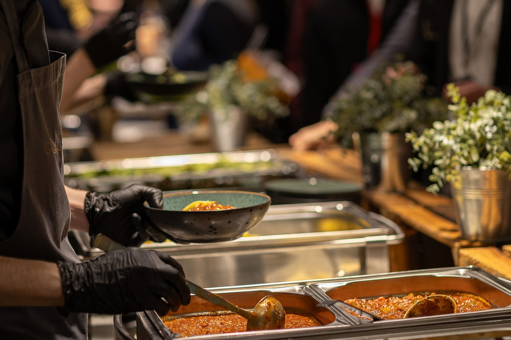
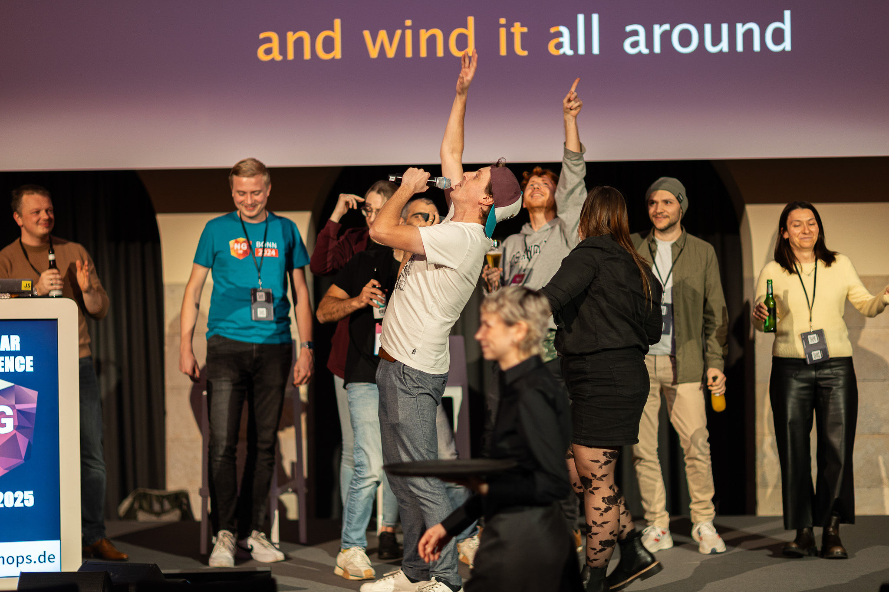
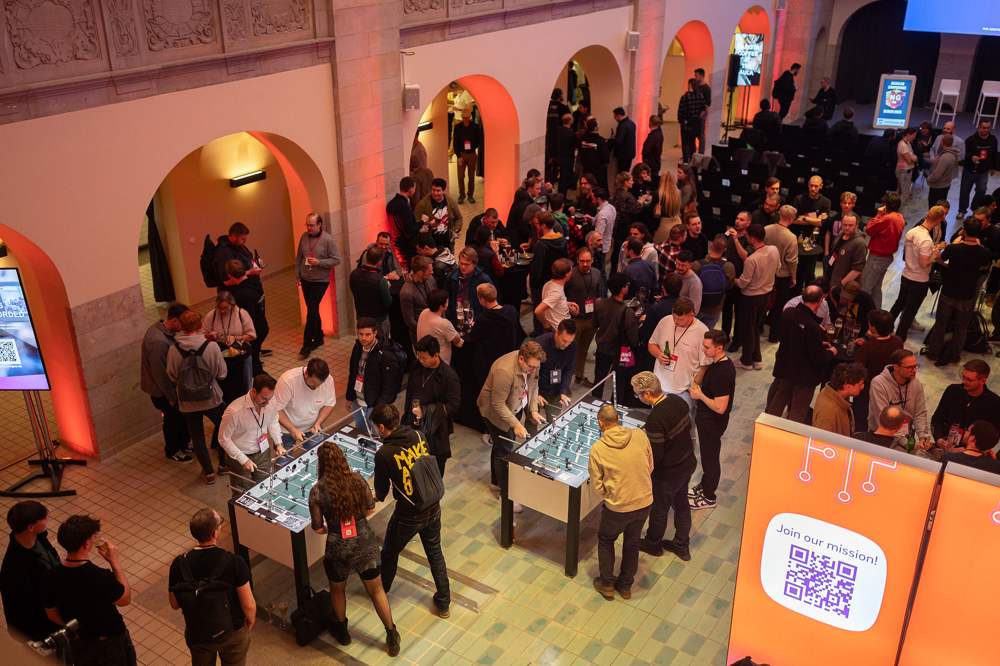
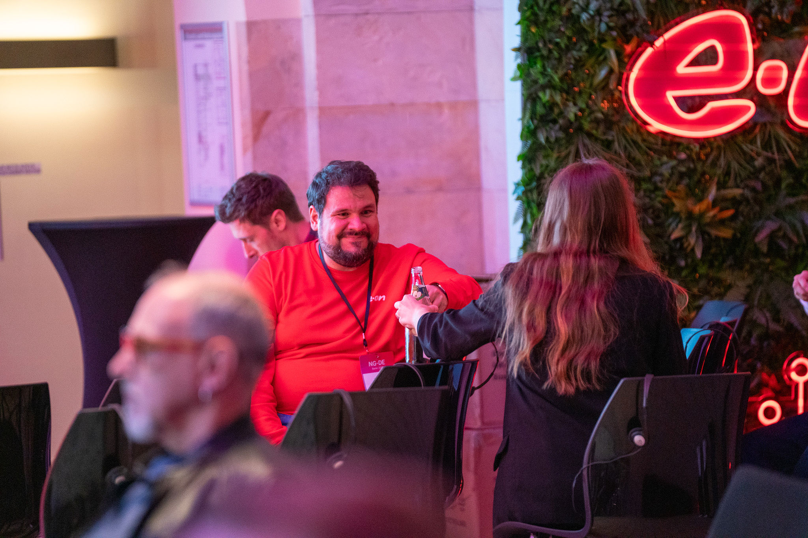
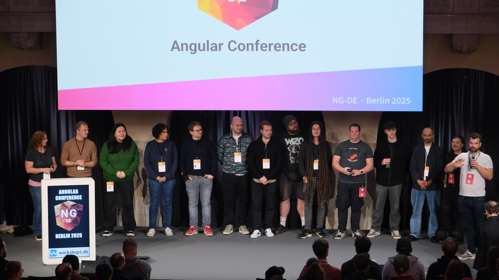

Wow, was für eine Konferenz! Noch immer bin ich völlig geflasht von den drei unglaublichen Tagen, die wir gemeinsam vom 5. bis 7. November im wunderschönen Hotel Oderberger am GLS Campus Berlin verbracht haben. Die NG-DE 2025 hat wieder einmal bewiesen, dass die Angular-Community einfach die Beste ist. Fast 450 begeisterte Teilnehmer:innen, erstklassige Speaker:innen und eine Stimmung, die einfach unbeschreiblich war – lasst uns gemeinsam auf diese fantastische Konferenz zurückblicken!

## Von angular.de zu Workshops.DE: Eine Reise durch die deutsche Angular-Geschichte

Die [NG-DE Konferenz](https://ng-de.org/?utm_source=angular.de&utm_medium=blog&utm_campaign=ng-de-2025-recap&utm_content=organizer-intro) wird von **Workshops.DE** organisiert – einem IT-Schulungsunternehmen mit tiefen Wurzeln in der deutschen Angular-Community. Die Geschichte begann 2012, als ich das erste deutsche Angular-Buch schrieb und daraufhin angular.de gründete. Was als Plattform für Angular-Wissen und Community-Building startete, entwickelte sich über die Jahre zu einem führenden Schulungsunternehmen.

Heute ist [Workshops.DE](https://workshops.de/?utm_source=angular.de&utm_medium=blog&utm_campaign=ng-de-2025-recap&utm_content=company-description) ein etablierter Player im Bereich IT-Weiterbildung, doch das Herz schlägt nach wie vor für Angular und moderne Web-Entwicklung. Mit dem Aufkommen von AI-Technologien erweitern wir kontinuierlich unser Angebot und bringen die neuesten Innovationen in die deutsche Entwickler-Community. Die NG-DE Konferenz ist dabei unser jährliches Highlight – ein Ort, wo Tradition und Innovation aufeinandertreffen und die Angular-Community zusammenkommt.

## Die Workshops: Deep Dive vom Feinsten

[[cta:training-top]]

Der Workshop-Tag war wieder einmal der perfekte Auftakt. 220 Entwickler:innen nutzten die Chance, einen ganzen Tag lang tief in spezielle Angular-Themen einzutauchen. Von "Modern Angular Architectures" über "Agentic AI Engineering with Angular" bis hin zu "Pragmatic Angular Testing" – die Trainer:innen gaben ihr Bestes und die Teilnehmer:innen saugten das Wissen förmlich auf.

Besonders beeindruckend: Die praktischen Übungen waren so gut durchdacht, dass wirklich jeder mitgenommen wurde – egal ob Angular-Neuling oder erfahrener Architekt. Die Atmosphäre in den Workshop-Räumen war konzentriert, aber gleichzeitig locker und von gegenseitiger Unterstützung geprägt.

## Das Angular Team live und in Farbe

Ein absolutes Highlight war natürlich die direkte Präsenz des Angular Teams. Nicht nur eine, nicht zwei, sondern gleich mehrere Keynotes und Panel Discussions mit den Köpfen hinter unserem Lieblings-Framework! Mark Thompson, Jens Kühlers und Matthieu Riegler gaben uns tiefe Einblicke in die Zukunft von Angular und standen Rede und Antwort zu allen brennenden Fragen der Community.

Die Panel Discussion am zweiten Tag war besonders spannend. Endlich konnten wir direkt mit dem Team über die Herausforderungen und Chancen von Angular diskutieren. Die Offenheit und Transparenz, mit der das Team auf unsere Fragen einging, war beeindruckend. Man spürte förmlich, wie wichtig ihnen das Feedback der Community ist.

## AI + Angular = Zukunft

Das Thema, das wie kein anderes den Nerv der Zeit getroffen hat: Die Verbindung von AI und Angular. Die Sessions zu diesem Themenbereich waren restlos überfüllt – kein Wunder, denn die Möglichkeiten, die sich hier auftun, sind einfach atemberaubend.

Von intelligenten Code-Generatoren über AI-gestützte Testing-Strategien bis hin zu vollständig autonomen Angular-Komponenten – die Speaker:innen zeigten uns, dass wir erst am Anfang einer Revolution stehen.

## Zahlen, die für sich sprechen

Lasst mich euch ein paar beeindruckende Zahlen nennen:

- **Workshop-Tag (5. November):** 220 wissbegierige Angular-Entwickler:innen vertieften ihr Wissen in intensiven Hands-on Sessions
- **Konferenz-Tage (6. & 7. November):** Jeweils 450 Teilnehmer:innen – ausverkauft bis auf den letzten Platz!
- **Speaker:innen:** Über 30 internationale Expert:innen teilten ihr Wissen
- **Sessions:** Von Modern Angular Architectures über NgRx SignalStore bis hin zu Web Accessibility – für jeden war etwas dabei
- **Community Spirit:** Unbezahlbar!

## Die Location: Ein Traum!

Das Hotel Oderberger hat sich als absoluter Glücksgriff erwiesen. Die Location im Herzen von Prenzlauer Berg bot nicht nur modernste Konferenzräume, sondern auch diese besondere Berliner Atmosphäre, die die NG-DE so einzigartig macht. Die historische Architektur kombiniert mit moderner Technik schuf eine inspirierende Umgebung für unsere Angular-Deep-Dives.

Und dann das Essen – einfach erstklassig! Die veganen Optionen waren so gut, dass selbst eingefleischte Fleischesser begeistert waren. Von den energiespendenden Smoothie-Bowls am Morgen über das kreative Mittagsbuffet bis zu den süßen Versuchungen am Nachmittag – das Catering-Team hat sich selbst übertroffen.

## Die legendäre Community Party

Aber was wäre die NG-DE ohne die legendäre Community Party? Am Abend des ersten Konferenztages verwandelte sich die Sponsoring Area in eine Partyzone der Extraklasse. Kicker-Turniere, bei denen erbittert um jeden Ball gekämpft wurde, Karaoke-Sessions, die uns Tränen vor Lachen in die Augen trieben, und Gespräche, die bis tief in die Nacht gingen.

Die Karaoke war definitiv ein Highlight – wer hätte gedacht, dass so viele Angular-Entwickler:innen versteckte Gesangstalente sind? Von "Bohemian Rhapsody" bis zu deutschen Klassikern war alles dabei. Der absolute Höhepunkt: Ein spontanes Duett zweier Speaker:innen zu "Don't Stop Believing" – Gänsehaut pur!

## Community at its Best

Was die NG-DE aber wirklich ausmacht, ist der unglaubliche Community Spirit. Es ist diese besondere Mischung aus fachlicher Expertise und menschlicher Wärme, die unsere Konferenz so einzigartig macht. Überall sah man kleine Gruppen in angeregte Diskussionen vertieft, neue Kontakte wurden geknüpft, alte Freundschaften vertieft.

Die Sponsoring Area war ein ständiger Treffpunkt für spannende Gespräche. Die Sponsoren hatten sich richtig ins Zeug gelegt und boten nicht nur interessante Demos und Challenges, sondern waren auch selbst mit ihren besten Angular-Expert:innen vor Ort. Die Gespräche an den Ständen waren oft so spannend, dass man fast die nächste Session verpasst hätte.

## Die Sessions: Wissen auf höchstem Niveau

Die Qualität der Talks war durchweg beeindruckend. Von den großen Keynotes bis zu den spezialisierten Deep-Dive Sessions – jeder Vortrag war sorgfältig vorbereitet und bot echten Mehrwert. Die Mischung aus theoretischem Background und praktischen Beispielen war perfekt ausbalanciert.

Besonders in Erinnerung geblieben sind mir die Live-Coding Sessions. Nichts ist spannender, als Expert:innen dabei zuzusehen, wie sie in Echtzeit komplexe Probleme lösen und dabei ihre Gedankengänge erklären.

## Der Spirit lebt weiter

Die NG-DE 2025 hat wieder einmal bewiesen, dass die Angular-Community eine der aktivsten und engagiertesten Communities im Web-Development ist. Die Energie, die Begeisterung und der Wissensdurst aller Beteiligten waren einfach ansteckend.

Ich bin immer noch überwältigt von der positiven Resonanz, die wir bekommen haben. So viele von euch haben uns gesagt, dass dies die beste NG-DE bisher war – und das motiviert uns ungemein für die Zukunft!

## Ein riesiges Dankeschön!

An dieser Stelle möchte ich mich bei allen bedanken, die diese fantastische Konferenz möglich gemacht haben:

- **Unserem großartigen Orga-Team**, das monatelang unermüdlich gearbeitet hat
- **Allen Speaker:innen und Workshop-Leiter:innen**, die ihr Wissen so großzügig geteilt haben
- **Unseren Sponsoren**, ohne die diese Konferenz nicht möglich wäre
- **Dem Team vom Hotel Oderberger** für die perfekte Betreuung
- Und natürlich **euch allen**, die ihr mit eurer Begeisterung und eurem Engagement die NG-DE zu dem macht, was sie ist!

## Alle Talks in bester Qualität auf Youtube

Wer die Talks verpasst hat oder noch einmal Revue passieren lassen möchte: Alle Sessions werden nach und nach auf unserem [YouTube-Channel](https://www.youtube.com/@ng-de) veröffentlicht. Abonniert den Kanal, um nichts zu verpassen!

Bis dahin: Keep coding, keep learning, und vor allem – bleibt dieser großartigen Community treu!

[[cta:training-bottom]]

## Mehr von uns

- 🎓 **[Angular Schulungen bei Workshops.DE](https://workshops.de/schulungsthemen/angular?utm_source=angular.de&utm_medium=blog&utm_campaign=ng-de-2025-recap&utm_content=training-cta)** – Erweitere dein Angular-Wissen mit unseren Experten
- 🎯 **[NG-DE 2026 Newsletter](https://ng-de.org/?utm_source=angular.de&utm_medium=blog&utm_campaign=ng-de-2025-recap&utm_content=next-year-cta)** – Sichere dir jetzt schon deinen Early-Bird-Platz
- 🤖 **[AI & Angular Workshops](https://workshops.de/schulungsthemen/angular?utm_source=angular.de&utm_medium=blog&utm_campaign=ng-de-2025-recap&utm_content=ai-cta)** – Die Zukunft der Web-Entwicklung

Wir sehen uns spätestens 2026 wieder in Berlin!

Euer Robin und das gesamte NG-DE Team 💙

