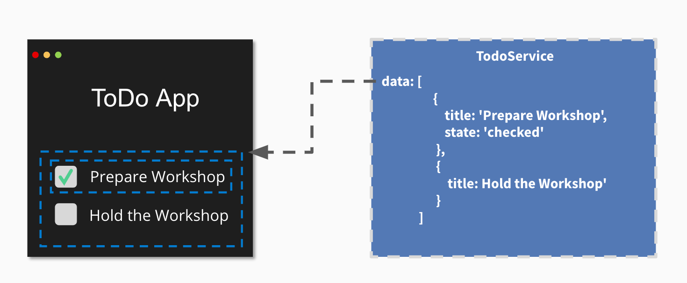

## Introduction

This tutorial explains the fundamentals of the Angular framework in its current version. Angular comes with many exciting innovations, including modern template syntax with @if/@for/@switch, Zoneless Change Detection, and much more. The framework uses semantic versioning and is continuously evolving.

This introduction is aimed at beginners who are just getting started with Angular. The example is based on the first exercises from our workshop content of the [Angular Intensive Training](https://workshops.de/seminare-schulungen-kurse/angular-modul-1?utm_source=angular_de&utm_campaign=tutorial&utm_medium=portal&utm_content=text-article-intro).

Our teaching approach covers motivation, theory, and then the hands-on part.

### What will you learn in this tutorial?

This tutorial shows you the fundamental building blocks of an Angular application through a practical example that you can implement yourself or use and modify with ready-made sample solutions.

We will cover the following topics:

- What is Angular?
- Differences to React and Vue
- Installing Angular
- Components and modern template syntax
- Expressions and loops
- Event & property binding
- Services and dependency injection
- Connecting to a REST API

We will briefly introduce the motivation and theoretical background, but primarily focus on practical examples. We will build a small application that reads a list of data from a REST API and displays it.


<div class="alert alert-success">This article and our portal are open-source. If you have suggestions for improving this article, feel free to contribute via our <a href="https://github.com/workshops-de/angular.de" target="_blank">GitHub Repo</a>. We appreciate any input! </div>

## What is Angular?

[[cta:training-top]]

Angular is a very successful, client-side JavaScript web framework for building single-page web applications. Angular has evolved into a full-fledged platform that, beyond the pure "API" for application development, also offers modern development tools, generators, and well-thought-out architectural concepts.

Angular stands alongside the two other successful frontend frameworks [React](https://reactjs.de) and [VueJS](https://vuejs.de), but thanks to its opinionated architecture, it offers clear advantages especially for enterprise applications.

### Differences to VueJS and React

All three libraries, or rather frameworks, have their right to exist, along with their strengths and weaknesses. Depending on the use case, you should decide which alternative provides the best foundation for your current project.

**Angular** clearly targets the professional development of enterprise software. Through clear structural guidelines and the use of generators, long-term maintainable and scalable software solutions can be created. Concepts like Dependency Injection and a focus on TDD have been anchored in Angular's core since day one. Thanks to the clear project structure, the scalability for onboarding new developers deserves special mention. Due to this massive foundation, Angular often appears somewhat heavyweight at first glance — but it delivers in production through systematic optimizations and extensibility.

**ReactJS** targets a very minimal layer at the component level and enables/requires you to design your own architecture from the ground up. This offers very flexible possibilities for building highly explicit solutions for individual problem domains. There is a wide selection of different modules for various requirements. The effort for integration and maintenance is higher than with Angular, but the project is often simpler and very lightweight as a result.

**VueJS** addresses the requirements between these two frameworks. By relying on a generator and clear structures, it also facilitates the scaling of project teams. However, VueJS simultaneously tries to stay very lightweight and introduce as little "framework magic" as possible. It is therefore the simple yet structured middle-ground solution.

This is my personal assessment, and I have worked very well with all of these frameworks. It depends on the individual problem and the team. If you are new to web development, I highly recommend our [Modern Web Development and Frontend Architecture Course](https://workshops.de/seminare-schulungen-kurse/frontend-architektur), which gives you an overview of modern web development today.

### Motivation

Angular itself has its origins in 2009, in the "Wild West" of web application development. A lot has happened since then — don't worry, I'm not going to start a history lesson here. The point is rather this: How could Angular prove itself as one of the most successful frameworks in the wild world of JavaScript frameworks, where it feels like 10 new frameworks appear every day?
This can probably be described most easily with Angular's mission:

- Apps that users ❤️ to use.
- Apps that developers ❤️ to build.
- A community where everyone feels welcome.

Through this mission, a wonderful ecosystem with an incredibly great community has emerged.
At the same time, the focus on quality and enterprise is clearly noticeable.
Google itself reportedly uses Angular in over 1600 projects.
(Google teams also use React and VueJS for projects where that stack is a better fit, by the way).

In 2016, the Angular team decided on a complete rewrite in TypeScript.
At the time, this decision was mostly perceived negatively and torn apart by users of other frameworks.


Today we can see the foresight of those decisions, as many other frameworks now also rely on TypeScript. To communicate breaking changes more easily, the team also decided on a fixed release schedule. This way, project teams can plan budgets for updates in advance and are not "surprised" by breaking changes in a release.


[[cta:training-middle-1]]

### The Angular Platform

Angular's ecosystem is very large. The core framework forms the foundation. This is where the fundamental concepts essential for modern web applications are implemented. Two additional core concepts, which can be used separately, are the Angular CLI and component management. These form the core functionalities needed in almost every application. Additional modules can be _optionally included_ if you need them:

- Routing — Routing for Single Page Applications
- forms — Forms and validation
- i18n — Multilingual applications
- Animations — Animations for transitions
- PWA — Offline capabilities
- HTTP — HTTP, REST, and GraphQL communication
- and many more


In this tutorial, we will primarily focus on the framework, the Angular CLI, and components.

## Preparation & Installation

Let's start by installing the required tools for Angular.

### System Requirements for Angular

Angular requires a current Node.js version.

You can download and install the latest Node.js version via the following link: [https://nodejs.org/download/](https://nodejs.org/download/)

Node.js also installs the command-line tool `npm`, which allows us to install additional Node.js packages on our machine.

<div class="alert alert-info">Note: If you need special proxy settings, you can read about them in the <a href="https://docs.npmjs.com/misc/config#https-proxy" target="_blank">NPM documentation for HTTPS proxies</a>.</div>

### The Angular CLI

Angular provides a powerful command-line tool: the Angular CLI. With it, you can create new projects, generate components, and much more. You don't need to install the CLI globally — you can use it directly via `npx`.

Verify your environment with:

```bash
npx @angular/cli version
```

You should see output similar to this:

```
Angular CLI: x.y.z
Node: x.y.z
Package Manager: npm x.y.z
OS: darwin x64

Angular:
...

Package                      Version
------------------------------------------------------
@angular-devkit/architect    x.y.z
@angular-devkit/core         x.y.z
@angular-devkit/schematics   x.y.z
@schematics/angular          x.y.z
```

## Generating the Angular App

The Angular CLI is used to generate new structures within our applications, instead of copying base structures as is common in many projects and stumbling over potential errors during renaming. It is a powerful tool that offers a detailed help text with `npx @angular/cli --help`.

To generate our first application, we use the `new` command, which takes the name of your application as an argument:

```bash
$ npx @angular/cli new angular-de-tutorial

✔ Which stylesheet system would you like to use? CSS             [ https://developer.mozilla.org/docs/Web/CSS ]
✔ Do you want to enable Server-Side Rendering (SSR) and Static Site Generation (SSG/Prerendering)? No
✔ Which AI tools do you want to configure with Angular best practices? https://angular.dev/ai/develop-with-ai None
```

When you later use the Angular CLI to generate code or run the project, the CLI will ask whether you want to share your usage data anonymously to help improve the Angular CLI.

```bash
? Would you like to share anonymous usage data about this project with the Angular Team at
Google under Google's Privacy Policy at https://policies.google.com/privacy? For more
details and how to change this setting, see http://angular.io/analytics. Yes|No
```

The project structures are now automatically created for you. This includes a start page, a component, the first end-to-end tests, linter rules, gitignore rules, and a TypeScript configuration.

```bash
CREATE angular-de-tutorial/angular.json (3809 bytes)
CREATE angular-de-tutorial/package.json (1209 bytes)
CREATE angular-de-tutorial/README.md (1026 bytes)
CREATE angular-de-tutorial/.editorconfig (274 bytes)
CREATE angular-de-tutorial/.gitignore (631 bytes)
CREATE angular-de-tutorial/tsconfig.json (737 bytes)
CREATE angular-de-tutorial/tslint.json (3185 bytes)
CREATE angular-de-tutorial/.browserslistrc (703 bytes)
...
CREATE angular-de-tutorial/src/app/app.module.ts (314 bytes)
CREATE angular-de-tutorial/src/app/app.component.scss (0 bytes)
CREATE angular-de-tutorial/src/app/app.component.html (25725 bytes)
CREATE angular-de-tutorial/src/app/app.component.spec.ts (979 bytes)
CREATE angular-de-tutorial/src/app/app.component.ts (224 bytes)
...
CREATE angular-de-tutorial/e2e/protractor.conf.js (904 bytes)
CREATE angular-de-tutorial/e2e/tsconfig.json (274 bytes)
CREATE angular-de-tutorial/e2e/src/app.e2e-spec.ts (670 bytes)
CREATE angular-de-tutorial/e2e/src/app.po.ts (274 bytes)
```

After generation, required packages are also installed via `npm`. This can take a few minutes. Once the installation is complete, you can start the development environment.

```bash
$ cd angular-de-tutorial
$ npx @angular/cli serve

Angular Live Development Server is listening on localhost:4200
```

Your base application is now generated and can be accessed in the browser at http://localhost:4200. You should see something similar to the following:


## Components and Services

In Angular, there are two primary building blocks of the framework that we will address first.

**Components** are display elements. They are defined as custom HTML elements. Depending on the defined display logic and the current data, these elements represent the state of the application.

**Services** are independent of your application's display. They define data, logic, and algorithms of the application. They are modular and reusable.

### Components

Angular components are the so-called "building blocks" of every application. The various logical building blocks of an application are divided into components. Each component takes on a specific function and is defined as its own HTML element.


```html
<todo-title>ToDo App</todo-title>
<todo-list>
  <todo-item state="checked">Prepare Workshop</todo-item>
  <todo-item>Hold the Workshop</todo-item>
</todo-list>
```

<div class="alert alert-info">Note: This representation is not yet 100% accurate and serves as a simplified form for step-by-step explanation. 🙂</div>

As you can see in this small example of a ToDo list, there are separate elements for the different areas, prefixed with `todo-` in this case. As you can clearly see with the `todo-list`, it is possible and absolutely common to nest custom components within each other. The goal is always to build reusable and maintainable elements. You will have to decide for yourself what the right component size is in your projects, and with growing experience you will develop an ever better sense for it. If you're unsure, you're always welcome to reach out to us on our [Discord](https://workshops.de/discord).

### Services

For data and logic that are not necessarily tied to a single component, Angular uses services. A service is a class that defines attributes and methods that can be used by components and other services.



```typescript
export class TodoService {
  data = [
    {
      title: "Prepare Workshop",
      state: "checked",
    },
    {
      title: "Hold the Workshop",
    },
  ];
}
```

The actual data is therefore referenced from a service, because other components may also need to be displayed based on the current to-dos — for example, a component that counts the currently open to-dos.

As an initial overview, this should be enough for now. We will take a closer look at services later.

## The First Component

When we now look at the component definition, we come into contact with [TypeScript](https://www.typescriptlang.org/) for the first time. TypeScript is an extension of JavaScript that gives us the ability to explicitly type the data in our application. Furthermore, this meta-language also introduces features that don't (yet) exist in JavaScript, such as `Decorators`. TypeScript "transpiles" our written source code so that the browser ultimately sees and can interpret plain JavaScript. It is therefore a feature that makes our daily work as developers more pleasant.

> **Classes** were introduced in ES2015 to avoid having to represent concepts like inheritance and constructors through prototypes. They can now be created using a simple and clean syntax.

> **Decorators** are structured metadata for a class. You may know these from other programming languages such as Java. The actual business behavior of the component is implemented within the class using methods.

A component definition primarily consists of the following parts:

- A **Component Decorator**, which registers the component within Angular.
- A **Selector**, which describes the HTML element we are creating.
- An **HTML Template**, which defines the visual representation of our component.
- A **Class**, which describes the interface and display logic of the component.


Our first component will be a static info box. To generate it, we use the Angular CLI again.
You can open a new terminal for this or briefly stop the running `npx @angular/cli serve`.
The serve process automatically detects changes within your source code and compiles the current version of your application within seconds.
I would therefore recommend opening a second terminal and using the following command:

```bash
$ npx @angular/cli generate component info-box
CREATE src/app/info-box/info-box.component.scss (0 bytes)
CREATE src/app/info-box/info-box.component.html (23 bytes)
CREATE src/app/info-box/info-box.component.spec.ts (636 bytes)
CREATE src/app/info-box/info-box.component.ts (277 bytes)
UPDATE src/app/app.module.ts (0 bytes)
```

The currently relevant files for us are `info-box.component.ts` and our template `info-box.component.html`. Let's first take a look at our class.

```typescript
@Component({
  selector: "app-info-box",
  templateUrl: "./info-box.component.html",
  styleUrls: ["./info-box.component.scss"],
  // standalone: true is the default
})
export class InfoBoxComponent implements OnInit {
  constructor() {}

  ngOnInit() {}
}
```

Here we see a Standalone Component as expected. Our selector has received the automatic prefix `app-`. This means our new component is now available under the HTML tag `<app-info-box></app-info-box>`.

**Important**: Since Standalone Components are the default, we need to import the component directly into the `AppComponent`. The entry point of our entire application is also a Standalone Component named `AppComponent`.

To display our freshly generated component, we first need to import it in the `AppComponent` and then call it in the template. To do this, go to the file `app.component.ts` and add the import:

```typescript
import { Component } from "@angular/core";
import { InfoBoxComponent } from "./info-box/info-box.component";

@Component({
  selector: "app-root",
  imports: [InfoBoxComponent],
  templateUrl: "./app.component.html",
  styleUrls: ["./app.component.scss"],
})
export class AppComponent {
  title = "angular-de-tutorial";
}
```

Next, go to the file `app.component.html`, delete all the current content, and add your component via its HTML tag.

```html
<app-info-box></app-info-box>
```

If you now open your application in the browser, you should see the output `info-box works!`.
Feel free to play around with your template in `info-box.component.html` at this point and create multiple info boxes by simply copying the HTML tag in your app template.
A historic moment — take a few seconds to admire your first custom component. 😉

## Expressions

A component with static content is of course only very limited in its usefulness within an application.
To display variable data, Angular uses so-called expressions in templates.
These are opened and closed with double curly braces.

{{ expression }}

An expression is dynamically evaluated by Angular based on the current properties of your class.
So if we introduce a new property `text` and fill it with a string, we can output it in our template.

```typescript
class InfoBoxComponent implements OnInit {
  text = "Additional Info-Text on our Info Box! 🎊";

  constructor() {}

  ngOnInit() {}
}
```

```html
<p>info-box works!</p>
<p>{{text}}</p>
```


If the property `text` changes, e.g. through external events, it is automatically updated by Angular. This concept is called `Data-Binding`.

## Property & Event Bindings

Other components can be integrated via so-called property and event bindings.
Angular connects to the properties and events of native HTML elements.
This also makes it easy to use elements from other frameworks like ReactJS or VueJS.

To access properties of elements, we use square brackets within our HTML templates. If we want to influence the [HTMLElement.hidden Property](https://developer.mozilla.org/en-US/docs/Web/API/HTMLElement/hidden) of a component, for example, we can do it as follows:

```html
<p [hidden]="'true'">{{text}}</p>
```

Here, the `hidden` property of the element is set to `'true'`, hiding the element.
To change this property dynamically, we can introduce a new property in our class and bind it to the p element's property via `Property-Binding`.
To do this, we replace the string `'true'` with the name of the attribute in our class for the binding:

```typescript
class InfoBoxComponent implements OnInit {
  text = "Additional Info-Text on our Info Box! 🎊";
  hidden = true;

  constructor() {}

  ngOnInit() {}
}
```

```html
<p>info-box works!</p>
<p [hidden]="hidden">{{text}}</p>
```

To change the component through user interaction, we can listen to so-called `Events` and define an `Event-Binding` for them as well.
Event bindings in Angular are defined using parentheses that contain the name of the event.
If we want to listen to the [click event](https://developer.mozilla.org/en-US/docs/Web/API/Element/click_event) of an HTML element, we can do it as follows.

```html
<button (click)="someFunction()">Button Text</button>
```

Within this definition, we can now define a so-called `Template-Statement`. This can be either a `Template-Expression` that directly modifies attributes of your class, or a reference to a method in your class.
To keep it simple, we'll use a `Template-Expression` in this case that negates the value of `hidden` each time. So `true` becomes `false` and vice versa.

```html
<p>info-box works!</p>
<button (click)="hidden=!hidden">Toggle</button>
<p [hidden]="hidden">{{text}}</p>
```


We can of course also use any other event, such as `keyup`. With this very simple mechanism, we can generically use and interact with all kinds of components. This is independent of whether they are written in Angular or another framework.

## Loops with *ngFor

Another core feature, as in every framework, is rendering list-like data structures.
Angular provides the `*ngFor` directive for this purpose.

> Directives are HTML attributes that can be used on DOM elements.
> We can distinguish between `Attribute Directives` and `Structural directives`.
> Attribute Directives modify or influence the behavior of an element they are attached to, such as `ngStyle` for setting CSS styles based on data.
> Structural directives create or remove DOM elements, such as `ngIf` or `ngFor`.
> Structural directives are marked with the `*` prefix.

The directive is modeled after a for loop, iterates over a list-like structure, and creates a copy of the DOM element it is applied to for each item.

```html
<!-- book-list.component.html -->

<ul>
  <li *ngFor="let book of books">
    <span>{{book.title}}</span> - <small>{{book.subtitle}}</small>
  </li>
</ul>
```

Here, a so-called `Looping Variable` — in our example `book` — and a list — in our case `books` — are defined. The variable book thus contains the value of the current list entry.

To try out `*ngFor`, we create a new component with the Angular CLI.
To do this, we run the command `npx @angular/cli generate component book-list`.

**Important**: Since we are using Standalone Components, we need to import the new component in the `AppComponent`:

```typescript
// app.component.ts
import { Component } from "@angular/core";
import { InfoBoxComponent } from "./info-box/info-box.component";
import { BookListComponent } from "./book-list/book-list.component";

@Component({
  selector: "app-root",
  imports: [InfoBoxComponent, BookListComponent],
  templateUrl: "./app.component.html",
  styleUrls: ["./app.component.scss"],
})
export class AppComponent {
  title = "angular-de-tutorial";
}
```

Next, we add the tag `<app-book-list></app-book-list>` to the template in `app.component.html`.
If we now define a variable `books` with a list of books in the `BookListComponent` (see _book-list.component.ts_), we get 3 DOM elements for it.

```typescript
books = [
  {
    title: "Book #1",
    subtitle: "Subtitle #1",
  },
  {
    title: "Book #2",
    subtitle: "Subtitle #2",
  },
  {
    title: "Book #3",
    subtitle: "Subtitle #3",
  },
];
```


[[cta:training-middle-2]]

## The First Service

If you've been paying close attention, you'll have noticed that data doesn't belong in the component in an Angular application.
We are mixing display logic with the management of our data here.
So let's do a quick refactoring of our application and extract the data into a separate service.


A service should always take care of one explicit task and be named accordingly.
In our case, we want to manage book data.
So we name our service `BookDataService`.
To generate it, we can use the Angular CLI as usual.

```bash
$ npx @angular/cli generate service book-data
```

```typescript
export class BookDataService {
  books = [
    {
      title: "Book #1 from Service",
      subtitle: "Subtitle #1",
    },
    {
      title: "Book #2 from Service",
      subtitle: "Subtitle #2",
    },
    {
      title: "Book #3 from Service",
      subtitle: "Subtitle #3",
    },
  ];

  constructor() {}

  getBooks() {
    return this.books;
  }
}
```

We have now extracted the data from our component.
The question now is: How do I connect the data back to my component?
This is where the concept of `Dependency Injection` comes into play.

### Dependency Injection

`Dependency Injection` is a design pattern also known as `Inversion of Control`. The idea is that the required dependency is not created by the calling site itself, but rather the component gives up control and merely defines which dependencies it has.

In our small example, the `BookListComponent` does not create our service itself, but simply tells the Angular framework that it needs a `BookDataService` in order to function.


<div class="alert alert-info">Note: This is a very simplified representation of Dependency Injection in Angular to help understand the basic concept. </div>

Within the Angular framework, the various services are managed by the so-called `Injector`.
It provides the calling site with a reference to the requested service, provided it is defined.

The dependency definition is expressed through the constructor. In our `BookListComponent` example, we define the dependency on `BookDataService` and bind it to the `bookData` field of our component.

<div class="alert alert-info">Note: We are using TypeScript's typing here by writing `: BookDataService` after our variable. This means that the variable `bookData` has the type `BookDataService`, and this is essential for the Dependency Injection mechanism. In other parts of this tutorial, we have not used typing in order to keep the tutorial's complexity as low as possible.</div>

Within the constructor, we then call the `getBooks()` method of the service to retrieve our data.

```typescript
export class BookListComponent {
  books: { title: string; subtitle: string }[];

  constructor(private bookData: BookDataService) {
    this.books = this.bookData.getBooks();
  }
}
```

In most cases, your IDE will automatically import the `BookDataService`.
If it doesn't, you can do it yourself by adding the following import at the top of `book-list.component.ts`.

```typescript
import { BookDataService } from "../book-data.service";
```

## Loading Data via REST API

The current version has explained Angular's concepts to us step by step. In reality, however, data is usually loaded asynchronously from a server.

We load this data from a sample API, which you can start with the following command:

```bash
$ npx bookmonkey-api
JSON Server is running on port 4730
```

You can now view the data being returned by the server at the following URL: <a href="http://localhost:4730/books" target="_blank">http://localhost:4730/books</a>

In the next step, we want to fetch this data from within our `BookDataService`. For this, we need the `HttpClient` service. It provides us with a very simple API for performing various operations on an HTTP interface.

**Important**: Since we are using Standalone Components, there is no `app.module.ts` anymore. Instead, we configure HTTP services in `main.ts`:

```typescript
// main.ts
import { bootstrapApplication } from "@angular/platform-browser";
import { provideHttpClient } from "@angular/common/http";
import { AppComponent } from "./app/app.component";

bootstrapApplication(AppComponent, {
  providers: [
    provideHttpClient(),
    // Further providers...
  ],
});
```

Alternatively, we can import the `HttpClient` directly in the component that needs it:

```typescript
// book-list.component.ts
import { Component } from "@angular/core";
import { HttpClient } from "@angular/common/http";

@Component({
  selector: "app-book-list",
  templateUrl: "./book-list.component.html",
  styleUrls: ["./book-list.component.scss"],
})
export class BookListComponent {
  // ...
}
```

Once this is done, our `Injector` also knows a service of type `HttpClient`, which we can now inject through the constructor of our `BookDataService`.

```typescript
import { Injectable } from "@angular/core";
import { HttpClient } from "@angular/common/http";

@Injectable({
  providedIn: "root",
})
export class BookDataService {
  constructor(private http: HttpClient) {}

  getBooks() {
    return this.http.get("http://localhost:4730/books");
  }
}
```

The service provides us with the `.get(url:string)` method, to which we can pass the API endpoint for our query. Here we use the address of the locally started JSON server.

### Handling Asynchronicity

<div class="alert alert-info">Note: In this tutorial, we assume that you are already familiar with asynchronicity in JavaScript. There is a very good introduction in the <a href="https://developer.mozilla.org/en-US/docs/Learn/JavaScript/Asynchronous" target="_blank">Mozilla Web Docs on Asynchronous JavaScript</a>. </div>

The return value of the HTTP service's get method returns an [Observable](https://v17.angular.io/guide/observables-in-angular). This is a data structure that makes it easier for us to work with asynchronous data. Angular uses [RxJS Observables](https://rxjs.dev/guide/observable) for this.

It has become good practice to mark variables and fields that hold asynchronous data structures with a `$` postfix. It has no functional impact, but it helps with long-term navigation and maintenance of your application.

```typescript
export class BookListComponent {
  books$: Observable<any>;

  constructor(private bookData: BookDataService) {
    this.books$ = this.bookData.getBooks();
  }
}
```

In most cases, your IDE will automatically import `Observable`.
If it doesn't, you can do it yourself by adding the following import at the top of `book-list.component.ts`.

```typescript
import { Observable } from "rxjs";
```

The call within our component essentially doesn't change. However, the evaluation within our HTML template needs to be slightly adjusted. Using a so-called `async` pipe, we can enable the `*ngFor` directive to handle the asynchronous data structure.

```html
<ul>
  <li *ngFor="let book of books$ | async">
    <span>{{book.title}}</span> - <small>{{book.subtitle}}</small>
  </li>
</ul>
```

The `async` pipe in combination with `*ngFor` subscribes to asynchronous updates of the `books$` variable. With this adjustment to our template, we can now also display the data from our JSON server as follows:


## Conclusion

Angular is an excellent choice for long-lived enterprise projects. Other frameworks like React and VueJS should also be considered, however, in order to make the best objective decision for the current challenges.

Angular remains very opinionated in many respects, which is particularly advantageous for enterprise projects. The uniform structure and clear architectural guidelines allow teams to fully focus on feature development.

If you want to continue exchanging ideas with us and others, join our [Discord Chat](/discord) with over 2000 wonderful people! Learning together is better! :)

[[cta:training-bottom]]
